供应链集成管理系统设计文档
一、###  项目概述

构建一套基于微服务架构、模块化设计的供应链集成管理系统,实现从需求溯源到财务结算的全链路、一体化数字管理。系统以协同办公为流程引擎,以业务运营(采购、销售、库存、招投标)为核心,以财务风控(资金、成本、票据)为闭环,深度融合"人、财、物、流程"四大要素,支撑企业供应链的敏捷响应、成本优化与风险可控。

### 系统覆盖范围

系统采用模块化设计,覆盖供应链管理的完整业务流程,包括以下16个核心功能模块:

| 序号 | 模块名称 | 核心功能 | 业务价值 |
|-----|---------|---------|----------|
| 1 | 数据看板 | 关键业务指标可视化展示 | 实时洞察业务全局,辅助经营决策 |
| 2 | 协同办公 | 日程、任务、会议、文档管理 | 提升团队协作效率,流程透明化 |
| 3 | 招投标管理 | 招标、投标、评标、中标全流程 | 规范采购流程,降低采购风险 |
| 4 | 物料管理 | 物料分类、物料信息维护 | 规范物料主数据,支撑业务运营 |
| 5 | 客商管理 | 客户和供应商信息管理 | 客商关系维护,资信评估 |
| 6 | 合同管理 | 合同模板、采购合同、销售合同 | 合同全生命周期管理,风险控制 |
| 7 | 采购管理 | 采购计划、采购订单、采购入库 | 优化采购流程,降低采购成本 |
| 8 | 销售管理 | 销售商机、销售订单、销售出库 | 销售全流程管理,提升客户满意度 |
| 9 | 库存管理 | 库存监控、出入库、调拨、盘点 | 优化库存水平,降低库存成本 |
| 10 | 结算管理 | 采购对账、销售对账、采购结算、销售结算 | 业财数据一致,结算准确高效 |
| 11 | 收付款管理 | 应收账款、应付账款及收付款流程 | 资金流管理,降低坏账风险 |
| 12 | 资金管理 | 资金计划、资金支付、资金收款 | 资金安全可控,提升资金效率 |
| 13 | 票据管理 | 发票和商业票据管理 | 票据规范管理,税务合规 |
| 14 | 成本管理 | 成本核算与分析 | 精准成本核算,支撑定价决策 |
| 15 | 系统管理 | 用户、角色、权限、组织架构 | 系统基础支撑,权限精细化管理 |
| 16 | 集成管理 | API网关、第三方系统集成 | 系统互联互通,生态开放 |

### 核心设计理念

| 设计理念 | 核心内容 | 实现路径 | 预期效果 |
|---------|---------|---------|----------|
| 一体化 | 打破OA、ERP、SCM系统壁垒 | 数据同源、流程贯通、业务协同 | 消除信息孤岛,提升整体效率 |
| 模块化 | 高内聚、低耦合的模块设计 | 按需部署、功能扩展、独立演进 | 降低维护成本,加快迭代速度 |
| 智能化 | 内嵌AI能力 | 预测、预警、优化、自动决策 | 从被动响应到主动管理 |
| 移动化 | 全平台响应式设计 | PC与移动端无缝体验 | 随时随地处理业务 |
| 标准化 | 标准化接口与流程 | API标准化、流程可配置化 | 提升系统集成能力 |
| 安全化 | 全方位安全保障 | 认证、授权、加密、审计 | 保障数据安全与合规 |

### 技术栈选型规范

#### 前端技术栈详细规范

| 分类 | 技术 | 版本 | 用途 | 技术要求 |
|-----|------|-----|------|----------|
| 核心框架 | Vue | 3.x | 前端UI构建 | 需使用Composition API,配合script setup语法糖,确保符合Vue 3的最佳实践 |
| 类型系统 | TypeScript | 5.x | 类型安全 | 严格模式配置,实现100%代码类型覆盖,关键业务逻辑需定义接口或类型别名 |
| 状态管理 | Pinia | 3.x | 前端状态管理 | 按业务模块划分store,实现状态持久化方案,支持开发环境状态调试 |
| UI组件库 | Ant Design Vue | 4.x | UI组件 | 统一主题定制,封装业务通用组件库,确保组件使用符合设计规范 |
| 数据可视化 | ECharts | 6.x | 数据图表展示 | 实现图表响应式适配,支持动态数据更新与交互事件处理 |
| 数据可视化 | AntV G6 | 5.x | 流程图与关系图 | 支持图形拖拽、缩放、节点关系编辑等交互功能,优化大数据量渲染性能 |
| HTTP客户端 | Axios | 1.x | API请求 | 封装请求拦截器和响应拦截器,实现请求缓存与重试机制 |
| 移动端框架 | UniApp | 4.x | 多端适配 | 确保代码同时兼容H5和小程序端,实现跨端统一的UI和交互体验 |
| 构建工具 | Vite | 7.x | 前端构建 | 配置开发环境热更新、生产环境代码分割与压缩,优化构建速度与产物体积 |
| 测试框架 | Vitest | 3.x | 单元测试 | 核心业务逻辑测试覆盖率≥80%,实现组件测试与API模拟测试 |

**前端技术选型核心要求:**
- 版本兼容性: 确保Vue 3.x、TypeScript 5.x、Ant Design Vue 4.x等核心技术栈版本相互兼容
- 类型安全: TypeScript严格模式配置,100%类型覆盖,避免运行时类型错误
- 性能优化: Vite构建工具提升开发与生产环境性能,ECharts图表按需加载
- 代码规范: 遵循Vue 3最佳实践,使用Composition API与script setup语法
- 测试覆盖: Vitest单元测试覆盖率≥80%,确保代码质量

#### 后端技术栈详细规范

| 分类 | 技术 | 版本 | 用途 | 技术要求 |
|-----|------|-----|------|----------|
| 微服务框架 | Spring Boot | 3.x | 应用框架 | 基于Spring Boot 3.x构建微服务应用,使用Spring Boot Starter简化配置 |
| 微服务体系 | Spring Cloud | 2023.x | 微服务体系 | 实现服务注册发现、配置中心、负载均衡等微服务核心功能 |
| 微服务套件 | Spring Cloud Alibaba | 2023.x | 阿里微服务套件 | 集成Nacos、Sentinel等组件,确保与Spring Cloud版本兼容 |
| 服务注册发现 | Nacos | 2.x | 服务注册与发现 | 实现服务健康检查机制,配置服务元数据管理 |
| 配置中心 | Nacos Config | 2.x | 配置管理 | 按环境隔离配置,支持配置动态刷新,敏感配置加密存储 |
| API网关 | Spring Cloud Gateway | 3.x | 网关服务 | 实现路由转发、认证授权、限流熔断、请求日志记录等功能 |
| 安全框架 | Spring Security | 6.x | 认证授权 | 基于OAuth2.0/JWT实现统一认证授权,配置细粒度的资源访问控制 |
| 数据持久化 | MyBatis Plus | 3.x | ORM框架 | 使用BaseMapper和Wrapper简化CRUD操作,实现分页插件配置 |
| 分布式事务 | Seata | 2.x | 分布式事务处理 | 采用AT模式实现跨服务事务一致性,确保关键业务数据准确性 |
| 服务熔断 | Sentinel | 1.x | 流量控制与熔断 | 配置接口限流规则、熔断降级策略,实现监控与告警机制 |
| 缓存 | Redis | 8.x | 分布式缓存 | 实现缓存防护策略,合理设置缓存过期时间 |
| 消息队列 | RabbitMQ | 4.x | 消息中间件 | 实现消息可靠投递与消费,配置死信队列处理失败消息 |
| 数据库 | MySQL | 8.4.x | 关系型数据库 | 配置主从复制架构,实现分库分表策略,添加慢查询监控 |
| 搜索引擎 | Elasticsearch | 9.x | 搜索引擎 | 实现全文检索功能,配置索引优化策略,支持搜索结果高亮与过滤 |
| NoSQL数据库 | MongoDB | 8.x | 非结构化数据存储 | 用于存储日志、文件元数据等非结构化数据,配置数据分片策略 |

**后端技术选型核心要求:**
- 微服务成熟度: Spring Boot 3.x + Spring Cloud 2023.x构建成熟微服务体系
- 高可用保障: Nacos服务注册发现,Sentinel流量控制,Redis缓存,RabbitMQ消息队列
- 数据一致性: Seata分布式事务保障跨服务数据一致性
- 安全合规: Spring Security统一认证授权,OAuth2.0/JWT标准协议
- 性能优化: MyBatis Plus高效ORM,Redis缓存,Elasticsearch全文检索

#### 运维与部署技术栈详细规范

| 分类 | 技术 | 版本 | 用途 | 技术要求 |
|-----|------|-----|------|----------|
| 容器化 | Docker | 25.x | 容器化部署 | 为所有服务组件编写Dockerfile,优化镜像大小,使用多阶段构建 |
| 容器编排 | Kubernetes | 1.x | 容器编排与管理 | 编写Deployment、Service、ConfigMap等资源配置文件,实现服务自动扩缩容 |
| CI/CD | Jenkins | 2.300+ | 持续集成/持续部署 | 配置自动化构建、测试、部署流水线,支持多环境部署策略 |
| 监控 | Prometheus | 3.x | 系统监控 | 配置关键指标采集规则,实现服务健康状态、性能指标监控 |
| 可视化 | Grafana | 12.x | 监控可视化 | 定制业务监控仪表盘,配置异常指标告警规则 |
| 日志 | ELK Stack | 8.x | 日志收集与分析 | 实现全链路日志收集,配置日志过滤与检索规则,支持日志异常告警 |

**运维部署核心要求:**
- 容器化标准: 所有服务Docker镜像化,Kubernetes编排管理
- 自动化部署: Jenkins CI/CD流水线,实现自动构建、测试、部署
- 可观测性: Prometheus监控+Grafana可视化+ELK日志,实现全方位系统监控
- 高可用: Kubernetes服务自动扩缩容,保障系统高可用
- 安全合规: 镜像安全扫描,配置加密存储,审计日志完整

### 系统总体要求

#### 架构与性能要求

| 要求类型 | 具体要求 | 验收标准 |
|---------|---------|----------|
| 架构先进性 | 采用云原生微服务架构 | 高可用、高并发、弹性伸缩能力 |
| 体验一致性 | 全系统响应式设计 | 多终端操作体验流畅、一致 |
| 功能模块化 | 严格定义模块边界 | 通过标准化接口实现服务解耦与协同联动 |
| 流程自动化 | 内置工作流引擎 | 支持图形化配置,实现审批、对账等流程自动流转 |
| 数据智能化 | 集成AI模型 | 预测、分类、优化等智能化功能 |
| 响应性能 | 页面响应时间 | <2秒 |
| API性能 | API平均响应时间 | ≤300毫秒 |
| 并发能力 | 支持并发用户数 | ≥10000用户 |
| 功能测试覆盖率 | 功能测试覆盖 | ≥95% |
| 代码测试覆盖率 | 单元测试覆盖 | ≥80% |

#### 交付标准要求

**代码质量标准:**
- 提供完整、洁净、可维护的源代码
- 符合阿里Java开发规范
- 核心代码包含完整的JavaDoc和行内注释
- 业务逻辑实现自动补全代码

**文档交付标准:**
- 系统架构设计文档
- API接口文档(OpenAPI 3.0)
- 数据库设计文档
- 系统部署与运维手册
- 用户操作手册

**部署交付标准:**
- 提供完整的Docker镜像
- 提供Kubernetes编排文件
- 提供CI/CD流水线脚本(Jenkinsfile或GitLab CI)
- 通过安全渗透测试与代码审计

### 2.7 前端UI/UX设计

#### 2.7.1 登录界面设计

**设计定位:**

现代化企业级登录界面,简约扁平化设计风格,以白色为主色调,支持亮色/暗黑模式切换,完全适配PC端、平板和移动设备,提供多种登录方式和第三方授权集成。

**整体布局结构:**

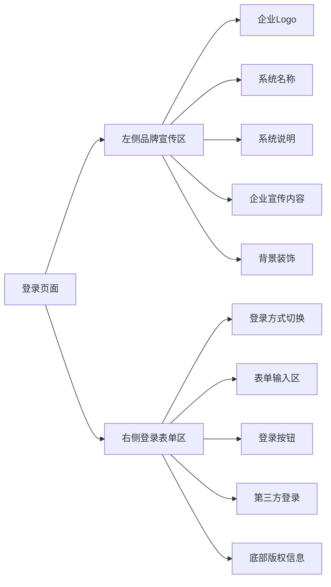

**视觉设计规范:**

| 设计元素 | 规范定义 | 具体要求 |
|---------|---------|----------|
| 主色调 | 白色为主 | 背景色#FFFFFF,营造简洁专业氛围 |
| 辅助色 | 品牌色协调 | 按钮、图标使用品牌主色,建议#1890FF |
| 字体规范 | 清晰易读 | 标题24-32px,正文14-16px,微软雅黑/思源黑体 |
| 间距规范 | 统一节奏 | 基础间距8px,标准间距16px,大间距24px |
| 圆角规范 | 柔和现代 | 卡片8px,按钮4px,输入框4px |
| 阴影规范 | 层次分明 | 卡片阴影0 2px 8px rgba(0,0,0,0.08) |
| 动画时长 | 自然流畅 | 快速0.2s,标准0.3s,缓慢0.5s |

**左侧品牌宣传区设计:**

| 区域元素 | 位置布局 | 内容设计 | 样式要求 |
|---------|---------|---------|----------|
| 企业Logo | 顶部居中 | 可配置企业Logo图标 | 尺寸80x80px,SVG格式 |
| 系统名称 | Logo下方 | "供应链集成管理系统" | 字号28px,字重600,颜色#1890FF |
| 系统说明 | 名称下方 | "高效、智能的供应链协同平台" | 字号16px,颜色#666666 |
| 企业宣传 | 中部区域 | 三大核心价值主张 | 左对齐,图标+标题+说明结构 |
| 背景装饰 | 全区域 | 渐变色或高质量背景图 | 支持自定义配置 |

**企业宣传内容设计:**

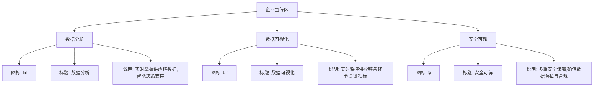

**右侧登录表单区设计:**

**登录方式切换Tab:**

| 登录方式 | 图标 | 输入字段 | 功能按钮 |
|---------|-----|---------|----------|
| 账号登录 | 👤 | 用户名/手机号+密码 | 记住密码、忘记密码 |
| 验证码登录 | 📱 | 手机号+验证码 | 获取验证码(60s倒计时) |
| 扫码登录 | 📷 | 二维码展示区 | 二维码刷新按钮 |

**表单输入字段设计:**

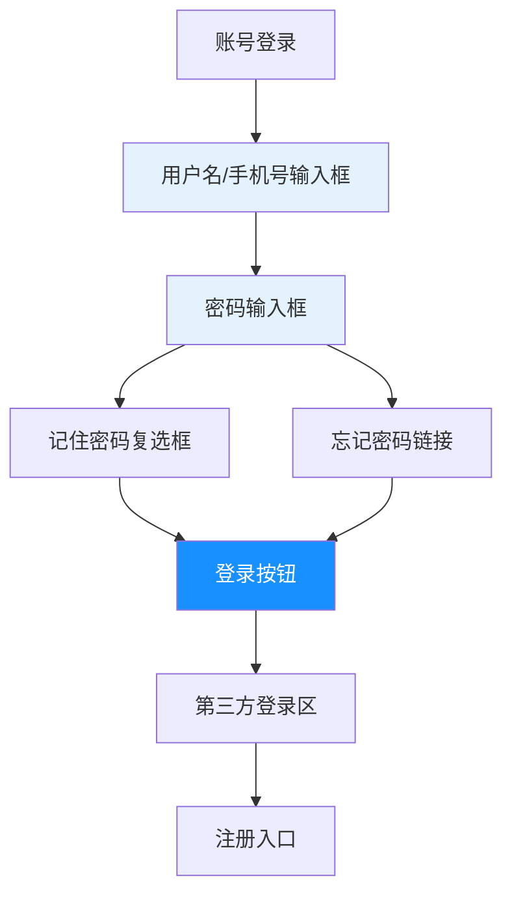

**输入框设计规范:**

| 输入框类型 | 前置图标 | 占位符提示 | 校验规则 | 错误提示 |
|----------|---------|-----------|---------|----------|
| 用户名 | 👤 | 请输入用户名/手机号 | 非空,4-20字符 | 用户名格式不正确 |
| 密码 | 🔒 | 请输入密码 | 非空,6-20字符 | 密码长度为6-20位 |
| 手机号 | 📱 | 请输入手机号 | 11位数字,1开头 | 请输入正确的手机号 |
| 验证码 | ✉️ | 请输入验证码 | 6位数字 | 验证码错误 |

**登录按钮设计:**

- 尺寸: 宽度100%,高度40px
- 样式: 圆角4px,渐变蓝色背景,白色文字
- 状态:
  - 默认: 背景#1890FF,鼠标悬停#40A9FF
  - 加载: 显示loading动画,文字变为"登录中..."
  - 禁用: 背景#F5F5F5,文字#CCCCCC
- 动画: 点击涟漪效果,0.6s扩散动画

**第三方登录集成:**

| 登录方式 | 图标 | 颜色 | 接入协议 | 回调处理 |
|---------|-----|------|---------|----------|
| 微信登录 | 微信绿色Logo | #07C160 | OAuth2.0 | 获取openid后绑定账号 |
| 支付宝登录 | 支付宝蓝色Logo | #1677FF | OAuth2.0 | 获取userid后绑定账号 |
| 钉钉登录 | 钉钉蓝色Logo | #0089FF | OAuth2.0 | 获取unionid后绑定账号 |

**第三方登录布局:**

```
─────────── 或 ───────────

[微信图标]  [支付宝图标]  [钉钉图标]
```

**注册功能设计:**

| 注册类型 | 注册表单 | 必填字段 | 可选字段 | 审核流程 |
|---------|---------|---------|---------|----------|
| 供应商注册 | 企业信息+联系人 | 企业名称、统一社会信用代码、联系人、手机号 | 企业地址、经营范围 | 后台审核通过后激活 |
| 客户注册 | 企业信息+联系人 | 企业名称、联系人、手机号 | 企业规模、行业类别 | 自动激活或审核激活 |

**注册流程:**

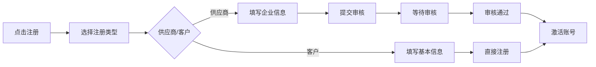

**底部版权信息:**

- 内容: "© 2025 供应链集成管理系统. 保留所有权利"
- 位置: 表单区域底部居中
- 样式: 字号12px,颜色#999999
- 附加: 可添加ICP备案号、技术支持链接

**响应式适配方案:**

| 设备类型 | 屏幕尺寸 | 布局方式 | 左侧宣传区 | 右侧表单区 |
|---------|---------|---------|-----------|----------|
| 桌面端 | ≥1200px | 左右分栏 | 显示完整内容,宽度50% | 显示完整表单,宽度50% |
| 平板端 | 768-1199px | 上下布局 | 仅显示Logo+系统名称 | 表单区域占据主要空间 |
| 移动端 | <768px | 全屏单栏 | 仅显示Logo+系统名称 | 表单区域全屏显示 |

**亮色/暗黑模式设计:**

| 模式 | 背景色 | 卡片背景 | 文字颜色 | 输入框背景 | 按钮颜色 |
|-----|-------|---------|---------|-----------|----------|
| 亮色模式 | #FFFFFF | #FAFAFA | #333333 | #FFFFFF | #1890FF |
| 暗黑模式 | #1F1F1F | #2D2D2D | #E0E0E0 | #3A3A3A | #177DDC |

**主题切换:**
- 位置: 登录表单右上角
- 图标: 🌙(月亮)切换到暗黑模式,☀️(太阳)切换到亮色模式
- 动画: 0.3s渐变过渡效果
- 存储: localStorage记忆用户选择

**智能输入提示与校验:**

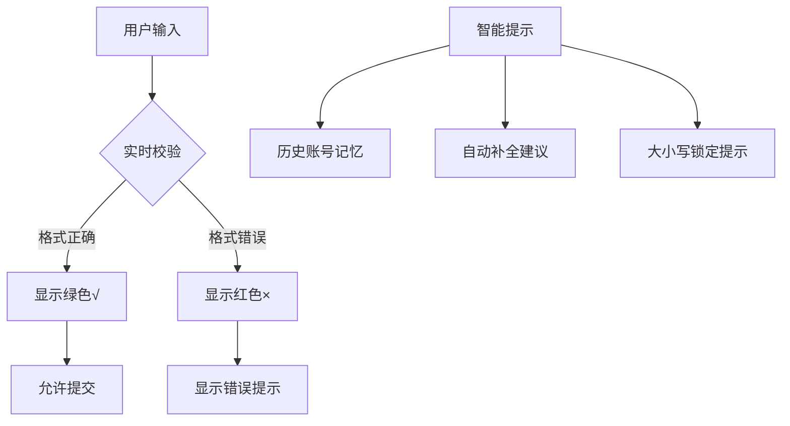

**登录交互动画:**

| 动画类型 | 触发时机 | 动画效果 | 持续时间 |
|---------|---------|---------|----------|
| 表单入场 | 页面加载 | 从右侧滑入+淡入 | 0.5s |
| 输入聚焦 | 点击输入框 | 边框高亮+微放大 | 0.2s |
| 按钮涟漪 | 点击登录 | 涟漪扩散效果 | 0.6s |
| 登录loading | 提交请求 | 按钮内旋转动画 | 持续 |
| 登录成功 | 验证通过 | 整页淡出+跳转 | 0.3s |
| 登录失败 | 验证失败 | 表单抖动+错误提示 | 0.3s |

**安全与体验优化:**

| 优化项 | 实现方式 | 用户价值 |
|-------|---------|----------|
| 图形验证码 | 登录失败3次后显示 | 防止暴力破解 |
| 滑块验证 | 首次登录或异地登录 | 人机验证 |
| 记住密码 | 加密存储本地 | 提升便捷性 |
| 自动登录 | Token有效期内免登 | 减少重复操作 |
| 异地登录提醒 | 邮件/短信通知 | 账号安全保障 |
| 登录日志 | 记录IP、设备、时间 | 安全审计追踪 |

#### 2.7.2 主界面导航系统设计

**设计定位:**

现代化企业级主界面导航系统,采用经典的顶部导航栏+侧边菜单栏+主内容区三段式布局,支持三级菜单层级、全局搜索、消息通知、用户菜单等核心功能,完全适配桌面端、平板端和移动端,实现全局美观、大气的企业气质。

**整体架构:**

```
┌────────────────────────────────────────────────────────────────────────────────────────────────────────────────────────────────────────────────────────────────────────────────┐
│ [Logo] 供应链集成管理系统  首页/采购管理/采购订单                                                      [搜索][消息][用户] │ ← 顶部导航栏(高度64px)                                   │
├────────────┬───────────────────────────────────────────────────────────────────────────────────────────────────────────────────────────────────────────────────────────────────┤
││ 数据看板   │                                                                                                                                                                   │
││ 协同办公▼  │                                                                                                                                                                   │
││├日程管理   │                                                                                                                                                                   │
││├信息发布   │                                                                          主内容区                                                                                  │
││├组织人事   │                                                                                                                                                                   │ 
││├...       │                                                                                                                                                                   │
││ 招投标管理 │                                                                                                                                                                   │
││ 物料管理   │                                                                                                                                                                   │
││  客商管理  │                                                                                                                                                                   │
││  ...      │                                                                                                                                                                   │
└────────────┴───────────────────────────────────────────────────────────────────────────────────────────────────────────────────────────────────────────────────────────────────┘
   ↑ 侧边栏(宽度200px)                           ↑ 内容区(动态宽度)
```
**布局尺寸规范:**

| 区域 | 高度/宽度 | 背景色 | 阴影 | 层级 |
|-----|----------|-------|------|------|
| 顶部导航栏 | 64px | #FFFFFF | 0 2px 8px rgba(0,0,0,0.08) | z-index: 1000 |
| 侧边菜单栏(展开) | 200px | #FFFFFF | 2px 0 8px rgba(0,0,0,0.06) | z-index: 999 |
| 侧边菜单栏(折叠) | 64px | #FFFFFF | 2px 0 8px rgba(0,0,0,0.06) | z-index: 999 |
| 主内容区 | 动态 | #F0F2F5 | 无 | z-index: 1 |

```

**顶部导航栏设计:**

**布局结构:**

| 区域 | 宽度占比 | 内容元素 | 对齐方式 |
|-----|---------|---------|----------|
| 左侧区域 | 30% | Logo+系统名称+面包屑 | 左对齐 |
| 中间区域 | 40% | 全局搜索+快捷功能 | 居中 |
| 右侧区域 | 30% | 消息+用户菜单 | 右对齐 |

**左侧区域详细设计:**

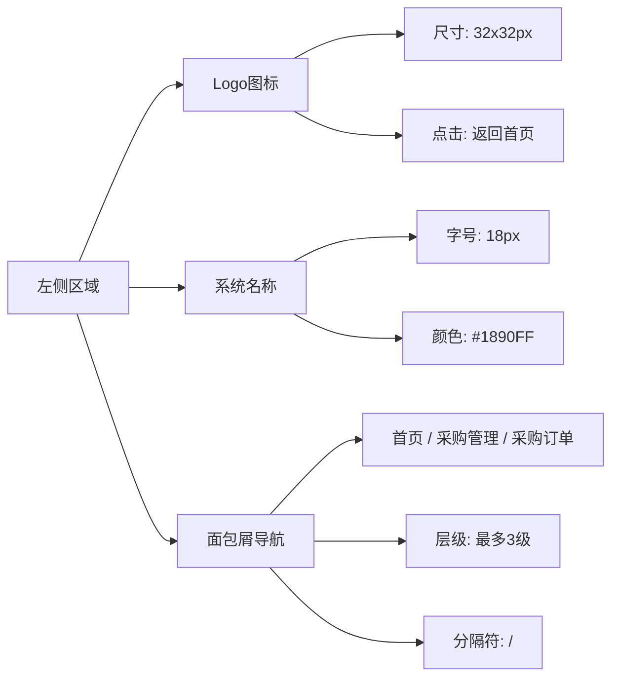

**面包屑导航设计:**

| 元素 | 样式 | 交互 | 状态 |
|-----|------|------|------|
| 首页 | 字号14px,颜色#666 | 可点击跳转 | hover:#1890FF |
| 分隔符 | / 字符,颜色#D9D9D9 | 不可点击 | 无 |
| 中间层级 | 字号14px,颜色#666 | 可点击跳转 | hover:#1890FF |
| 当前页面 | 字号14px,颜色#333 | 不可点击 | 加粗显示 |

**中间区域详细设计:**

**全局搜索:**

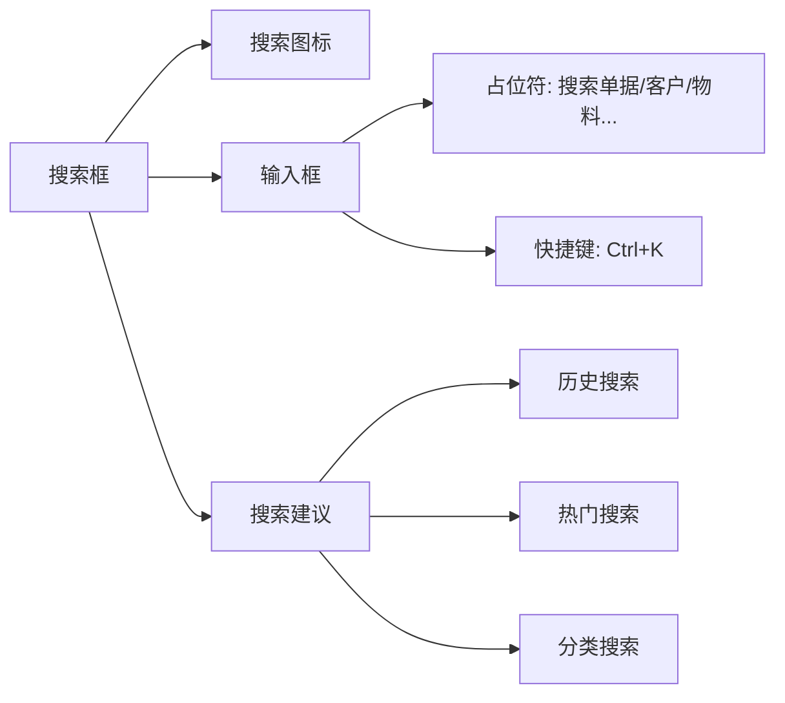

| 搜索功能 | 搜索范围 | 结果展示 | 排序规则 |
|---------|---------|---------|----------|
| 单据搜索 | 采购/销售/库存单据 | 单据号+类型+状态+时间 | 按时间倒序 |
| 客户搜索 | 客户/供应商 | 名称+编号+联系人 | 按匹配度 |
| 物料搜索 | 物料信息 | 编号+名称+规格 | 按匹配度 |
| 全文搜索 | 全局数据 | 分类展示结果 | 按相关性 |

**快捷功能入口:**

| 功能 | 图标 | 徽标 | 点击行为 | 下拉内容 |
|-----|------|------|---------|----------|
| 待办事项 | ✓ | 红点数字徽标 | 展开待办列表 | 待审批/待处理/待签收 |
| 消息通知 | 🔔 | 红点数字徽标 | 展开消息列表 | 系统通知/业务提醒/预警信息 |
| 数据刷新 | 🔄 | 无 | 刷新当前页面 | 无 |

**待办事项下拉面板:**

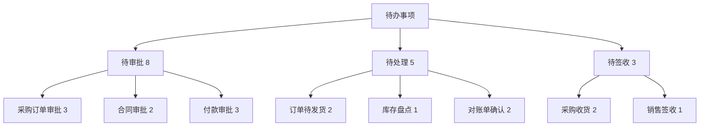
**消息通知下拉面板:**

| 消息类型 | 图标 | 标题 | 时间 | 操作 |
|---------|-----|------|------|------|
| 系统通知 | ℹ️ | 系统将于今晚维护 | 2小时前 | 查看详情 |
| 业务提醒 | 📋 | 您有3个订单待审批 | 5分钟前 | 立即处理 |
| 预警信息 | ⚠️ | 库存低于安全值 | 1小时前 | 查看库存 |

**右侧区域详细设计:**

**用户菜单下拉:**
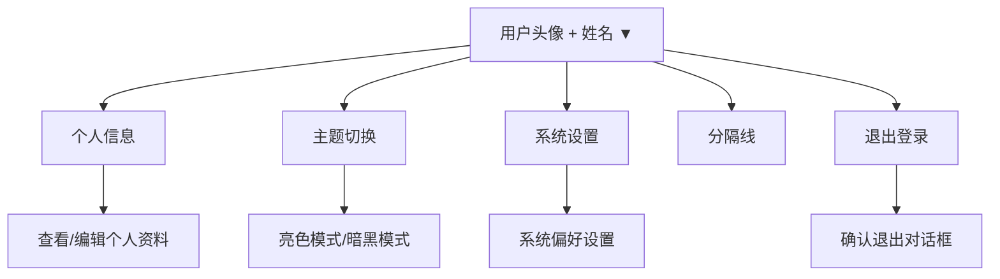
**用户信息展示:**

- 头像: 圆形,直径32px,支持自定义上传
- 姓名: 字号14px,最多显示4个汉字,超出省略
- 下拉图标: 向下箭头,hover时旋转180°
- 在线状态: 绿点表示在线

**主题切换:**

| 主题 | 图标 | 背景色 | 文字色 | 卡片色 |
|-----|------|-------|-------|--------|
| 亮色模式 | ☀️ | #F0F2F5 | #333333 | #FFFFFF |
| 暗黑模式 | 🌙 | #141414 | #E0E0E0 | #1F1F1F |

**侧边菜单栏设计:**

**菜单层级结构:**
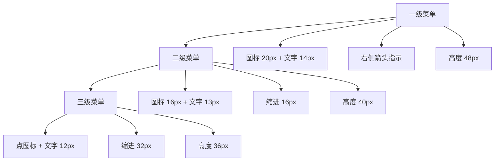
**完整菜单数据结构:**
| 一级菜单 | 图标 | 二级菜单 | 三级菜单 |
|---------|-----|---------|----------|
| 数据看板 | 📊 | 无 | 无 |
| 协同办公 | 👥 | 日程管理、信息发布、组织人事、知识库 | 我的日程、团队日程、会议室预约 |
| 招投标管理 | 📝 | 专家管理、招标管理、投标管理 | 招标项目、招标公告、评标结果 |
| 物料管理 | 📦 | 物料分类、物料信息、物料属性 | 物料列表、物料导入、物料审核 |
| 客商管理 | 🏢 | 客户管理、供应商管理、联系人管理 | 客户列表、客户资质、信用评级 |
| 合同管理 | 📄 | 合同模板、采购合同、销售合同、合同审批 | 合同列表、合同归档、合同提醒 |
| 采购管理 | 🛒 | 采购需求、采购计划、采购订单、采购入库 | 需求列表、订单审批、入库单 |
| 销售管理 | 💰 | 销售商机、销售订单、销售出库、客户跟进 | 商机列表、订单管理、发货单 |
| 库存管理 | 📋 | 库存查询、出入库、调拨盘点、库存预警 | 实时库存、库存报表、呆滞分析 |
| 结算管理 | 💳 | 采购结算、销售结算、对账单管理 | 结算单、对账确认、差异处理 |
| 收付款管理 | 💵 | 应收账款、应付账款、收款单、付款单 | 账款列表、收付款审批、账龄分析 |
| 资金管理 | 💸 | 资金计划、资金支付、资金收款、资金监控 | 资金流水、资金预测、余额监控 |
| 票据管理 | 🎫 | 发票管理、商业票据、票据审核 | 进项发票、销项发票、票据台账 |
| 成本管理 | 📈 | 成本核算、成本分析、成本控制 | 采购成本、库存成本、利润分析 |
| 系统管理 | ⚙️ | 用户管理、角色管理、组织架构、系统配置 | 用户列表、角色权限、部门管理 |
| 集成管理 | 🔗 | API管理、第三方集成、集成监控 | API列表、集成日志、性能监控 |
**菜单交互状态设计:**
| 状态 | 背景色 | 文字色 | 左侧边框 | 图标 | 动画效果 |
|-----|-------|-------|---------|------|----------|
| 默认 | 透明 | #666666 | 无 | 灰色 | 无 |
| 悬停 | #E6F7FF | #1890FF | 无 | 蓝色 | 图标放大105% |
| 选中 | #E6F7FF | #1890FF | 3px蓝色 | 蓝色 | 背景渐变 |
| 展开 | 透明 | #333333 | 无 | 灰色 | 箭头旋转90° |
**菜单展开/收起动画:**
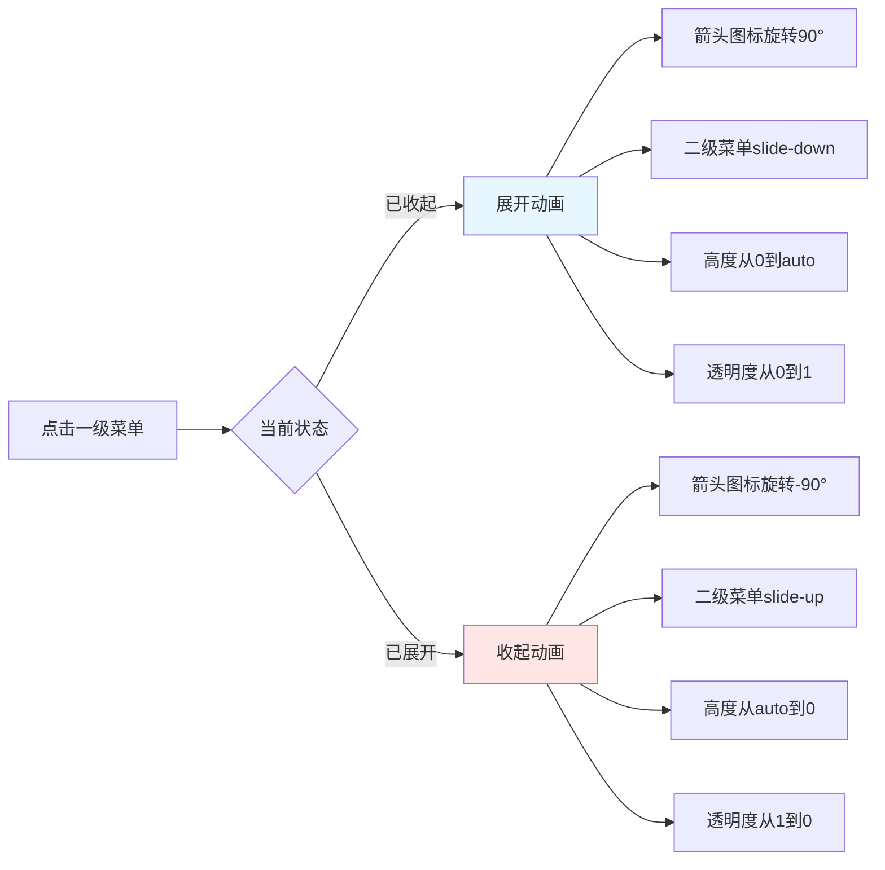

**侧边栏折叠功能:**

| 状态 | 宽度 | 显示内容 | 触发方式 | 动画时长 |
|-----|------|---------|---------|----------|
| 展开 | 200px | 图标+文字 | 点击折叠按钮 | 0.2s |
| 折叠 | 64px | 仅图标 | 点击折叠按钮/鼠标离开 | 0.2s |
| 悬浮展开 | 200px | 图标+文字 | 鼠标悬停折叠栏 | 0.2s |
**折叠按钮设计:**
- 位置: 侧边栏顶部或底部
- 图标: 展开时◀,折叠时▶
- 样式: 圆形按钮,直径32px
- 动画: hover时背景色变化
**主内容区设计:**
**布局结构:**
```
┌─────────────────────────────────────┐
│  页面标题 + 操作按钮区 │         ← 内容头部(高度56px)
├─────────────────────────────────────┤
│                        │
│                        │
│ 业务内容区             │                  ← 动态内容区域
│ (router-view)            │
│                        │
│                        │
└─────────────────────────────────────┘
```
**内容头部设计:**
| 区域 | 内容 | 样式 | 功能 |
|-----|------|------|------|
| 左侧 | 页面标题 | 字号20px,颜色#333 | 显示当前页面名称 |
| 右侧 | 操作按钮组 | 按钮间距8px | 新增、导出、设置等 |
| 底部 | 分隔线 | 1px,颜色#F0F0F0 | 分隔头部和内容 |
**响应式适配方案:**
**桌面端(≥1200px):**
```
┌────────────────────────────────────┐
│         顶部导航栏 64px              │
├────────┬───────────────────────────┤
│侧边栏  │                            │
│200px   │      主内容区              │
│展开    │                            │
└────────┴───────────────────────────┘
```
**平板端(768-1199px):**
```
┌────────────────────────────────────┐
│         顶部导航栏 64px              │
├────┬───────────────────────────────┤
│侧边│                                │
│64px│      主内容区                  │
│折叠│                                │
└────┴───────────────────────────────┘
```
- 侧边栏默认折叠为64px,仅显示图标
- 鼠标悬停时展开为200px,显示完整菜单
- 点击菜单项后自动收回折叠状态
- 三级菜单通过弹层方式在右侧显示
**移动端(<768px):**
```
┌────────────────────────────────────┐
│ [☰]  系统名称        [🔔] [👤]     │ ← 简化导航栏
├────────────────────────────────────┤
│                                    │
│                                    │
│         主内容区(全屏)             │
│                                    │
│                                    │
└────────────────────────────────────┘
```
- 侧边栏完全隐藏
- 点击汉堡菜单(☰)触发全屏抽屉式侧边栏
- 抽屉从左侧滑入,覆盖主内容区
- 背景遮罩半透明黑色,点击关闭抽屉
- 菜单展开方式改为手风琴式
**状态记忆功能:**
**LocalStorage数据结构:**

```
{
  "supplyChainNavState": {
    "sidebarCollapsed": false,              // 侧边栏折叠状态
    "expandedMenus": ["collaboration", "purchase"], // 展开的菜单key
    "activeMenu": "purchase-order",        // 当前选中菜单
    "recentMenus": [                        // 最近访问(最多10个)
      {"key": "purchase-order", "name": "采购订单", "time": 1642147200000},
      {"key": "dashboard", "name": "数据看板", "time": 1642147100000}
    ],
    "customShortcuts": [                    // 自定义快捷方式(最多5个)
      {"key": "purchase-order", "name": "采购订单", "icon": "🛒"},
      {"key": "sales-order", "name": "销售订单", "icon": "💰"}
    ],
    "theme": "light",                      // 主题模式
    "lastVisitTime": 1642147200000          // 最后访问时间
  }
}
```
**快捷访问功能:**

| 功能 | 位置 | 触发方式 | 展示内容 |
|-----|------|---------|----------|
| 最近访问 | 侧边栏顶部 | 点击"最近访问" | 最近10个访问页面 |
| 收藏夹 | 侧边栏顶部 | 点击"我的收藏" | 用户收藏的页面 |
| 快捷键 | 全局 | Ctrl+K | 唤起快捷搜索面板 |
**搜索导航功能:**
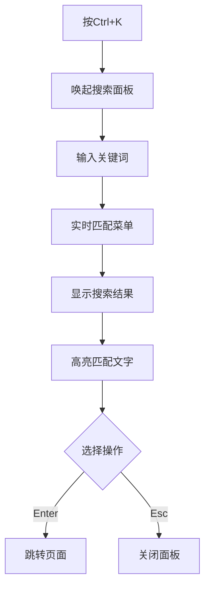
**搜索结果展示:**
- 分组显示: 按一级菜单分组
- 匹配高亮: 关键词高亮显示
- 快捷键导航: 上下箭头选择,Enter确认
- 智能排序: 访问频率+匹配度综合排序
**性能优化策略:**
| 优化项 | 实现方式 | 性能提升 |
|-------|---------|----------|
| 菜单数据 | 懒加载,按需加载子菜单 | 减少初始化加载时间 |
| 图标 | 使用IconFont或SVG | 减少HTTP请求 |
| 动画 | 使用transform而非width | 启用GPU加速 |
| 滚动 | 虚拟滚动(菜单项>50时) | 优化长列表性能 |
| 缓存 | 菜单数据本地缓存 | 减少服务器请求 |
**无障碍访问支持:**
- 键盘导航: Tab键切换焦点,Enter键激活
- ARIA标签: 为菜单项添加aria-label
- 焦点管理: 清晰的焦点指示器
- 屏幕阅读器: 支持屏幕阅读器访问
**设计要求:**
- 可折叠式侧边栏,支持展开/折叠切换
- 支持至少三级菜单层级
- 自动适配PC端与移动端
- 移动端自动折叠,支持抽屉式展开

**侧边栏状态:**

| 设备类型 | 默认状态 | 宽度 | 交互方式 |
|---------|---------|------|----------|
| PC端(≥1200px) | 展开 | 240px | 鼠标悬停展开子菜单 |
| PC端折叠后 | 折叠 | 64px | 点击图标展开弹层菜单 |
| Pad端(768-1199px) | 折叠 | 64px | 点击图标展开 |
| 移动端(<768px) | 隐藏 | 0px | 点击汉堡包抽屉式展开 |

**菜单结构设计:**

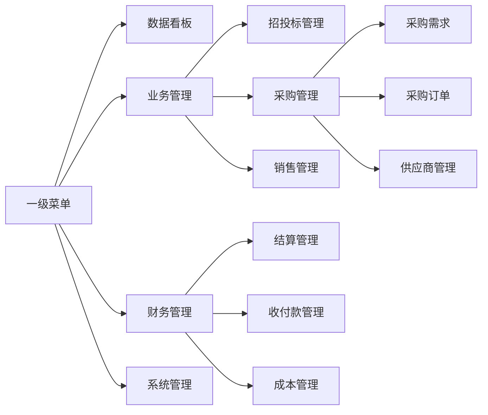

**菜单配置能力:**
- 支持动态菜单配置,后台可灵活调整
- 支持按角色配置不同菜单权限
- 支持菜单图标自定义
- 支持菜单排序、显示隐藏
- 支持快捷菜单收藏

**技术实现设计要点:**

**组件结构设计:**

主界面布局采用嵌套组件结构,包含以下核心组件:

| 组件名称 | 职责定义 | 数据来源 | 关键功能 |
|---------|---------|---------|----------|
| LayoutContainer | 整体布局容器 | 路由配置 | 管理顶部导航栏、侧边栏、主内容区布局 |
| TopNavigation | 顶部导航栏 | 用户状态、系统配置 | Logo、面包屑、搜索、消息、用户菜单 |
| SidebarMenu | 侧边菜单栏 | 菜单数据API | 菜单渲染、展开折叠、权限过滤 |
| ContentArea | 主内容区 | 路由视图 | 动态路由内容渲染 |
| MenuItem | 菜单项组件 | 父组件传递 | 单个菜单项渲染与交互 |
| MenuGroup | 菜单组组件 | 父组件传递 | 菜单分组渲染与折叠 |

**菜单数据结构设计:**

菜单数据采用树形结构,支持无限层级嵌套,典型结构包含以下字段:

| 字段名称 | 数据类型 | 必填 | 说明 | 示例值 |
|---------|---------|-----|------|--------|
| key | 字符串 | 是 | 菜单唯一标识 | "dashboard" |
| title | 字符串 | 是 | 菜单显示名称 | "数据看板" |
| icon | 字符串 | 否 | 图标标识 | "dashboard-icon" |
| path | 字符串 | 否 | 路由路径(叶子节点必填) | "/dashboard" |
| children | 数组 | 否 | 子菜单列表 | [] |
| badge | 数字 | 否 | 徽标数字 | 5 |
| hidden | 布尔 | 否 | 是否隐藏 | false |
| permission | 字符串 | 否 | 权限标识 | "dashboard:view" |
| sort | 数字 | 否 | 排序权重 | 1 |

**完整菜单数据示例:**

一级菜单"协同办公"的数据结构示例:
- key: "collaboration"
- title: "协同办公"
- icon: "collaboration-icon"
- children:
  - 二级菜单"日程管理":
    - key: "schedule"
    - title: "日程管理"
    - children:
      - 三级菜单"我的日程"(key: "my-schedule", path: "/collaboration/schedule/my")
      - 三级菜单"团队日程"(key: "team-schedule", path: "/collaboration/schedule/team")
      - 三级菜单"会议室预约"(key: "meeting-room", path: "/collaboration/schedule/meeting")
  - 二级菜单"信息发布":
    - key: "announcement"
    - title: "信息发布"
    - path: "/collaboration/announcement"
  - 二级菜单"组织人事":
    - key: "organization"
    - title: "组织人事"
    - children:
      - 三级菜单"组织架构"(path: "/collaboration/organization/structure")
      - 三级菜单"员工档案"(path: "/collaboration/organization/employee")
      - 三级菜单"考勤管理"(path: "/collaboration/organization/attendance")

**响应式处理设计:**

响应式布局采用CSS媒体查询和动态类名控制,各断点行为定义如下:

| 断点类型 | 屏幕尺寸 | 侧边栏默认状态 | 侧边栏宽度 | 侧边栏位置 | 触发方式 |
|---------|---------|---------------|-----------|-----------|----------|
| 桌面端 | ≥1200px | 展开 | 200px | 固定左侧 | 点击折叠按钮切换 |
| 桌面端折叠 | ≥1200px | 折叠 | 64px | 固定左侧 | 点击或悬停展开 |
| 平板端 | 768-1199px | 折叠 | 64px | 固定左侧 | 悬停展开为200px |
| 移动端 | <768px | 隐藏 | 240px | 抽屉浮层 | 点击汉堡菜单展开 |

**侧边栏折叠交互逻辑:**

| 交互场景 | 触发条件 | 动画效果 | 持续时间 | 状态变化 |
|---------|---------|---------|----------|----------|
| 点击折叠按钮 | 桌面端展开状态 | 宽度从200px过渡到64px,文字淡出 | 0.2s | 展开→折叠 |
| 点击展开按钮 | 桌面端折叠状态 | 宽度从64px过渡到200px,文字淡入 | 0.2s | 折叠→展开 |
| 鼠标悬停 | 平板端折叠状态 | 宽度从64px过渡到200px,弹层展开 | 0.2s | 折叠→悬浮展开 |
| 鼠标离开 | 平板端悬浮展开 | 宽度从200px过渡到64px,弹层收起 | 0.2s | 悬浮展开→折叠 |
| 点击汉堡菜单 | 移动端隐藏状态 | 抽屉从左侧滑入,遮罩淡入 | 0.3s | 隐藏→抽屉展开 |
| 点击遮罩 | 移动端抽屉展开 | 抽屉滑出,遮罩淡出 | 0.3s | 抽屉展开→隐藏 |

**移动端抽屉式侧边栏设计:**

| 元素 | 样式规范 | 交互行为 | 动画效果 |
|-----|---------|---------|----------|
| 汉堡菜单按钮 | 位置:左上角,尺寸:32x32px | 点击展开抽屉 | 图标旋转90° |
| 抽屉容器 | 宽度:240px,高度:100vh | 覆盖主内容区 | 从左侧滑入,transform: translateX |
| 背景遮罩 | 半透明黑色,opacity:0.5 | 点击关闭抽屉 | 淡入淡出,opacity过渡 |
| 关闭按钮 | 位置:抽屉右上角,尺寸:24x24px | 点击关闭抽屉 | 按钮hover放大 |
| 菜单列表 | 手风琴式展开 | 点击展开子菜单 | 高度过渡+箭头旋转 |

**菜单权限过滤设计:**

菜单渲染前需进行权限过滤,确保用户只能看到有权限的菜单项:

| 过滤步骤 | 处理逻辑 | 输入 | 输出 |
|---------|---------|------|------|
| 获取用户权限 | 从用户状态获取权限标识列表 | 用户登录信息 | 权限标识数组 |
| 递归过滤菜单 | 遍历菜单树,检查每个节点的permission字段 | 原始菜单数据+权限数组 | 过滤后菜单数据 |
| 处理空父节点 | 移除子节点全部被过滤的父节点 | 过滤后菜单数据 | 最终菜单数据 |
| 渲染菜单 | 根据过滤后数据渲染菜单组件 | 最终菜单数据 | 可见菜单UI |

**菜单状态管理设计:**

菜单状态采用状态管理库(如Pinia)统一管理,包含以下状态:

| 状态名称 | 数据类型 | 初始值 | 说明 | 持久化 |
|---------|---------|-------|------|--------|
| sidebarCollapsed | 布尔 | false | 侧边栏折叠状态 | LocalStorage |
| expandedMenus | 字符串数组 | [] | 当前展开的菜单key列表 | LocalStorage |
| activeMenu | 字符串 | "" | 当前激活的菜单key | LocalStorage |
| recentMenus | 对象数组 | [] | 最近访问的菜单列表(最多10个) | LocalStorage |
| customShortcuts | 对象数组 | [] | 用户自定义快捷方式(最多5个) | LocalStorage |
| theme | 字符串 | "light" | 主题模式(light/dark) | LocalStorage |

**菜单展开折叠逻辑设计:**

| 操作 | 当前状态 | 目标状态 | 状态变更逻辑 |
|-----|---------|---------|-------------|
| 点击已折叠菜单 | expandedMenus不包含该key | expandedMenus添加该key | 将key加入数组,触发展开动画 |
| 点击已展开菜单 | expandedMenus包含该key | expandedMenus移除该key | 将key从数组移除,触发折叠动画 |
| 点击手风琴模式菜单 | expandedMenus包含其他同级key | 替换为当前key | 移除同级key,添加当前key |
| 切换路由 | 任意状态 | 自动展开父菜单 | 根据路由path匹配菜单,展开所有父节点 |

**性能优化实现策略:**

| 优化项 | 优化技术 | 实现方式 | 性能提升效果 |
|-------|---------|---------|-------------|
| 菜单懒加载 | 按需加载 | 仅加载当前展开的子菜单数据 | 减少初始化数据量50% |
| 图标优化 | IconFont | 将所有图标打包为字体文件 | 减少HTTP请求80% |
| 动画优化 | GPU加速 | 使用transform和opacity而非width | 动画帧率提升至60FPS |
| 虚拟滚动 | 虚拟列表 | 菜单项超过50个时启用虚拟滚动 | 长列表渲染性能提升10倍 |
| 数据缓存 | 本地缓存 | 菜单数据缓存1小时,减少API请求 | 减少服务器压力90% |
| 防抖节流 | 事件优化 | 搜索输入防抖300ms,滚动事件节流100ms | 减少无效计算70% |

**无障碍访问实现:**

| 无障碍特性 | 实现方式 | 支持场景 |
|-----------|---------|----------|
| 键盘导航 | Tab键切换焦点,Enter键激活,Esc键关闭 | 无鼠标操作 |
| ARIA标签 | aria-label、aria-expanded、role属性 | 屏幕阅读器 |
| 焦点管理 | 清晰的焦点指示器,2px蓝色边框 | 键盘操作可见性 |
| 语义化标签 | nav、ul、li、button等语义化标签 | 结构清晰 |
| 颜色对比度 | 文字与背景对比度≥4.5:1 | 视障用户 |
| 快捷键支持 | Ctrl+K唤起搜索,Alt+方向键导航菜单 | 高效操作 |

#### 2.7.2 卡片式布局设计

**设计原则:**
- 采用卡片(Card)式布局,信息分组清晰
- 统一卡片阴影、圆角、间距风格
- 支持卡片折叠/展开,节省屏幕空间
- 关键信息置顶,次要信息可折叠

**状态标识设计:**

| 业务状态 | 颜色 | 场景 |
|---------|------|------|
| 待处理/草稿 | 灰色 | 订单草稿、待提交 |
| 审批中/处理中 | 蓝色 | 审批流转中、处理中 |
| 已完成/成功 | 绿色 | 审批通过、业务完成 |
| 警告/待办 | 橙色 | 即将逾期、待处理事项 |
| 异常/失败 | 红色 | 审批驳回、业务异常 |

#### 2.7.3 移动端适配设计

**移动端优化策略:**

| 优化类型 | 优化措施 | 目标 |
|---------|---------|------|
| 布局优化 | 单列布局,卡片堆叠,自适应宽度 | 提升阅读性 |
| 交互优化 | 放大点击区域(44x44px),触摸反馈 | 提升可点击性 |
| 表单优化 | 简化表单字段,分步填写,调用原生组件 | 降低填写难度 |
| 表格优化 | 卡片列表替代表格,核心信息置顶 | 提升浏览效率 |
| 图表优化 | 简化图表类型,支持手势交互 | 提升数据可视化 |
| 性能优化 | 图片懒加载,分页加载,缓存策略 | 提升加载速度 |

**移动端特有功能:**
- 二维码扫描: 快速访问业务详情、签收确认
- GPS定位: 考勤打卡、外勤签到、物流跟踪
- 语音输入: 支持语音转文字填写表单
- 离线缓存: 关键数据本地缓存,支持离线查看
- 消息推送: 待办事项、业务预警实时推送

### 2.8 环境配置与部署设计

#### 2.8.1 开发环境规范

**目标环境定义:**

本系统开发环境基于Windows 25H2操作系统构建,所有组件版本严格遵循技术栈规范,确保开发、测试、生产环境的一致性与兼容性。

**环境组件版本基线:**

| 组件类别 | 组件名称 | 最低版本要求 | 推荐版本 | 用途说明 |
|---------|---------|------------|---------|----------|
| 前端运行时 | Node.js | 22.x系列 | 22.11.0 | 前端开发环境运行时 |
| 前端包管理 | npm | 10.x系列 | 10.9.0 | 前端依赖包管理工具 |
| 后端运行时 | JDK | 25.x版本 | 25.0.1 | Java应用运行环境 |
| 后端构建工具 | Maven | 3.9.x版本 | 3.9.9 | Java项目构建与依赖管理 |
| 容器化 | Docker | 25.x系列 | 25.0.2 | 容器化部署基础设施 |
| 容器编排工具 | Docker Compose | 2.x系列 | 2.30.0 | 多容器编排管理 |
| 关系型数据库 | MySQL | 8.4.x系列 | 8.4.3 | 主数据库存储 |
| 缓存数据库 | Redis | 8.x系列 | 8.0.1 | 分布式缓存与会话存储 |
| 服务注册中心 | Nacos | 2.x系列 | 2.4.3 | 服务注册发现与配置中心 |
| 消息队列 | RabbitMQ | 4.x版本 | 4.0.4 | 消息中间件 |
| 前端构建工具 | Vite | 7.x系列 | 7.0.0 | 前端开发服务器与构建工具 |

**版本兼容性矩阵:**

| 组件组合 | 依赖关系 | 兼容性要求 | 验证要点 |
|---------|---------|-----------|----------|
| Node.js 22.x + npm 10.x | npm内置于Node.js | 默认兼容 | npm版本号检查 |
| JDK 25.x + Maven 3.9.x | Maven支持JDK 8+ | 完全兼容 | Maven编译测试 |
| Docker 25.x + Docker Compose 2.x | Docker Compose依赖Docker | 官方配对版本 | 容器编排测试 |
| Spring Boot 3.x + JDK 25.x | Spring Boot要求JDK 17+ | 完全支持 | 应用启动测试 |
| Vite 7.x + Node.js 22.x | Vite要求Node.js 18+ | 完全支持 | 开发服务器启动测试 |

#### 2.8.2 环境检查与验证机制

**环境扫描设计:**

环境检查系统采用分层扫描策略,按照组件类别、依赖关系顺序执行检查流程。

**检查流程设计:**

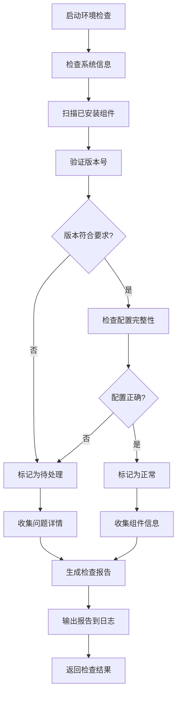

**检查项目清单:**

| 检查类别 | 检查项 | 检查方法 | 判定标准 | 失败处理 |
|---------|-------|---------|---------|----------|
| 系统环境 | 操作系统版本 | 读取系统注册表 | Windows 10/11/Server | 警告提示 |
| 系统环境 | 系统位数 | 查询系统架构 | x64架构 | 错误终止 |
| 系统环境 | 磁盘空间 | 检查剩余空间 | 至少20GB可用 | 警告提示 |
| 运行时环境 | Node.js安装 | 执行node --version | 返回版本号 | 标记缺失 |
| 运行时环境 | Node.js版本 | 解析版本号 | >=22.0.0且<23.0.0 | 标记版本不符 |
| 运行时环境 | JDK安装 | 执行java --version | 返回版本号 | 标记缺失 |
| 运行时环境 | JDK版本 | 解析版本号 | >=25.0.0且<26.0.0 | 标记版本不符 |
| 环境变量 | JAVA_HOME | 读取环境变量 | 指向JDK安装目录 | 标记配置错误 |
| 环境变量 | PATH | 检查路径包含 | 包含Node.js、JDK、Maven路径 | 标记配置错误 |
| 容器环境 | Docker服务 | 检查服务状态 | 服务运行中 | 标记服务未启动 |
| 容器环境 | Docker版本 | 执行docker --version | >=25.0.0且<26.0.0 | 标记版本不符 |
| 数据库 | MySQL服务 | 检查端口监听 | 3306端口可访问 | 标记服务未启动 |
| 数据库 | MySQL连接 | 测试数据库连接 | 连接成功 | 标记连接失败 |
| 中间件 | Redis服务 | 检查端口监听 | 6379端口可访问 | 标记服务未启动 |
| 中间件 | Nacos服务 | 检查HTTP端口 | 8848端口可访问 | 标记服务未启动 |
| 中间件 | RabbitMQ服务 | 检查端口监听 | 5672端口可访问 | 标记服务未启动 |

**环境检查报告结构:**

检查报告采用结构化JSON格式,包含以下信息层级:

```
检查报告根对象
├─ 报告元数据
│  ├─ 检查时间戳
│  ├─ 检查执行人
│  ├─ 报告版本号
│  └─ 执行耗时
├─ 系统环境信息
│  ├─ 操作系统类型与版本
│  ├─ 系统架构
│  ├─ 计算机名称
│  ├─ 处理器信息
│  ├─ 内存总量
│  └─ 磁盘空间
├─ 组件检查结果
│  ├─ 组件名称
│  ├─ 期望版本
│  ├─ 实际版本
│  ├─ 安装路径
│  ├─ 配置状态
│  ├─ 检查状态(正常/版本不符/缺失/配置错误)
│  └─ 问题描述
├─ 版本兼容性分析
│  ├─ 兼容性问题列表
│  ├─ 冲突组件组合
│  └─ 解决建议
└─ 总体评估
   ├─ 合规率百分比
   ├─ 严重问题数量
   ├─ 警告问题数量
   └─ 整体状态(通过/部分通过/不通过)
```

**潜在冲突分析规则:**

| 冲突类型 | 检测条件 | 风险等级 | 处理建议 |
|---------|---------|---------|----------|
| 版本过低 | 实际版本<最低版本 | 高 | 必须升级至最低版本以上 |
| 版本过高 | 实际版本>=下一个主版本 | 中 | 建议降级至兼容版本 |
| 多版本共存 | 同一组件检测到多个版本 | 高 | 卸载旧版本,保留符合要求的版本 |
| 环境变量冲突 | PATH中存在多个相同组件路径 | 中 | 清理环境变量,保留正确路径 |
| 端口占用 | 所需端口被其他进程占用 | 高 | 停止占用进程或修改服务端口 |
| 依赖缺失 | 组件依赖的前置组件未安装 | 高 | 先安装依赖组件 |

#### 2.8.3 组件安装与升级策略

**安装策略设计:**

组件安装采用优先级分级策略,按照依赖关系自底向上依次安装。

**安装优先级定义:**

| 优先级 | 组件列表 | 安装顺序 | 原因说明 |
|-------|---------|---------|----------|
| P0 | JDK、Node.js | 1-2 | 基础运行时环境,所有其他组件的前置依赖 |
| P1 | Maven、npm | 3-4 | 构建工具,依赖运行时环境 |
| P2 | Docker、Docker Compose | 5-6 | 容器化基础设施,独立于业务组件 |
| P3 | MySQL、Redis、RabbitMQ | 7-9 | 数据存储与消息中间件,可并行安装 |
| P4 | Nacos | 10 | 服务注册中心,依赖JDK |
| P5 | Vite | 11 | 前端构建工具,依赖Node.js和npm |

**版本升级路径设计:**

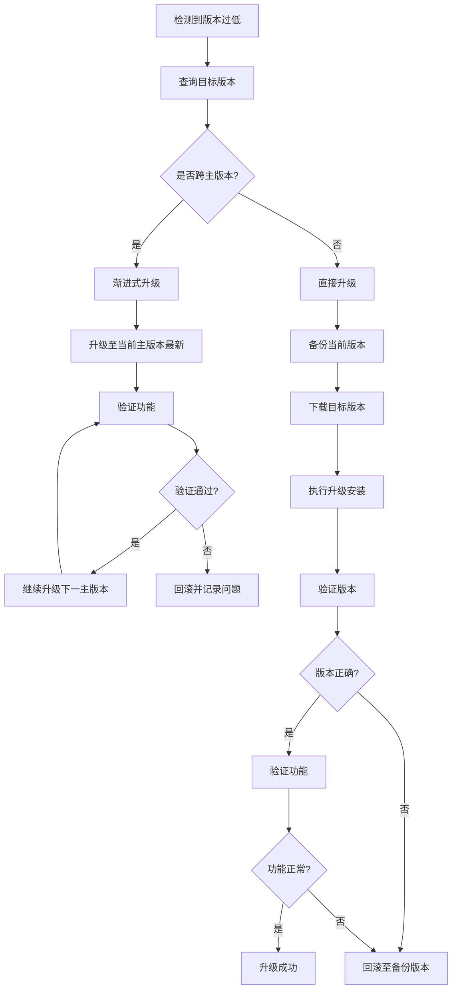

**安全卸载流程设计:**

| 卸载阶段 | 执行步骤 | 检查点 | 回退方案 |
|---------|---------|-------|----------|
| 准备阶段 | 记录组件安装信息 | 安装路径、版本号、配置文件 | 无 |
| 准备阶段 | 检查依赖组件 | 是否有其他组件依赖 | 提示用户确认 |
| 备份阶段 | 导出配置文件 | 配置文件完整性 | 无 |
| 备份阶段 | 备份数据目录 | 数据完整性校验 | 无 |
| 卸载阶段 | 停止相关服务 | 服务已停止 | 强制停止 |
| 卸载阶段 | 执行卸载程序 | 卸载程序返回码 | 手动清理残留 |
| 清理阶段 | 删除安装目录 | 目录已删除 | 手动删除 |
| 清理阶段 | 清理环境变量 | 环境变量已移除 | 手动编辑 |
| 清理阶段 | 清理注册表项 | 注册表项已删除 | 手动删除 |
| 验证阶段 | 检查残留文件 | 无残留文件 | 记录残留位置 |
| 验证阶段 | 检查残留进程 | 无相关进程 | 结束进程 |

**自动化安装程序设计:**

安装程序采用静默安装模式,应用预定义配置参数,减少人工干预。

| 组件 | 安装方式 | 静默安装参数 | 配置要点 |
|-----|---------|------------|----------|
| Node.js | MSI安装包 | /quiet /norestart | 自动添加到PATH |
| JDK | EXE安装包 | /s INSTALLDIR="路径" | 设置JAVA_HOME |
| Maven | ZIP解压 | 无需安装 | 配置M2_HOME和PATH |
| Docker Desktop | EXE安装包 | install --quiet | 启用Hyper-V |
| MySQL | MSI安装包 | /quiet INSTALLDIR="路径" | 配置root密码、端口 |
| Redis | MSI安装包 | /quiet | 配置为Windows服务 |
| Nacos | ZIP解压 | 无需安装 | 配置standalone模式 |
| RabbitMQ | EXE安装包 | /S | 启用管理插件 |

**环境变量配置规范:**

| 变量名 | 变量值 | 作用域 | 配置时机 |
|-------|-------|-------|----------|
| JAVA_HOME | JDK安装路径 | 系统变量 | JDK安装后 |
| M2_HOME | Maven解压路径 | 系统变量 | Maven配置后 |
| NODE_HOME | Node.js安装路径 | 系统变量 | Node.js安装后 |
| PATH | %JAVA_HOME%\bin | 系统变量 | JDK安装后 |
| PATH | %M2_HOME%\bin | 系统变量 | Maven配置后 |
| PATH | %NODE_HOME% | 系统变量 | Node.js安装后 |
| MAVEN_OPTS | -Xms256m -Xmx1024m | 系统变量 | Maven配置后 |

**依赖程序安装清单:**

| 依赖类别 | 依赖项 | 安装方式 | 用途 |
|---------|-------|---------|------|
| 前端依赖 | Vue 3.x | npm install | 前端框架 |
| 前端依赖 | TypeScript 5.x | npm install | 类型系统 |
| 前端依赖 | Ant Design Vue 4.x | npm install | UI组件库 |
| 前端依赖 | Pinia 3.x | npm install | 状态管理 |
| 前端依赖 | Axios 1.x | npm install | HTTP客户端 |
| 后端依赖 | Spring Boot 3.x | Maven依赖 | 微服务框架 |
| 后端依赖 | Spring Cloud 2023.x | Maven依赖 | 微服务体系 |
| 后端依赖 | MyBatis Plus 3.x | Maven依赖 | ORM框架 |
| 后端依赖 | Nacos Client 2.x | Maven依赖 | 服务注册客户端 |
| 后端依赖 | Sentinel 1.x | Maven依赖 | 流量控制 |

#### 2.8.4 配置文件生成与管理

**Docker Compose配置设计:**

Docker Compose配置文件定义系统所需的所有中间件和微服务容器,实现一键启动整体环境。

**服务定义清单:**

| 服务名称 | 镜像源 | 端口映射 | 数据卷 | 依赖服务 | 内存限制 |
|---------|-------|---------|-------|----------|----------|
| mysql | mysql:8.4 | 3306:3306 | /var/lib/mysql | 无 | 2GB |
| redis | redis:8-alpine | 6379:6379 | /data | 无 | 512MB |
| nacos | nacos/nacos-server:v2.4.3 | 8848:8848 | /home/nacos/data | mysql | 1GB |
| rabbitmq | rabbitmq:4-management | 5672:5672, 15672:15672 | /var/lib/rabbitmq | 无 | 1GB |
| elasticsearch | elasticsearch:9.0.0 | 9200:9200 | /usr/share/elasticsearch/data | 无 | 2GB |
| mongodb | mongo:8 | 27017:27017 | /data/db | 无 | 1GB |
| prometheus | prom/prometheus:v3.0.0 | 9090:9090 | /prometheus | 无 | 512MB |
| grafana | grafana/grafana:12.0.0 | 3000:3000 | /var/lib/grafana | prometheus | 512MB |

**环境变量注入设计:**

| 服务 | 环境变量 | 变量值 | 用途 |
|-----|---------|-------|------|
| mysql | MYSQL_ROOT_PASSWORD | oascm@2025 | 数据库root密码 |
| mysql | MYSQL_DATABASE | oascm | 默认数据库名 |
| mysql | TZ | Asia/Shanghai | 时区设置 |
| redis | REDIS_PASSWORD | oascm@redis2025 | Redis访问密码 |
| nacos | MODE | standalone | 运行模式 |
| nacos | SPRING_DATASOURCE_PLATFORM | mysql | 数据源类型 |
| nacos | MYSQL_SERVICE_HOST | mysql | MySQL主机 |
| nacos | MYSQL_SERVICE_DB_NAME | nacos | Nacos数据库 |
| rabbitmq | RABBITMQ_DEFAULT_USER | oascm | 管理员用户名 |
| rabbitmq | RABBITMQ_DEFAULT_PASS | oascm@rabbitmq2025 | 管理员密码 |
| elasticsearch | discovery.type | single-node | 单节点模式 |
| elasticsearch | ES_JAVA_OPTS | -Xms1g -Xmx1g | JVM内存配置 |

**服务依赖关系设计:**

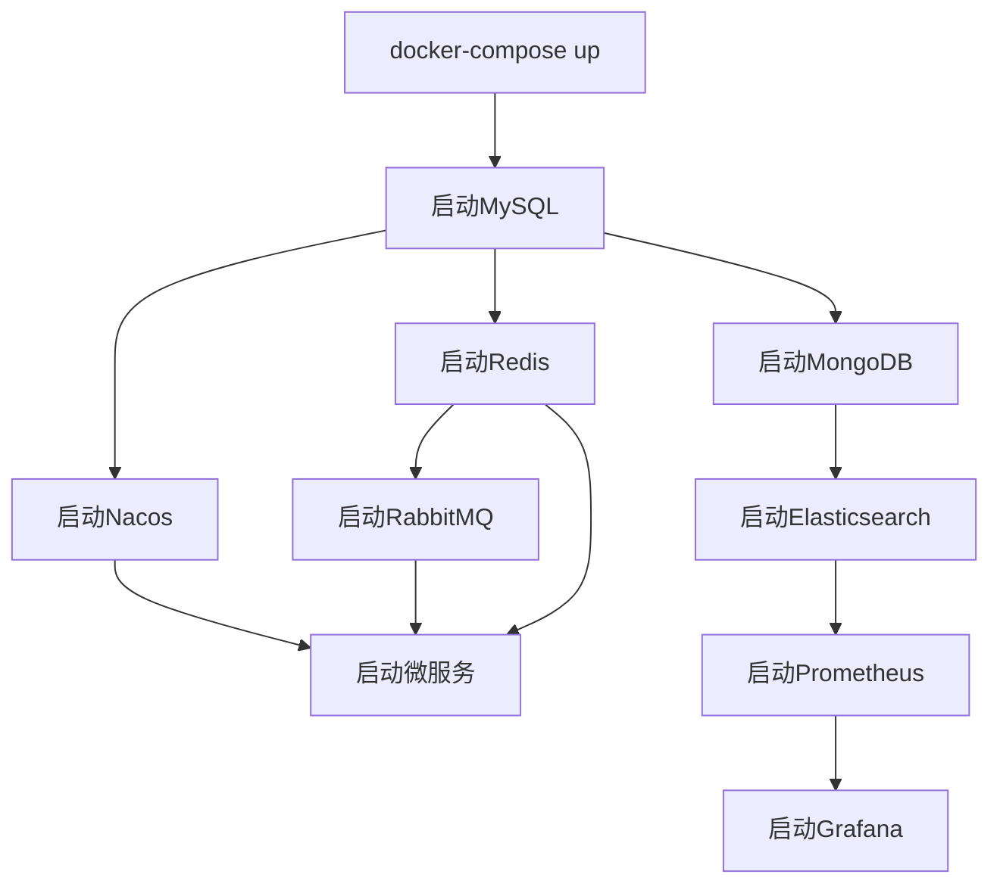

**数据卷持久化策略:**

| 服务 | 数据卷类型 | 主机路径 | 容器路径 | 持久化目的 |
|-----|----------|---------|---------|------------|
| mysql | named volume | mysql_data | /var/lib/mysql | 数据库文件 |
| mysql | bind mount | ./mysql/conf | /etc/mysql/conf.d | 配置文件 |
| mysql | bind mount | ./mysql/init | /docker-entrypoint-initdb.d | 初始化SQL |
| redis | named volume | redis_data | /data | RDB/AOF文件 |
| nacos | named volume | nacos_data | /home/nacos/data | 配置数据 |
| nacos | bind mount | ./nacos/logs | /home/nacos/logs | 日志文件 |
| rabbitmq | named volume | rabbitmq_data | /var/lib/rabbitmq | 消息数据 |
| elasticsearch | named volume | es_data | /usr/share/elasticsearch/data | 索引数据 |
| mongodb | named volume | mongo_data | /data/db | 文档数据 |
| prometheus | bind mount | ./prometheus/config | /etc/prometheus | 配置文件 |
| prometheus | named volume | prometheus_data | /prometheus | 监控数据 |
| grafana | named volume | grafana_data | /var/lib/grafana | Dashboard配置 |

**Kubernetes部署文件设计:**

Kubernetes部署文件集包含Deployment、Service、ConfigMap、Secret等多种资源类型,实现生产环境的高可用部署。

**Deployment配置要点:**

| 配置项 | 配置值 | 说明 |
|-------|-------|------|
| 副本数 | 2-3个 | 每个微服务至少2个实例 |
| 资源限制 | CPU: 500m-2000m, Memory: 512Mi-2Gi | 根据服务类型设定 |
| 健康检查 | livenessProbe + readinessProbe | HTTP探针,初始延迟30s |
| 更新策略 | RollingUpdate | 滚动更新,最多不可用25% |
| 重启策略 | Always | 容器异常退出自动重启 |
| 镜像拉取策略 | IfNotPresent | 本地不存在才拉取 |

**Service配置要点:**

| 服务类型 | 使用场景 | 端口设计 | 负载均衡 |
|---------|---------|---------|----------|
| ClusterIP | 内部微服务 | targetPort与containerPort一致 | 轮询 |
| NodePort | 外部访问入口 | nodePort: 30000-32767 | 轮询 |
| LoadBalancer | 生产环境对外服务 | 云厂商提供 | 动态 |

**ConfigMap配置管理:**

| ConfigMap名称 | 存储内容 | 挂载方式 | 使用服务 |
|------------|---------|---------|----------|
| mysql-config | MySQL配置文件 | 文件挂载 | MySQL Pod |
| redis-config | Redis配置文件 | 文件挂载 | Redis Pod |
| nacos-config | Nacos启动参数 | 环境变量 | Nacos Pod |
| application-config | 微服务通用配置 | 环境变量 | 所有微服务 |
| logging-config | 日志配置 | 文件挂载 | 所有微服务 |

**Secret敏感信息管理:**

| Secret名称 | 存储内容 | 编码方式 | 使用方式 |
|----------|---------|---------|----------|
| mysql-secret | 数据库密码 | Base64 | 环境变量注入 |
| redis-secret | Redis密码 | Base64 | 环境变量注入 |
| jwt-secret | JWT签名密钥 | Base64 | 文件挂载 |
| registry-secret | 镜像仓库凭证 | Docker Config JSON | imagePullSecrets |

**环境变量配置文件设计:**

系统提供三种环境配置文件,对应不同部署环境。

**配置文件结构:**

| 环境 | 文件名 | 配置项类别 | 配置内容 |
|-----|-------|----------|----------|
| 开发 | .env.development | 后端服务地址 | http://localhost:8080 |
| 开发 | .env.development | 数据库连接 | localhost:3306 |
| 开发 | .env.development | Redis连接 | localhost:6379 |
| 开发 | .env.development | 日志级别 | DEBUG |
| 测试 | .env.test | 后端服务地址 | http://test-api.oascm.com |
| 测试 | .env.test | 数据库连接 | test-db.oascm.com:3306 |
| 测试 | .env.test | 日志级别 | INFO |
| 生产 | .env.production | 后端服务地址 | https://api.oascm.com |
| 生产 | .env.production | 数据库连接 | prod-db.oascm.com:3306 |
| 生产 | .env.production | 日志级别 | WARN |

**项目依赖配置文件:**

| 文件类型 | 文件名 | 依赖定义 | 版本锁定 |
|---------|-------|---------|----------|
| 前端 | package.json | 直接依赖列表 | 精确版本号 |
| 前端 | package-lock.json | 完整依赖树 | SHA校验值 |
| 后端 | pom.xml | Maven依赖坐标 | 版本号锁定 |
| 后端 | pom.xml | 依赖管理 | dependencyManagement |

#### 2.8.5 一键部署脚本设计

**脚本功能架构:**

一键部署脚本包含环境安装脚本和系统部署脚本两部分,实现从环境准备到系统运行的自动化流程。

**环境安装脚本设计:**

脚本名称: install-oascm-env.bat

| 功能模块 | 实现机制 | 关键特性 |
|---------|---------|----------|
| 参数解析 | 支持命令行参数 | --help, --skip-check, --force-reinstall |
| 权限检查 | 检测管理员权限 | 未提权时自动请求UAC |
| 断点续装 | 读取进度状态文件 | progress.json记录已完成步骤 |
| 错误回滚 | 备份原有组件 | 失败时恢复备份 |
| 日志记录 | 写入日志文件 | logs/install-YYYYMMDD-HHMMSS.log |
| 进度显示 | 控制台输出 | 进度条+百分比+当前步骤描述 |
| 错误处理 | 捕捉异常 | 显示友好错误信息+解决建议 |

**安装脚本执行流程:**

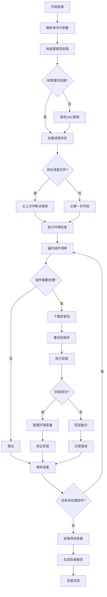
**系统部署脚本设计:**

脚本名称: deploy-oascm-system.bat

| 功能模块 | 实现机制 | 关键特性 |
|---------|---------|----------|
| 部署模式选择 | 命令行参数 | --mode=docker/kubernetes |
| 环境验证 | 执行检查脚本 | 验证所有组件就绪 |
| Docker部署 | docker-compose命令 | docker-compose up -d |
| Kubernetes部署 | kubectl命令 | kubectl apply -f k8s/ |
| 服务状态检查 | 轮询检测 | 检查容器/Pod运行状态 |
| 健康检查 | HTTP请求 | 访问/actuator/health端点 |
| 部署结果反馈 | 控制台输出 | 显示所有服务状态 |

**部署脚本执行流程:**

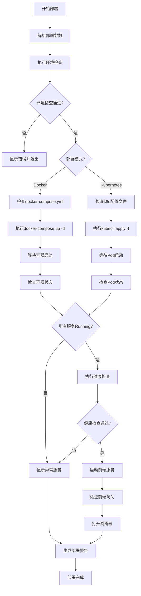
#### 2.8.6 环境验证与系统启动

**部署后验证流程:**
| 验证阶段 | 验证项 | 验证方法 | 成功标准 |
|---------|-------|---------|----------|
| 容器层验证 | 容器运行状态 | docker ps / kubectl get pods | 状态Running/Ready |
| 容器层验证 | 容器日志 | docker logs / kubectl logs | 无Error日志 |
| 网络层验证 | 端口监听 | netstat -ano / ss -tlnp | 端口处于LISTEN状态 |
| 网络层验证 | 网络连通性 | telnet / nc | 连接成功 |
| 应用层验证 | 健康检查端点 | curl http://host:port/actuator/health | {"status":"UP"} |
| 应用层验证 | 服务注册 | Nacos控制台 | 服务列表显示 |
| 数据层验证 | 数据库连接 | mysql -h host -u user -p | 连接成功 |
| 数据层验证 | 缓存可用性 | redis-cli ping | PONG |
| 业务层验证 | 登录功能 | POST /api/auth/login | 返回token |
| 业务层验证 | API接口 | GET /api/test | 返回200 |
| 前端层验证 | 页面加载 | http://localhost:3000 | 页面正常显示 |
| 前端层验证 | 登录界面 | 检查UI元素 | 登录表单显示 |
**前端开发服务器启动流程:**


**前端服务器配置要点:**

| 配置项 | 配置值 | 说明 |
|-------|-------|------|
| 监听端口 | 3000 | 开发服务器端口 |
| 监听主机 | 0.0.0.0 | 允许外部访问 |
| 自动打开浏览器 | true | 启动后自动打开 |
| 热更新 | true | 文件修改后自动刷新 |
| Proxy代理 | /api -> http://localhost:8080 | API请求代理 |
| HTTPS | false | 开发环境使用HTTP |

**浏览器启动验证:**

| 验证项 | 验证方法 | 期望结果 |
|-------|---------|----------|
| 页面加载 | 访问http://localhost:3000 | 页面正常渲染 |
| 登录界面 | 检查页面元素 | 显示登录表单 |
| API连接 | 检查控制台网络请求 | 无连接错误 |
| 资源加载 | 检查Network面板 | 所有资源200状态 |
| 控制台错误 | 查看Console面板 | 无错误信息 |
#### 2.8.7 安全与日志管理
**安全最佳实践:**
| 安全项 | 实施措施 | 防护目标 |
|-------|---------|----------|
| 权限最小化 | 仅在必要时请求管理员权限 | 减少权限滥用风险 |
| 密码安全 | 数据库密码使用强密码 | 防止暴力破解 |
| 端口防护 | 仅对外开放必要端口 | 减少攻击面 |
| 数据加密 | 敏感配置加密存储 | 保护敏感信息 |
| 防火墙规则 | 配置Windows防火墙允许规则 | 防止未经授权访问 |
| SSL/TLS | 生产环境强制HTTPS | 数据传输加密 |
| 备份机制 | 定时备份数据库和配置 | 灾难恢复 |
**日志记录策略:**
| 日志类型 | 日志级别 | 记录内容 | 存储位置 |
|---------|---------|---------|----------|
| 安装日志 | INFO/ERROR | 安装步骤、耗时、结果 | logs/install-*.log |
| 部署日志 | INFO/ERROR | 部署过程、服务状态 | logs/deploy-*.log |
| 检查日志 | DEBUG/INFO | 检查项、检查结果 | logs/check-*.log |
| 错误日志 | ERROR/FATAL | 异常堆栈、错误原因 | logs/error-*.log |
| 系统日志 | INFO | 系统事件、操作记录 | logs/system-*.log |
**日志文件格式:**

每条日志包含以下信息:
- 时间戳: YYYY-MM-DD HH:mm:ss.SSS
- 日志级别: DEBUG/INFO/WARN/ERROR/FATAL
- 模块名称: 执行日志的脚本模块
- 日志内容: 详细描述
- 附加信息: 用户名、计算机名等

**错误处理机制:**

| 错误类型 | 处理策略 | 用户提示 | 日志记录 |
|---------|---------|---------|----------|
| 网络错误 | 重试3次,失败后提示 | "网络连接失败,请检查网络" | ERROR级别 |
| 权限错误 | 请求提权 | "需要管理员权限" | WARN级别 |
| 文件错误 | 检查文件是否存在 | "文件不存在:xxx" | ERROR级别 |
| 配置错误 | 显示错误配置项 | "配置项xxx无效" | ERROR级别 |
| 依赖错误 | 提示缺失的依赖 | "缺少依赖:xxx" | ERROR级别 |
| 系统错误 | 记录完整堆栈 | "系统错误,请查看日志" | FATAL级别 |

**问题排查支持:**

| 排查场景 | 日志位置 | 检索关键词 | 常见问题 |
|---------|---------|-----------|----------|
| 安装失败 | logs/install-*.log | "ERROR", "FAILED" | 权限不足、网络不通 |
| 部署失败 | logs/deploy-*.log | "ERROR", "FAILED" | 端口占用、配置错误 |
| 服务异常 | logs/system-*.log | "Exception", "ERROR" | 连接超时、内存溢出 |
| 性能问题 | logs/system-*.log | "SLOW", "TIMEOUT" | 数据库慢查询、缓存未命中 |

#### 2.8.8 组件版本管理与自动升级

**版本基线检查机制:**

| 检查频率 | 执行时机 | 检查范围 | 输出报告 |
|---------|---------|---------|----------|
| 每月一次 | 每月第一个周一上午8点 | 所有指定组件 | reports/version-check-YYYYMM.json |
| 手动触发 | 执行检查脚本 | 所有指定组件 | reports/version-check-manual.json |
| 部署前检查 | 部署脚本启动时 | 所有指定组件 | 控制台输出 |

**自动升级策略:**

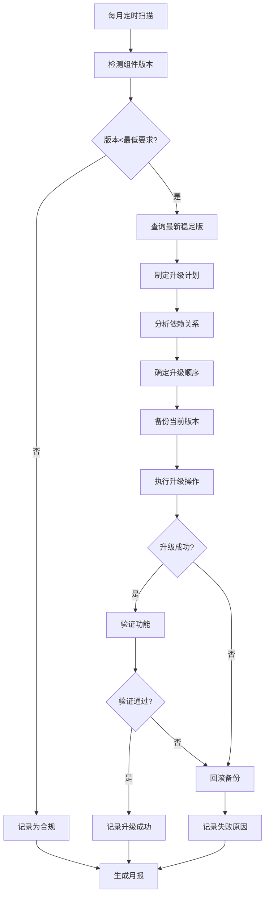

**升级计划内容:**

| 计划项 | 内容 | 输出产物 |
|-------|------|----------|
| 组件依赖分析 | 分析待升级组件的依赖关系 | 依赖关系图 |
| 升级顺序确定 | 按照依赖关系排序升级顺序 | 升级顺序表 |
| 回滚机制设计 | 定义升级失败的回滚方案 | 回滚操作流程 |
| 验证步骤设计 | 定义升级后的验证测试用例 | 验证测试清单 |

**升级日志记录:**

| 日志字段 | 字段内容 | 用途 |
|---------|---------|------|
| 升级时间 | 2025-02-01 10:00:00 | 升级开始时间 |
| 组件名称 | Node.js | 待升级的组件 |
| 原始版本 | 22.11.0 | 升级前的版本 |
| 目标版本 | 22.12.0 | 升级后的版本 |
| 升级方式 | 直接升级/渐进升级 | 升级策略 |
| 升级耗时 | 120s | 升级执行时间 |
| 升级结果 | 成功/失败 | 执行结果 |
| 异常信息 | 错误堆栈 | 失败时的错误信息 |
| 处理措施 | 回滚备份 | 失败后的处理动作 |

**升级后监控机制:**

| 监控项 | 监控周期 | 监控指标 | 告警阈值 |
|-------|---------|---------|----------|
| 服务可用性 | 实时 | 健康检查接口 | 失败超过3次 |
| 服务响应时间 | 每分钟 | API响应时间 | >500ms |
| 错误率 | 每5分钟 | 错误日志数量 | >10条/分钟 |
| CPU使用率 | 每分钟 | 系统 CPU | >80% |
| 内存使用率 | 每分钟 | 系统内存 | >85% |
| 服务重启次数 | 实时 | 容器重启事件 | >3次/小时 |

**月度版本状态报告:**

| 报告章节 | 内容 |
|---------|------|
| 执行摘要 | 检查时间、组件数量、总体合规率 |
| 合规状况 | 每个组件的合规状态（合规/不合规） |
| 升级记录 | 当月执行的升级操作列表 |
| 问题分析 | 发现的问题及影响评估 |
| 风险评估 | 潜在的安全风险和兼容性风险 |
| 改进建议 | 下月需要关注的事项 |

### 2.9 项目管理与规范化设计

#### 2.9.1 项目文件结构规范

**设计目标:**

建立清晰、规范、可维护的项目文件组织体系,实现文档资源的有序管理与高效检索,降低项目管理成本,提升团队协作效率。

**标准化目录结构:**

项目根目录按照文件类型与业务功能划分为五大核心目录,各目录职责明确,层级清晰:

```
OASCM项目根目录
├── docs                          项目文档中心
├── scripts                       脚本执行中心
├── sql                          数据库管理中心
├── src                          源代码中心
└── config                       配置文件中心
```

**docs目录详细规范:**

文档目录按照功能维度划分为八大文档类别,每类文档聚焦特定业务场景:

| 文档类别 | 目录路径 | 核心文档清单 | 使用场景 |
|---------|---------|------------|----------|
| 环境配置类 | docs/环境配置类 | 环境检查脚本.md<br>系统依赖安装指南.md<br>开发环境配置说明.md | 环境搭建、问题排查 |
| 部署指南类 | docs/部署指南类 | Docker容器化部署指南.md<br>Kubernetes集群部署指南.md<br>生产环境部署检查清单.md | 系统部署、运维管理 |
| 启动脚本类 | docs/启动脚本类 | 前端开发服务器启动指南.md<br>后端服务启动指南.md<br>一键部署脚本使用说明.md | 服务启动、操作指导 |
| 系统状态报告类 | docs/系统状态报告类 | 环境初始化报告模板.md<br>部署完成验证报告.md | 状态跟踪、质量验收 |
| 性能优化类 | docs/性能优化类 | 数据库索引优化指南.md<br>系统缓存配置说明.md<br>前端性能优化建议.md | 性能调优、系统优化 |
| 监控配置类 | docs/监控配置类 | Prometheus监控配置.md<br>Grafana仪表板配置指南.md<br>系统告警规则说明.md | 监控部署、告警配置 |
| 开发文档类 | docs/开发文档类 | API接口文档.md<br>代码规范指南.md<br>模块开发说明.md | 开发协作、接口对接 |
| 操作指南类 | docs/操作指南类 | 系统使用手册.md<br>故障排查指南.md<br>日常维护操作手册.md | 用户培训、运维支持 |

**scripts目录详细规范:**

脚本目录按照执行阶段与功能职责划分为四大脚本类别:

| 脚本类别 | 目录路径 | 核心脚本清单 | 执行时机 |
|---------|---------|------------|----------|
| 环境配置脚本 | scripts/环境配置脚本 | 环境检查.ps1<br>依赖安装.ps1<br>系统初始化.sh | 环境搭建阶段 |
| 部署脚本 | scripts/部署脚本 | Docker构建部署.ps1<br>Kubernetes部署.sh<br>生产环境发布.ps1 | 系统部署阶段 |
| 启动脚本 | scripts/启动脚本 | 启动前端服务.ps1<br>启动后端服务.ps1<br>一键启动所有服务.ps1 | 服务启动阶段 |
| 系统维护脚本 | scripts/系统维护脚本 | 数据库备份.ps1<br>日志清理.sh<br>系统健康检查.ps1 | 运维维护阶段 |

**sql目录详细规范:**

数据库文件目录按照数据库生命周期阶段划分为三大类别:

| SQL文件类别 | 目录路径 | 核心文件清单 | 执行顺序 |
|-----------|---------|------------|----------|
| 数据库初始化脚本 | sql/数据库初始化脚本 | 创建数据库结构.sql<br>初始化基础数据.sql<br>创建索引和约束.sql | 优先级P0 |
| 数据迁移脚本 | sql/数据迁移脚本 | 版本升级迁移.sql<br>数据转换脚本.sql | 优先级P1 |
| 存储过程和函数 | sql/存储过程和函数 | 业务存储过程.sql<br>系统函数.sql | 优先级P2 |

**src目录详细规范:**

源代码目录按照前后端分离原则划分:

| 代码模块 | 目录路径 | 核心配置 | 说明 |
|---------|---------|---------|------|
| 前端代码 | src/frontend | vite.config.ts端口配置为3000 | Vue 3 + TypeScript前端工程 |
| 后端代码 | src/backend | application.yml端口配置为5000 | Spring Boot微服务工程 |

**config目录详细规范:**

配置文件目录按照配置类型划分:

| 配置类别 | 目录路径 | 典型配置文件 | 环境区分 |
|---------|---------|------------|----------|
| 应用配置文件 | config/应用配置文件 | application-dev.yml<br>application-test.yml<br>application-prod.yml | 按环境隔离 |
| 监控配置文件 | config/监控配置文件 | prometheus.yml<br>grafana-dashboard.json | 统一配置 |
| 部署配置文件 | config/部署配置文件 | docker-compose.yml<br>kubernetes-deployment.yml | 按部署方式区分 |

**目录层级控制原则:**

| 控制项 | 规范要求 | 合规示例 | 违规示例 |
|-------|---------|---------|----------|
| 最大层级深度 | 不超过3级 | docs/环境配置类/环境检查脚本.md | docs/a/b/c/d/file.md |
| 层级命名 | 使用中文描述性名称 | 部署指南类 | deploy_guide |
| 层级职责 | 每级目录职责单一 | 按功能分类 | 混合多种分类维度 |

#### 2.9.2 文件整合与清理策略

**整合设计原则:**

文件整合遵循单一真实来源原则,消除功能重叠与内容冗余,建立清晰的文件职责边界。

**功能相似文件合并规则:**

| 合并场景 | 原始文件分布 | 合并策略 | 合并后文件 |
|---------|------------|---------|----------|
| 环境检查文档 | 多个环境检查脚本说明分散在不同位置 | 合并为统一的环境检查脚本.md文档 | docs/环境配置类/环境检查脚本.md |
| 部署指南文档 | Docker部署、K8s部署文档内容重复 | 提取公共内容,差异化内容分章节描述 | docs/部署指南类/容器化部署指南.md |
| 启动脚本文档 | 前端、后端启动说明分散 | 合并为统一的服务启动指南 | docs/启动脚本类/服务启动指南.md |

**内容去重优化策略:**

| 去重维度 | 识别方法 | 处理方式 | 保留标准 |
|---------|---------|---------|----------|
| 环境配置说明 | 文本相似度分析 | 提取公共配置说明至独立章节 | 保留最新、最完整版本 |
| 技术栈版本说明 | 版本号关键词检索 | 统一引用技术栈规范章节 | 以设计文档为唯一真实来源 |
| 系统要求描述 | 内容语义对比 | 建立统一的系统要求清单 | 保留官方标准描述 |

**临时文件清理机制:**

| 清理类型 | 识别规则 | 清理频率 | 清理方式 |
|---------|---------|---------|----------|
| 过时文档 | 文档未更新超过6个月且不在核心文件清单 | 季度清理 | 归档至archive目录 |
| 重复文档 | 文件名相似度>80%且内容重复 | 月度清理 | 保留最新版本,删除旧版 |
| 临时日志 | 文件名包含temp、tmp、log且创建时间>30天 | 周度清理 | 直接删除 |
| 测试数据 | 文件路径包含test、mock、demo | 月度清理 | 迁移至测试专用目录 |

**核心文件保护清单:**

| 文件类别 | 核心文件 | 保护级别 | 变更审批 |
|---------|---------|---------|----------|
| 环境配置 | 环境检查脚本.md | 高 | 技术负责人 |
| 部署指南 | Docker容器化部署指南.md | 高 | 技术负责人+运维负责人 |
| 启动脚本 | 一键启动所有服务.ps1 | 高 | 技术负责人 |
| 数据库 | 创建数据库结构.sql | 极高 | 技术负责人+DBA |
| 系统配置 | application-prod.yml | 极高 | 技术负责人+安全负责人 |

**文件整合执行流程:**

```mermaid
flowchart TD
    A[启动文件整合] --> B[扫描项目文件]
    B --> C[识别功能相似文件]
    C --> D[分析内容重叠度]
    D --> E{重叠度>50%?}
    E -->|是| F[制定合并方案]
    E -->|否| G[标记为独立文件]
    F --> H[提取公共内容]
    H --> I[差异化内容分章节]
    I --> J[生成合并后文件]
    J --> K[审核合并结果]
    K --> L{审核通过?}
    L -->|是| M[执行合并操作]
    L -->|否| F
    M --> N[归档原始文件]
    G --> O[保持文件独立]
    N --> P[更新文件索引]
    O --> P
    P --> Q[生成整合报告]
```

#### 2.9.3 文件命名规范

**命名设计原则:**

文件命名采用中文描述性命名,确保文件用途一目了然,降低理解成本,提升检索效率。

**中文命名优势:**

| 优势维度 | 说明 | 示例对比 |
|---------|------|----------|
| 语义清晰 | 直接表达文件功能,无需翻译理解 | 环境检查脚本.md vs env_check_script.md |
| 检索便捷 | 支持中文关键词快速定位 | 直接搜索"部署指南" |
| 降低门槛 | 非技术人员也能快速理解文件用途 | 系统使用手册.md vs system_user_manual.md |
| 团队协作 | 减少命名歧义,统一团队认知 | 数据库备份.ps1 vs db_backup.ps1 |

**文件命名格式标准:**

**基础格式定义:**

```
[功能描述]_[类型标识].[文件扩展名]
```

**命名组成要素:**

| 要素 | 说明 | 字符限制 | 示例 |
|-----|------|---------|------|
| 功能描述 | 使用中文准确描述文件功能 | 2-20个字符 | 环境检查、数据库备份、系统启动 |
| 类型标识 | 可选,标识文件类型或版本 | 2-10个字符 | 脚本、指南、配置、v1.0 |
| 文件扩展名 | 标准文件后缀 | 标准格式 | .md、.ps1、.sql、.yml |

**分类命名规范:**

| 文件类型 | 命名格式 | 完整示例 | 说明 |
|---------|---------|---------|------|
| 文档类 | [功能描述].[md] | 环境检查脚本.md | 不需类型标识 |
| 脚本类 | [功能描述]_脚本.[ps1\|sh] | 环境检查_脚本.ps1 | 明确标识为脚本 |
| SQL类 | [功能描述]_[版本].[sql] | 创建数据库结构_v1.0.sql | 包含版本信息 |
| 配置类 | [功能描述]_配置.[yml\|json] | 监控_配置.yml | 明确标识为配置 |
| 报告类 | [功能描述]_报告_[日期].[md\|pdf] | 部署验证_报告_20250115.md | 包含日期信息 |

**禁止使用的命名方式:**

| 禁止类型 | 错误示例 | 问题 | 正确示例 |
|---------|---------|------|----------|
| 无意义缩写 | env_chk.md | 理解困难 | 环境检查.md |
| 纯英文 | deployment_guide.md | 不符合中文规范 | 部署指南.md |
| 模糊描述 | 文档1.md | 无法识别用途 | 环境配置说明.md |
| 特殊字符 | 部署@指南.md | 文件系统不兼容 | 部署指南.md |
| 过长命名 | 供应链集成管理系统生产环境Docker容器化部署完整指南.md | 超过30字符 | Docker部署指南.md |

**版本命名规范:**

| 版本类型 | 命名格式 | 示例 | 适用场景 |
|---------|---------|------|----------|
| 主版本 | [文件名]_v主版本号 | 数据库结构_v1.sql | 重大结构变更 |
| 次版本 | [文件名]_v主.次版本号 | 数据库结构_v1.2.sql | 功能增强 |
| 修订版本 | [文件名]_v主.次.修订号 | 数据库结构_v1.2.3.sql | Bug修复 |
| 日期版本 | [文件名]_YYYYMMDD | 部署报告_20250115.md | 时间敏感文档 |

**环境标识命名规范:**

| 环境 | 标识符 | 命名示例 | 说明 |
|-----|-------|---------|------|
| 开发环境 | _dev | 应用配置_dev.yml | 开发人员本地环境 |
| 测试环境 | _test | 应用配置_test.yml | 测试团队使用环境 |
| 预发布环境 | _staging | 应用配置_staging.yml | 生产前验证环境 |
| 生产环境 | _prod | 应用配置_prod.yml | 线上正式环境 |
| 演示环境 | _demo | 应用配置_demo.yml | 客户演示环境 |

**特殊文件命名规范:**

| 文件类型 | 固定命名 | 说明 | 位置 |
|---------|---------|------|------|
| 项目说明 | README.md | 项目概览与快速开始 | 根目录 |
| 变更日志 | CHANGELOG.md | 版本变更记录 | 根目录 |
| 依赖清单 | package.json / pom.xml | 依赖管理文件 | 项目目录 |
| 忽略配置 | .gitignore | Git忽略规则 | 根目录 |
| 环境变量 | .env | 环境变量配置 | 根目录 |

#### 2.9.4 工作流程规范化设计

**流程设计目标:**

建立标准化的文件管理工作流程,确保文件创建、修改、归档全生命周期的规范性与可追溯性。

**新增文件审批流程:**

```mermaid
flowchart TD
    A[提出新增文件需求] --> B[检查现有文件]
    B --> C{存在类似文件?}
    C -->|是| D[评估是否需要新建]
    C -->|否| E[填写新增文件申请]
    D --> F{确需新建?}
    F -->|是| E
    F -->|否| G[在现有文件基础上扩展]
    E --> H[技术负责人审批]
    H --> I{审批通过?}
    I -->|是| J[按规范创建文件]
    I -->|否| K[驳回并说明理由]
    J --> L[记录文件创建信息]
    L --> M[更新文件索引清单]
    G --> N[修改现有文件]
```

**新增文件申请要素:**

| 申请要素 | 填写要求 | 审核要点 |
|---------|---------|----------|
| 文件名称 | 按命名规范填写完整文件名 | 是否符合命名规范 |
| 文件用途 | 详细描述文件功能与使用场景 | 功能是否清晰唯一 |
| 存放位置 | 指定目标目录路径 | 目录分类是否正确 |
| 关联文件 | 列出相关联的其他文件 | 是否存在重复 |
| 预期用户 | 说明文件的使用对象 | 用户群体是否明确 |
| 维护责任人 | 指定文件维护负责人 | 责任是否明确 |

**文件修改审批流程:**

```mermaid
flowchart TD
    A[识别修改需求] --> B[定位现有文件]
    B --> C{核心文件?}
    C -->|是| D[提交修改申请]
    C -->|否| E[直接修改]
    D --> F[技术负责人审批]
    F --> G{审批通过?}
    G -->|是| H[执行修改]
    G -->|否| I[驳回并说明]
    H --> J[记录变更历史]
    E --> J
    J --> K[更新文件版本号]
    K --> L[通知相关人员]
```

**文件修改记录要素:**

| 记录要素 | 内容要求 | 存储方式 |
|---------|---------|----------|
| 修改时间 | 精确到秒的时间戳 | Git提交记录 |
| 修改人 | 修改人姓名与账号 | Git提交记录 |
| 修改内容 | 详细描述修改的章节与内容 | Git提交消息 |
| 修改原因 | 说明修改的业务背景 | Git提交消息 |
| 影响范围 | 列出受影响的关联文件 | 提交说明 |
| 审批人 | 审批通过的负责人 | 审批记录 |

**单一真实来源原则实施:**

| 原则要求 | 实施方式 | 违规处理 |
|---------|---------|----------|
| 同类功能只保留一个权威文件 | 定期扫描识别重复文件 | 合并或归档重复文件 |
| 新增需求在现有文件基础上扩展 | 新增文件审批流程强制检查 | 驳回新增申请,要求扩展现有文件 |
| 定期检查并合并相似内容 | 每月执行文件整合检查 | 自动生成整合建议报告 |

**版本控制策略:**

| 版本控制项 | 控制策略 | 工具支持 |
|-----------|---------|----------|
| 代码版本控制 | 所有源代码通过Git管理 | Git + GitLab/GitHub |
| 文档版本控制 | 所有文档通过Git管理 | Git + Markdown |
| 配置版本控制 | 所有配置文件通过Git管理 | Git + 配置中心 |
| SQL版本控制 | 数据库脚本按版本号管理 | Flyway/Liquibase |

**Git提交规范:**

| 提交类型 | 提交消息格式 | 示例 |
|---------|------------|------|
| 新增功能 | feat: [模块] 功能描述 | feat: [环境配置] 新增Docker部署脚本 |
| Bug修复 | fix: [模块] 问题描述 | fix: [数据库] 修复索引创建错误 |
| 文档更新 | docs: [文档类型] 更新内容 | docs: [部署指南] 补充K8s部署步骤 |
| 代码重构 | refactor: [模块] 重构内容 | refactor: [启动脚本] 优化脚本结构 |
| 性能优化 | perf: [模块] 优化内容 | perf: [数据库] 优化查询索引 |
| 测试相关 | test: [模块] 测试内容 | test: [API] 新增接口测试用例 |

**重要变更审核机制:**

| 变更级别 | 判定标准 | 审核流程 | 审核人 |
|---------|---------|---------|--------|
| 一级变更 | 涉及生产环境配置、核心数据库结构 | 三级审核 | 技术负责人+DBA+安全负责人 |
| 二级变更 | 涉及部署流程、启动脚本、核心文档 | 二级审核 | 技术负责人+模块负责人 |
| 三级变更 | 涉及一般文档、测试脚本 | 一级审核 | 模块负责人 |
| 四级变更 | 涉及注释、格式调整 | 无需审核 | 提交即可 |

#### 2.9.5 端口与服务规范化设计

**端口标准化目标:**

统一前后端服务端口配置,确保开发、测试、生产环境的一致性,降低配置管理复杂度。

**标准端口定义:**

| 服务类型 | 标准端口 | 配置文件位置 | 环境范围 |
|---------|---------|------------|----------|
| 前端开发服务器 | 3000 | src/frontend/vite.config.ts | 开发环境 |
| 前端生产服务 | 80/443 | nginx配置 | 生产环境 |
| 后端API服务 | 5000 | src/backend/application.yml | 全部环境 |
| MySQL数据库 | 3306 | docker-compose.yml | 全部环境 |
| Redis缓存 | 6379 | docker-compose.yml | 全部环境 |
| Nacos注册中心 | 8848 | docker-compose.yml | 全部环境 |
| RabbitMQ消息队列 | 5672 | docker-compose.yml | 全部环境 |
| RabbitMQ管理界面 | 15672 | docker-compose.yml | 全部环境 |
| Elasticsearch | 9200 | docker-compose.yml | 全部环境 |
| Prometheus监控 | 9090 | prometheus.yml | 全部环境 |
| Grafana可视化 | 3001 | grafana配置 | 全部环境 |

**端口冲突检测机制:**

```mermaid
flowchart TD
    A[服务启动前] --> B[扫描端口占用]
    B --> C{端口已占用?}
    C -->|否| D[启动服务]
    C -->|是| E[识别占用进程]
    E --> F{关键服务进程?}
    F -->|是| G[提示端口冲突错误]
    F -->|否| H[询问是否终止占用进程]
    H --> I{用户确认?}
    I -->|是| J[终止占用进程]
    I -->|否| G
    J --> D
    G --> K[服务启动失败]
```

**配置文件同步更新策略:**

| 配置文件 | 端口配置项 | 更新触发条件 | 同步方式 |
|---------|-----------|------------|----------|
| vite.config.ts | server.port | 前端端口变更 | 手动修改+Git提交 |
| application.yml | server.port | 后端端口变更 | 手动修改+Git提交 |
| docker-compose.yml | ports映射 | 容器端口变更 | 手动修改+Git提交 |
| nginx.conf | listen端口 | 反向代理端口变更 | 手动修改+Git提交 |
| 启动脚本 | 端口参数 | 任意端口变更 | 脚本自动读取配置文件 |

**端口变更审批流程:**

| 变更范围 | 审批级别 | 审批人 | 变更窗口 |
|---------|---------|--------|----------|
| 生产环境端口 | 一级变更 | 技术负责人+运维负责人 | 需提前7天申请 |
| 测试环境端口 | 二级变更 | 技术负责人 | 需提前3天申请 |
| 开发环境端口 | 三级变更 | 模块负责人 | 即时变更 |

#### 2.9.6 数据库整合与规范化设计

**数据库整合目标:**

消除重复数据库实例,建立统一的数据库命名与管理规范,降低数据库维护成本,提升数据一致性。

**重复数据库识别流程:**

```mermaid
flowchart TD
    A[扫描所有数据库实例] --> B[提取数据库元数据]
    B --> C[分析表结构相似度]
    C --> D{相似度>80%?}
    D -->|是| E[标记为重复数据库]
    D -->|否| F[标记为独立数据库]
    E --> G[分析数据重叠度]
    G --> H{数据重叠>50%?}
    H -->|是| I[制定数据库合并方案]
    H -->|否| J[保留独立数据库]
    I --> K[执行数据迁移]
    K --> L[验证数据完整性]
    L --> M{验证通过?}
    M -->|是| N[归档旧数据库]
    M -->|否| O[回滚迁移操作]
```

**数据库命名规范:**

**基础命名格式:**

```
oascm_[模块名]_[功能描述]_[环境标识]
```

**命名组成要素:**

| 要素 | 说明 | 字符限制 | 示例 |
|-----|------|---------|------|
| 模块名 | 业务模块英文缩写 | 2-15字符 | purchase、inventory |
| 功能描述 | 数据库功能说明 | 2-20字符 | transaction、master |
| 环境标识 | 环境标识符 | 必填 | dev、test、prod |

**数据库命名示例:**

| 业务场景 | 数据库名称 | 说明 |
|---------|-----------|------|
| 采购交易数据-开发环境 | oascm_purchase_transaction_dev | 采购模块交易数据 |
| 库存主数据-生产环境 | oascm_inventory_master_prod | 库存主数据 |
| 财务报表数据-测试环境 | oascm_finance_report_test | 财务报表数据 |
| 人力资源配置-预发布环境 | oascm_hr_config_staging | 人力资源配置 |

**数据表命名规范:**

**基础命名格式:**

```
[模块前缀]_[表功能描述]
```

**表命名示例:**

| 模块 | 表名称 | 说明 |
|-----|-------|------|
| 采购模块 | purchase_orders | 采购订单表 |
| 采购模块 | purchase_order_items | 采购订单明细表 |
| 库存模块 | inventory_items | 库存物品表 |
| 库存模块 | inventory_transactions | 库存交易记录表 |
| 财务模块 | finance_invoices | 财务发票表 |
| 人力资源模块 | hr_employees | 员工信息表 |

**关联表命名规范:**

**命名格式:**

```
[模块1]_[模块2]_relation
```

**关联表示例:**

| 关联关系 | 表名称 | 说明 |
|---------|-------|------|
| 采购-库存关联 | purchase_inventory_relation | 采购单与库存的关联关系 |
| 用户-角色关联 | user_role_relation | 用户与角色的多对多关系 |
| 订单-物料关联 | order_material_relation | 订单与物料的关联关系 |

**数据库结构标准化:**

| 标准化项 | 规范要求 | 强制性 |
|---------|---------|--------|
| 主键命名 | 统一使用id作为主键列名 | 强制 |
| 主键类型 | 使用BIGINT类型自增主键 | 强制 |
| 创建时间 | 统一使用created_at字段 | 强制 |
| 更新时间 | 统一使用updated_at字段 | 强制 |
| 创建人 | 统一使用created_by字段 | 推荐 |
| 更新人 | 统一使用updated_by字段 | 推荐 |
| 逻辑删除 | 统一使用is_deleted字段 | 推荐 |
| 字段命名 | 使用小写字母+下划线 | 强制 |
| 字段注释 | 所有字段必须添加中文注释 | 强制 |
| 表注释 | 所有表必须添加中文注释 | 强制 |

**数据库文件管理规范:**

**按版本号组织结构:**

```
sql/
├── v1.0.0/
│   ├── 01_创建数据库结构.sql
│   ├── 02_初始化基础数据.sql
│   └── 03_创建索引和约束.sql
├── v1.1.0/
│   ├── 01_新增采购模块表.sql
│   └── 02_数据迁移脚本.sql
└── v1.2.0/
    ├── 01_新增库存模块表.sql
    └── 02_优化索引.sql
```

**SQL文件命名规范:**

| 文件类型 | 命名格式 | 示例 |
|---------|---------|------|
| 结构定义 | [序号]_创建[模块]表.sql | 01_创建采购模块表.sql |
| 数据初始化 | [序号]_初始化[数据类型].sql | 02_初始化字典数据.sql |
| 数据迁移 | [序号]_迁移[业务场景].sql | 03_迁移历史订单数据.sql |
| 索引优化 | [序号]_优化[表名]索引.sql | 04_优化订单表索引.sql |
| 存储过程 | [序号]_[存储过程名].sql | 05_采购订单审批流程.sql |

**数据库版本控制策略:**

| 版本类型 | 版本号规则 | 变更范围 | 示例 |
|---------|-----------|---------|------|
| 主版本 | v主版本.0.0 | 重大架构调整、表结构重构 | v2.0.0 |
| 次版本 | v主.次版本.0 | 新增模块、新增表 | v1.1.0 |
| 修订版本 | v主.次.修订 | Bug修复、索引优化 | v1.1.1 |

**数据库变更流程:**

```mermaid
flowchart TD
    A[提出数据库变更需求] --> B[编写SQL脚本]
    B --> C[在开发环境测试]
    C --> D{测试通过?}
    D -->|否| B
    D -->|是| E[DBA审核SQL脚本]
    E --> F{审核通过?}
    F -->|否| B
    F -->|是| G[在测试环境执行]
    G --> H[验证数据完整性]
    H --> I{验证通过?}
    I -->|否| J[回滚并分析问题]
    I -->|是| K[提交生产变更申请]
    K --> L[在生产环境执行]
    L --> M[备份变更前数据]
    M --> N[执行SQL脚本]
    N --> O[验证生产数据]
    O --> P{验证通过?}
    P -->|是| Q[记录变更日志]
    P -->|否| R[回滚生产环境]
```

#### 2.9.7 环境标识规范化设计

**环境标识设计目标:**

建立统一的环境标识体系,确保配置文件、数据库、部署脚本等资源的环境区分清晰,降低环境混淆风险。

**标准环境定义:**

| 环境名称 | 标识符 | 用途说明 | 访问权限 | 数据特征 |
|---------|-------|---------|---------|----------|
| 开发环境 | dev | 开发人员本地开发与调试 | 开发团队 | 模拟数据、可随意重置 |
| 测试环境 | test | 测试团队功能测试与集成测试 | 开发团队+测试团队 | 测试数据、定期重置 |
| 预发布环境 | staging | 生产前最终验证环境 | 测试团队+运维团队 | 生产模拟数据、严格变更控制 |
| 生产环境 | prod | 线上正式运行环境 | 运维团队 | 真实业务数据、严格变更审批 |
| 演示环境 | demo | 客户演示与培训环境 | 销售团队+实施团队 | 演示数据、定期刷新 |

**特殊环境标识规则:**

| 特殊场景 | 标识格式 | 命名示例 | 使用场景 |
|---------|---------|---------|----------|
| 个人开发环境 | dev_[姓名拼音] | dev_zhangsan | 开发人员独立环境 |
| 分支测试环境 | test_[分支名] | test_feature_payment | 特性分支测试 |
| 性能测试环境 | perf | oascm_purchase_transaction_perf | 性能压测 |
| 备份环境 | [环境]_bak | oascm_purchase_transaction_prod_bak | 生产备份 |
| 临时环境 | temp_[用途] | oascm_temp_datamigration | 临时数据处理 |

**环境配置文件管理:**

| 配置文件类型 | 环境区分方式 | 文件命名 | 存储位置 |
|------------|------------|---------|----------|
| 应用配置 | 按环境独立文件 | application-dev.yml<br>application-test.yml<br>application-prod.yml | config/应用配置文件/ |
| 数据库配置 | 环境变量注入 | .env.dev<br>.env.test<br>.env.prod | config/环境变量/ |
| Docker配置 | 独立Compose文件 | docker-compose-dev.yml<br>docker-compose-prod.yml | config/部署配置文件/ |
| Kubernetes配置 | 独立namespace | oascm-dev<br>oascm-test<br>oascm-prod | K8s集群配置 |

**环境隔离策略:**

| 隔离层级 | 隔离方式 | 开发环境 | 测试环境 | 生产环境 |
|---------|---------|---------|---------|----------|
| 网络隔离 | VLAN划分 | 内网可访问 | 独立测试网段 | 生产专用网段 |
| 数据库隔离 | 独立实例 | 本地MySQL | 测试MySQL集群 | 生产MySQL集群 |
| 缓存隔离 | 独立Redis实例 | 本地Redis | 测试Redis | 生产Redis集群 |
| 文件存储隔离 | 独立存储空间 | 本地磁盘 | 测试OSS | 生产OSS |
| 日志隔离 | 独立日志存储 | 本地日志 | 测试ELK | 生产ELK |

**环境切换机制:**

```mermaid
flowchart TD
    A[启动应用] --> B[读取环境变量]
    B --> C{环境标识存在?}
    C -->|否| D[默认使用dev环境]
    C -->|是| E[解析环境标识]
    E --> F[加载对应配置文件]
    F --> G[验证配置完整性]
    G --> H{配置有效?}
    H -->|是| I[初始化应用]
    H -->|否| J[抛出配置错误]
    D --> F
```

**环境变量命名规范:**

| 变量用途 | 变量命名格式 | 示例 |
|---------|------------|------|
| 环境标识 | OASCM_ENV | OASCM_ENV=prod |
| 数据库地址 | OASCM_DB_HOST | OASCM_DB_HOST=192.168.1.100 |
| 数据库端口 | OASCM_DB_PORT | OASCM_DB_PORT=3306 |
| 数据库名称 | OASCM_DB_NAME | OASCM_DB_NAME=oascm_purchase_prod |
| Redis地址 | OASCM_REDIS_HOST | OASCM_REDIS_HOST=192.168.1.101 |
| API网关地址 | OASCM_GATEWAY_URL | OASCM_GATEWAY_URL=https://api.oascm.com |

#### 2.9.8 持续改进机制设计

**持续改进目标:**

建立项目文件管理的长效监督与优化机制,通过定期检查、自动化检查、生命周期管理,确保文件管理规范的持续落地。

**定期检查机制:**

| 检查周期 | 检查范围 | 检查内容 | 执行人 | 输出产物 |
|---------|---------|---------|--------|----------|
| 每周检查 | 新增与修改的文件 | 命名规范、目录位置、文件完整性 | 模块负责人 | 周检查报告 |
| 每月检查 | 全部项目文件 | 重复文件、过时文档、临时文件 | 技术负责人 | 月度整改清单 |
| 每季度检查 | 全部项目文件+流程执行 | 规范执行情况、流程优化建议 | 质量管理团队 | 季度质量报告 |
| 年度检查 | 整体文件管理体系 | 规范适用性、改进方向 | 技术委员会 | 年度优化方案 |

**周检查清单:**

| 检查项 | 检查标准 | 不合规处理 |
|-------|---------|----------|
| 文件命名 | 是否符合中文命名规范 | 要求重命名 |
| 目录位置 | 是否存放在正确目录 | 要求移动文件 |
| 文件完整性 | 文档是否包含必要章节 | 要求补充完善 |
| 版本信息 | 是否标注版本号 | 要求添加版本信息 |
| Git提交 | 提交消息是否规范 | 要求规范提交消息 |

**月检查清单:**

| 检查项 | 检查方法 | 阈值标准 | 处理措施 |
|-------|---------|---------|----------|
| 重复文件 | 文件名相似度分析 | 相似度>80% | 合并或归档 |
| 过时文档 | 最后修改时间检查 | 超过6个月未更新 | 归档或删除 |
| 临时文件 | 文件名关键词检索 | 包含temp、tmp | 删除 |
| 文件数量 | 统计各目录文件数 | 单目录文件>50个 | 优化目录结构 |
| 文件大小 | 检查超大文件 | 单文件>10MB | 拆分或压缩 |

**自动化检查脚本设计:**

**检查脚本功能模块:**

| 功能模块 | 功能说明 | 检查频率 | 输出方式 |
|---------|---------|---------|----------|
| 命名规范检查 | 扫描所有文件,检查是否符合命名规范 | 每日自动执行 | 生成检查报告 |
| 重复文件检查 | 计算文件哈希值,识别完全重复文件 | 每周自动执行 | 生成重复文件清单 |
| 目录结构检查 | 验证目录层级是否超过3级 | 每日自动执行 | 生成不合规目录列表 |
| 文件大小检查 | 识别超大文件与空文件 | 每周自动执行 | 生成异常文件清单 |
| 链接有效性检查 | 检查文档中的链接是否有效 | 每周自动执行 | 生成失效链接列表 |
| Git提交规范检查 | 验证提交消息是否符合规范 | 提交时自动执行 | 提交前拦截 |

**自动化检查流程:**

```mermaid
flowchart TD
    A[定时任务触发] --> B[扫描项目文件]
    B --> C[执行命名规范检查]
    C --> D[执行重复文件检查]
    D --> E[执行目录结构检查]
    E --> F[执行文件大小检查]
    F --> G[执行链接有效性检查]
    G --> H[汇总检查结果]
    H --> I{发现问题?}
    I -->|是| J[生成问题清单]
    I -->|否| K[生成合规报告]
    J --> L[发送邮件通知]
    K --> M[记录检查日志]
    L --> M
```

**文件生命周期管理:**

| 生命周期阶段 | 阶段说明 | 管理策略 | 责任人 |
|------------|---------|---------|--------|
| 创建阶段 | 文件新建并纳入版本控制 | 审批制度、命名规范检查 | 创建人 |
| 活跃阶段 | 文件被频繁访问与修改 | 版本控制、变更审批 | 维护责任人 |
| 稳定阶段 | 文件修改频率降低 | 定期检查、保持可用性 | 模块负责人 |
| 归档阶段 | 文件不再活跃但需保留 | 迁移至archive目录 | 技术负责人 |
| 删除阶段 | 文件确认可以删除 | 审批后永久删除 | 技术负责人 |

**文件归档策略:**

| 归档触发条件 | 归档位置 | 归档方式 | 保留期限 |
|------------|---------|---------|----------|
| 文件6个月未修改且不在核心清单 | archive/docs/ | 移动到归档目录 | 2年 |
| 项目模块已下线 | archive/deprecated/ | 压缩后归档 | 5年 |
| 配置文件被新版本替代 | archive/config/ | 保留原文件 | 永久 |
| 数据库脚本被新版本覆盖 | archive/sql/ | 按版本号归档 | 永久 |

**改进建议收集机制:**

| 收集渠道 | 收集频率 | 处理流程 | 反馈方式 |
|---------|---------|---------|----------|
| 周检查反馈 | 每周 | 模块负责人汇总→技术负责人审核→制定改进计划 | 下周例会通报 |
| 月检查问题 | 每月 | 技术负责人分析→技术委员会评审→实施改进措施 | 月报发布 |
| 团队建议 | 随时 | 提交改进建议→技术负责人评估→采纳或说明理由 | 邮件回复 |
| 工具反馈 | 每季度 | 自动化工具优化需求→开发改进→部署上线 | 版本发布说明 |

**规范优化迭代机制:**

```mermaid
flowchart TD
    A[收集改进建议] --> B[分析问题根因]
    B --> C[制定优化方案]
    C --> D[技术委员会评审]
    D --> E{评审通过?}
    E -->|否| C
    E -->|是| F[试点实施]
    F --> G[收集试点反馈]
    G --> H{效果良好?}
    H -->|否| I[调整方案]
    H -->|是| J[全面推广]
    I --> F
    J --> K[更新规范文档]
    K --> L[培训与宣贯]
    L --> M[监督执行]
```

**规范执行监督考核:**

| 考核对象 | 考核指标 | 考核周期 | 考核结果应用 |
|---------|---------|---------|------------|
| 模块负责人 | 周检查合规率≥95% | 每月 | 绩效考核 |
| 开发人员 | 提交规范符合率≥90% | 每月 | 绩效考核 |
| 技术负责人 | 月检查问题整改率100% | 每季度 | 绩效考核 |
| 团队整体 | 自动化检查合规率≥85% | 每季度 | 团队奖励 |

**知识沉淀与培训机制:**

| 培训对象 | 培训内容 | 培训方式 | 培训频率 |
|---------|---------|---------|----------|
| 新入职员工 | 项目文件结构、命名规范、流程规范 | 入职培训 | 入职第一周 |
| 全体开发人员 | 规范更新、最佳实践分享 | 技术分享会 | 每季度 |
| 模块负责人 | 检查方法、问题处理、改进措施 | 专题培训 | 每半年 |
| 技术委员会 | 规范体系设计、行业最佳实践 | 外部培训 | 每年 |

### 2.10 开发规范与质量保障设计

#### 2.10.1 代码质量标准体系

**设计目标:**

建立全面的代码质量标准体系,通过规范化的开发流程、自动化的质量检查、完善的文档要求,确保所有代码达到生产级质量标准。

**代码质量分级标准:**

| 质量等级 | 标准要求 | 验收条件 | 应用范围 |
|---------|---------|---------|----------|
| 生产级(P0) | 完整JavaDoc、完整注释、单元测试覆盖率≥80%、无已知缺陷 | 通过代码审查+自动化测试 | 核心业务模块 |
| 稳定级(P1) | 关键方法JavaDoc、核心逻辑注释、单元测试覆盖率≥60% | 通过代码审查 | 一般业务模块 |
| 开发级(P2) | 基础注释、主要功能测试 | 功能验证通过 | 辅助功能模块 |
| 原型级(P3) | 功能可用、基本注释 | 功能演示通过 | 原型验证模块 |

**Java代码质量规范:**

| 规范类别 | 规范要求 | 检查方式 | 强制性 |
|---------|---------|---------|--------|
| JavaDoc注释 | 所有public类、接口、方法必须包含完整JavaDoc | SonarQube扫描 | 强制 |
| 方法注释 | 复杂业务逻辑方法必须添加行内注释说明 | 代码审查 | 强制 |
| 类注释 | 类级注释包含作者、创建日期、功能说明、修改历史 | 代码审查 | 强制 |
| 参数校验 | 所有公共方法必须进行参数合法性校验 | 单元测试 | 强制 |
| 异常处理 | 禁止捕获异常后不处理,必须记录日志或向上抛出 | 代码审查 | 强制 |
| 日志记录 | 关键业务操作必须记录INFO级别日志 | 代码审查 | 强制 |
| 代码复用 | 相同逻辑代码行数>10行必须提取为方法 | SonarQube扫描 | 推荐 |
| 方法长度 | 单个方法代码行数≤50行 | SonarQube扫描 | 推荐 |
| 圈复杂度 | 方法圈复杂度≤10 | SonarQube扫描 | 推荐 |

**JavaDoc注释模板标准:**

```
类级JavaDoc模板:
/**
 * [类功能描述]
 *
 * <p>[详细功能说明,业务场景描述]
 *
 * @author [作者姓名]
 * @version [版本号]
 * @since [创建日期]
 */

方法级JavaDoc模板:
/**
 * [方法功能描述]
 *
 * <p>[方法详细说明,业务逻辑描述]
 *
 * @param [参数名] [参数说明]
 * @return [返回值说明]
 * @throws [异常类型] [异常情况说明]
 */
```

**Vue组件代码质量规范:**

| 规范类别 | 规范要求 | 检查方式 | 强制性 |
|---------|---------|---------|--------|
| 组件注释 | 每个Vue组件文件顶部必须包含组件说明注释 | ESLint检查 | 强制 |
| 方法注释 | 复杂方法必须添加行内注释说明功能和逻辑 | 代码审查 | 强制 |
| Props定义 | Props必须定义类型、默认值、是否必填 | ESLint检查 | 强制 |
| 事件命名 | 自定义事件使用kebab-case命名 | ESLint检查 | 强制 |
| 组件命名 | 组件名称使用PascalCase命名 | ESLint检查 | 强制 |
| 样式作用域 | 组件样式必须使用scoped限定作用域 | 代码审查 | 强制 |
| 组件拆分 | 单个组件代码行数≤300行 | 代码审查 | 推荐 |
| 状态管理 | 跨组件共享状态使用Pinia管理 | 代码审查 | 推荐 |

**Vue组件注释模板标准:**

```
组件文件头部注释模板:
/**
 * [组件名称]
 * 
 * 功能描述: [组件主要功能]
 * 使用场景: [组件使用场景]
 * 
 * @author [作者姓名]
 * @version [版本号]
 * @since [创建日期]
 */

方法注释模板:
/**
 * [方法功能描述]
 * @param {类型} 参数名 - 参数说明
 * @returns {类型} 返回值说明
 */
```

**Swagger API文档注解规范:**

| 注解类型 | 使用位置 | 必填信息 | 示例 |
|---------|---------|---------|------|
| @Api | Controller类 | tags(模块名称)、description(模块说明) | @Api(tags = "采购管理") |
| @ApiOperation | 接口方法 | value(接口功能)、notes(详细说明) | @ApiOperation(value = "创建采购订单") |
| @ApiParam | 方法参数 | name(参数名)、value(参数说明)、required(是否必填) | @ApiParam(name = "订单ID", required = true) |
| @ApiModel | 实体类 | description(模型说明) | @ApiModel(description = "采购订单实体") |
| @ApiModelProperty | 实体属性 | value(属性说明)、example(示例值) | @ApiModelProperty(value = "订单编号") |
| @ApiResponse | 返回值 | code(状态码)、message(返回说明) | @ApiResponse(code = 200, message = "成功") |

**代码缺陷修复优先级:**

| 缺陷级别 | 定义 | 修复时限 | 责任人 |
|---------|------|---------|--------|
| 阻塞级 | 导致系统崩溃、数据丢失、安全漏洞 | 24小时内 | 开发负责人 |
| 严重级 | 核心功能无法使用、业务流程中断 | 3天内 | 模块负责人 |
| 一般级 | 功能部分受限、用户体验较差 | 1周内 | 开发人员 |
| 轻微级 | 界面显示问题、提示信息不准确 | 2周内 | 开发人员 |

**自动补全代码标准:**

| 补全类型 | 补全内容 | 补全方式 | 验证标准 |
|---------|---------|---------|----------|
| 业务逻辑 | 缺失的CRUD操作、数据校验、异常处理 | IDE智能补全+人工验证 | 功能测试通过 |
| 接口实现 | 未实现的接口方法、抽象方法 | IDE快速修复 | 编译通过 |
| JavaDoc | 缺失的类、方法、参数注释 | 注释生成工具 | SonarQube检查通过 |
| 单元测试 | 核心方法的测试用例 | 测试框架生成 | 测试覆盖率达标 |
| 导入语句 | 缺失的import语句 | IDE自动导入 | 编译通过 |

#### 2.10.2 功能开发规范体系

**开发流程标准化:**

```mermaid
flowchart TD
    A[需求分析] --> B[设计评审]
    B --> C[数据库设计]
    C --> D[API接口设计]
    D --> E[后端开发]
    E --> F[前端开发]
    F --> G[联调测试]
    G --> H[单元测试]
    H --> I[集成测试]
    I --> J{测试通过?}
    J -->|否| K[问题修复]
    K --> G
    J -->|是| L[代码审查]
    L --> M{审查通过?}
    M -->|否| N[代码优化]
    N --> L
    M -->|是| O[提交代码]
```

**后端开发规范:**

**控制器层开发标准:**

| 开发项 | 规范要求 | 示例说明 |
|-------|---------|----------|
| RESTful规范 | 使用标准HTTP方法(GET/POST/PUT/DELETE) | GET获取、POST新增、PUT修改、DELETE删除 |
| 路径命名 | 使用复数名词,小写字母,中划线分隔 | /api/purchase-orders |
| 参数验证 | 使用@Valid注解进行参数校验 | @Valid @RequestBody PurchaseOrder order |
| 统一响应 | 使用统一的Result封装返回数据 | Result.success(data)、Result.error(message) |
| 异常处理 | 使用@ControllerAdvice统一异常处理 | 全局捕获业务异常、系统异常 |
| 日志记录 | 记录请求参数、响应结果、异常信息 | log.info("创建采购订单: {}", order) |
| 权限控制 | 使用@PreAuthorize注解进行权限校验 | @PreAuthorize("hasAuthority('purchase:order:add')") |

**服务层开发标准:**

| 开发项 | 规范要求 | 说明 |
|-------|---------|------|
| 接口定义 | 所有服务必须先定义接口后实现 | 便于切换实现、编写单元测试 |
| 事务管理 | 涉及数据修改的方法必须添加@Transactional | 确保数据一致性 |
| 业务校验 | 在服务层进行完整的业务规则校验 | 不依赖前端校验 |
| 日志记录 | 记录关键业务操作和业务异常 | log.info("订单审批通过", orderId) |
| 缓存使用 | 热点数据使用Redis缓存 | 减少数据库压力 |
| 异步处理 | 耗时操作使用@Async异步处理 | 提升接口响应速度 |

**数据访问层开发标准:**

| 开发项 | 规范要求 | 说明 |
|-------|---------|------|
| Mapper接口 | 继承BaseMapper获得基础CRUD方法 | 减少重复代码 |
| SQL编写 | 复杂SQL使用XML方式编写 | 便于维护和优化 |
| 分页查询 | 使用MyBatis Plus分页插件 | 统一分页处理 |
| 结果映射 | 使用@Results注解或XML映射复杂对象 | 确保字段映射准确 |
| SQL注入防护 | 使用#{}参数占位符,禁止使用${} | 防止SQL注入 |
| 索引优化 | 查询字段必须建立索引 | 提升查询性能 |

**依赖配置管理规范:**

| 配置项 | 规范要求 | 管理方式 |
|-------|---------|----------|
| 版本统一 | 在父pom.xml中统一管理依赖版本 | <dependencyManagement>标签 |
| 依赖范围 | 正确设置依赖scope(compile/provided/test) | 减小打包体积 |
| 依赖排除 | 排除冲突的传递依赖 | <exclusions>标签 |
| 版本属性 | 使用properties定义版本号变量 | 便于统一升级 |
| 依赖检查 | 定期检查未使用的依赖并移除 | Maven插件扫描 |

**前端开发规范:**

**Vue组件开发标准:**

| 开发项 | 规范要求 | 说明 |
|-------|---------|------|
| 组件拆分 | 遵循单一职责原则,组件功能单一 | 提高组件复用性 |
| Props传递 | 父子组件通过props传递数据 | 单向数据流 |
| 事件通信 | 子组件通过emit向父组件传递事件 | 解耦组件关系 |
| 生命周期 | 正确使用组合式API生命周期钩子 | onMounted、onUnmounted等 |
| 响应式数据 | 使用ref、reactive定义响应式数据 | 确保数据响应性 |
| 计算属性 | 使用computed定义派生状态 | 避免重复计算 |

**表单组件开发标准:**

| 开发项 | 规范要求 | 实现方式 |
|-------|---------|----------|
| 表单验证 | 使用Ant Design Vue表单验证规则 | rules属性定义验证规则 |
| 必填标识 | 必填字段添加*标识 | required: true |
| 错误提示 | 显示友好的错误提示信息 | message: "请输入采购订单号" |
| 数据绑定 | 使用v-model实现双向绑定 | v-model="formData.orderNo" |
| 提交控制 | 验证通过后才允许提交 | validate()方法校验 |
| 重置功能 | 提供表单重置功能 | resetFields()方法 |
| 加载状态 | 提交时显示loading状态 | :loading="submitLoading" |

**路由配置规范:**

| 配置项 | 规范要求 | 说明 |
|-------|---------|------|
| 路由命名 | 使用有意义的路由名称 | name: 'PurchaseOrderList' |
| 路径规范 | 使用小写字母,中划线分隔 | path: '/purchase/order-list' |
| 懒加载 | 路由组件使用动态import | component: () => import('./views/Order.vue') |
| 路由守卫 | 需要权限的路由添加meta标识 | meta: { requiresAuth: true } |
| 面包屑 | 路由meta中定义面包屑信息 | meta: { breadcrumb: '采购订单' } |
| 缓存控制 | 列表页面使用keep-alive缓存 | meta: { keepAlive: true } |

**API接口调用规范:**

| 规范项 | 规范要求 | 实现方式 |
|-------|---------|----------|
| 统一封装 | 使用axios封装HTTP请求 | 创建axios实例 |
| 请求拦截 | 添加token、请求ID等公共参数 | interceptors.request |
| 响应拦截 | 统一处理响应数据和错误 | interceptors.response |
| 错误处理 | 统一处理网络错误、业务错误 | catch块处理异常 |
| 超时设置 | 设置合理的请求超时时间 | timeout: 30000 |
| 取消请求 | 页面销毁时取消未完成的请求 | CancelToken |

#### 2.10.3 菜单导航优化设计

**菜单优化目标:**

完善系统菜单结构,提供清晰、美观、易用的导航体验,确保用户能够快速定位所需功能,提升系统整体用户体验。

**菜单结构优化原则:**

| 优化原则 | 设计要求 | 实现方式 |
|---------|---------|----------|
| 层级清晰 | 菜单层级不超过3级 | 一级菜单(模块)→二级菜单(功能组)→三级菜单(具体功能) |
| 分组合理 | 按业务模块分组,相关功能聚合 | 采购管理、销售管理、库存管理等 |
| 命名规范 | 使用简洁明了的中文名称 | 采购订单、销售订单、库存盘点 |
| 图标统一 | 使用统一的图标库,风格一致 | Ant Design Icons |
| 重点突出 | 常用功能放置在易于访问的位置 | 一级菜单或二级菜单首位 |

**菜单功能增强设计:**

| 功能特性 | 功能说明 | 用户价值 |
|---------|---------|----------|
| 菜单搜索 | 支持快捷键(Ctrl+K)唤起菜单搜索 | 快速定位功能 |
| 智能推荐 | 根据用户使用频率推荐常用功能 | 提升操作效率 |
| 收藏功能 | 支持收藏常用菜单到快捷入口 | 个性化定制 |
| 最近访问 | 记录最近访问的10个菜单 | 快速切换功能 |
| 菜单折叠 | 支持菜单展开/折叠切换 | 节省屏幕空间 |
| 响应式设计 | 适配桌面、平板、移动端 | 多端一致体验 |

**菜单搜索功能设计:**

```mermaid
flowchart TD
    A[用户按下Ctrl+K] --> B[显示搜索对话框]
    B --> C[用户输入关键词]
    C --> D[实时搜索匹配]
    D --> E[显示搜索结果]
    E --> F{选择结果?}
    F -->|是| G[跳转到对应页面]
    F -->|否| H[继续输入]
    H --> D
    G --> I[关闭搜索对话框]
```

**搜索匹配规则:**

| 匹配类型 | 匹配规则 | 权重 | 示例 |
|---------|---------|------|------|
| 精确匹配 | 菜单名称完全匹配关键词 | 100 | 搜索"采购订单"匹配"采购订单" |
| 前缀匹配 | 菜单名称以关键词开头 | 80 | 搜索"采购"匹配"采购订单" |
| 包含匹配 | 菜单名称包含关键词 | 60 | 搜索"订单"匹配"采购订单" |
| 拼音匹配 | 菜单名称拼音包含关键词 | 40 | 搜索"cgdd"匹配"采购订单" |
| 功能描述匹配 | 菜单功能描述包含关键词 | 20 | 搜索"新增"匹配"采购订单管理" |

**菜单权限控制设计:**

| 控制维度 | 控制方式 | 实现机制 |
|---------|---------|----------|
| 角色权限 | 根据用户角色显示菜单 | 后端返回用户权限列表 |
| 功能权限 | 根据功能权限显示菜单项 | 前端过滤无权限菜单 |
| 数据权限 | 根据数据范围控制菜单可见性 | 业务规则判断 |
| 动态权限 | 运行时动态调整菜单权限 | 权限变更实时刷新 |

**菜单美化设计规范:**

| 美化项 | 设计标准 | 视觉效果 |
|-------|---------|----------|
| 菜单高度 | 一级菜单48px,二三级菜单40px | 舒适的点击区域 |
| 字体大小 | 一级菜单14px,二三级菜单13px | 清晰易读 |
| 图标大小 | 16x16px | 与文字协调 |
| 间距 | 左侧图标与文字间距8px | 视觉平衡 |
| 激活状态 | 背景色#E6F7FF,文字色#1890FF | 明确的状态反馈 |
| 悬停效果 | 背景色#F5F5F5 | 良好的交互反馈 |
| 展开动画 | 0.3s ease过渡动画 | 流畅的视觉体验 |

#### 2.10.4 数据库设计与优化规范

**数据库设计标准:**

**表设计规范:**

| 设计项 | 规范要求 | 说明 |
|-------|---------|------|
| 表命名 | 使用模块前缀+功能描述 | purchase_orders、inventory_items |
| 主键设计 | 使用BIGINT自增主键,字段名为id | 统一主键标准 |
| 字段命名 | 使用小写字母+下划线分隔 | order_no、create_time |
| 必备字段 | 包含created_at、updated_at、created_by、updated_by | 记录审计信息 |
| 逻辑删除 | 使用is_deleted字段实现逻辑删除 | 保留历史数据 |
| 字段类型 | 根据数据范围选择合适的字段类型 | 避免存储空间浪费 |
| 默认值 | 为字段设置合理的默认值 | 简化数据插入 |
| 注释完整 | 所有表和字段必须添加中文注释 | 便于理解和维护 |

**索引设计规范:**

| 索引类型 | 使用场景 | 设计原则 |
|---------|---------|----------|
| 主键索引 | 每个表的主键 | 自动创建,无需手动添加 |
| 唯一索引 | 业务唯一字段 | 订单号、编号等唯一标识 |
| 普通索引 | 频繁查询的字段 | WHERE、ORDER BY、JOIN字段 |
| 组合索引 | 多字段联合查询 | 遵循最左前缀原则 |
| 全文索引 | 文本搜索字段 | 标题、内容等长文本字段 |

**索引优化策略:**

| 优化项 | 优化策略 | 预期效果 |
|-------|---------|----------|
| 索引覆盖 | 查询字段全部在索引中 | 避免回表查询 |
| 前缀索引 | 长字符串使用前缀索引 | 减小索引体积 |
| 索引合并 | 避免冗余索引 | 减少索引维护成本 |
| 索引选择性 | 选择区分度高的字段建索引 | 提高索引效率 |
| 索引维护 | 定期分析索引使用情况 | 移除无用索引 |

**SQL语句优化规范:**

| 优化类型 | 优化方法 | 示例 |
|---------|---------|------|
| 避免全表扫描 | 在WHERE和ORDER BY字段上建立索引 | CREATE INDEX idx_order_no ON orders(order_no) |
| 避免SELECT * | 只查询需要的字段 | SELECT id, order_no FROM orders |
| 使用LIMIT | 大数据量查询使用分页 | SELECT * FROM orders LIMIT 0, 100 |
| 避免子查询 | 使用JOIN替代子查询 | 使用INNER JOIN替代IN子查询 |
| 批量操作 | 使用批量插入/更新 | INSERT INTO ... VALUES (...),(...) |
| 避免函数 | WHERE条件避免使用函数 | 使用索引字段原值查询 |

**数据库性能监控:**

| 监控项 | 监控指标 | 告警阈值 | 处理措施 |
|-------|---------|---------|----------|
| 慢查询 | 查询执行时间 | >1秒 | 优化SQL或添加索引 |
| 连接数 | 数据库连接数 | >80% | 优化连接池配置 |
| 锁等待 | 锁等待时间 | >5秒 | 优化事务范围 |
| 缓存命中率 | 查询缓存命中率 | <80% | 调整缓存配置 |
| 磁盘IO | 磁盘读写速率 | >80% | 增加硬件资源 |

#### 2.10.5 测试与质量验证规范

**测试体系设计:**

```mermaid
flowchart TD
    A[代码开发完成] --> B[单元测试]
    B --> C[接口测试]
    C --> D[集成测试]
    D --> E[系统测试]
    E --> F[性能测试]
    F --> G[安全测试]
    G --> H{测试通过?}
    H -->|否| I[问题修复]
    I --> B
    H -->|是| J[发布上线]
```

**单元测试规范:**

| 测试项 | 测试要求 | 工具支持 |
|-------|---------|----------|
| 覆盖率 | 核心业务方法覆盖率≥80% | JaCoCo |
| 测试命名 | 测试方法命名清晰,说明测试场景 | test[方法名]_[场景]_[预期结果] |
| 独立性 | 测试用例之间相互独立,不依赖执行顺序 | 每个测试方法独立 |
| Mock对象 | 使用Mock对象隔离外部依赖 | Mockito框架 |
| 断言完整 | 使用断言验证结果,不仅仅是执行 | Assert.assertEquals |
| 边界测试 | 测试边界条件和异常情况 | 空值、最大值、最小值 |

**接口测试规范:**

| 测试维度 | 测试内容 | 验证标准 |
|---------|---------|----------|
| 功能测试 | 验证接口功能正确性 | 返回结果符合预期 |
| 参数测试 | 测试必填参数、可选参数、非法参数 | 参数校验正确 |
| 权限测试 | 测试接口权限控制 | 无权限返回403 |
| 异常测试 | 测试异常情况处理 | 返回友好错误信息 |
| 性能测试 | 测试接口响应时间 | 平均响应时间<300ms |
| 并发测试 | 测试接口并发处理能力 | 支持100并发请求 |

**集成测试规范:**

| 测试场景 | 测试方法 | 验证要点 |
|---------|---------|----------|
| 服务集成 | 测试微服务之间的调用 | 服务间通信正常 |
| 数据库集成 | 测试数据库操作 | 数据持久化正确 |
| 缓存集成 | 测试Redis缓存 | 缓存读写正常 |
| 消息队列集成 | 测试RabbitMQ消息 | 消息发送接收正常 |
| 第三方集成 | 测试第三方服务调用 | 集成接口调用正常 |

**功能验证标准:**

| 验证类型 | 验证内容 | 通过标准 |
|---------|---------|----------|
| 功能完整性 | 所有需求功能已实现 | 需求覆盖率100% |
| 操作正确性 | CRUD操作功能正确 | 数据操作准确无误 |
| 数据准确性 | 数据计算和显示正确 | 计算结果准确 |
| 异常处理 | 异常情况处理正确 | 友好的错误提示 |
| 界面友好性 | 界面操作便捷直观 | 用户体验良好 |
| 性能表现 | 响应速度满足要求 | 页面加载<2秒 |

**性能测试规范:**

| 测试指标 | 测试要求 | 验收标准 |
|---------|---------|----------|
| 响应时间 | 页面响应时间 | <2秒 |
| API响应 | API平均响应时间 | ≤300毫秒 |
| 并发能力 | 支持并发用户数 | ≥1000用户 |
| TPS | 每秒事务处理数 | ≥500 TPS |
| 错误率 | 请求错误率 | <0.1% |
| 资源使用 | CPU使用率 | <70% |
| 内存使用 | 内存使用率 | <80% |

**代码审查规范:**

| 审查项 | 审查要点 | 审查方式 |
|-------|---------|----------|
| 代码规范 | 是否符合编码规范 | 对照规范检查 |
| 设计合理性 | 架构设计是否合理 | 设计模式评估 |
| 代码质量 | 代码可读性、可维护性 | 静态代码分析 |
| 安全性 | 是否存在安全漏洞 | 安全扫描工具 |
| 性能 | 是否存在性能问题 | 性能分析工具 |
| 测试覆盖 | 单元测试覆盖率 | JaCoCo报告 |

#### 2.10.6 项目交付与文档规范

**项目总结报告结构:**

| 章节 | 内容要求 | 页数要求 |
|-----|---------|----------|
| 1. 项目背景 | 项目目标、建设背景、组织架构 | 2-3页 |
| 2. 技术架构 | 系统架构图、技术栈说明、部署架构 | 3-5页 |
| 3. 功能实现 | 各模块功能清单、核心功能说明、业务流程图 | 10-15页 |
| 4. 开发过程 | 开发计划、里程碑、人员投入 | 2-3页 |
| 5. 质量保障 | 测试策略、测试结果、缺陷统计 | 3-5页 |
| 6. 问题与解决 | 技术难点、解决方案、经验教训 | 3-5页 |
| 7. 交付清单 | 代码交付、文档交付、环境交付 | 1-2页 |
| 8. 运维计划 | 维护策略、升级计划、支持服务 | 2-3页 |

**代码交付清单:**

| 交付项 | 交付内容 | 验收标准 |
|-------|---------|----------|
| 源代码 | 完整的前后端源代码 | 代码编译通过,功能完整 |
| 数据库脚本 | 建表脚本、初始化数据、升级脚本 | 脚本执行成功 |
| 配置文件 | 各环境配置文件 | 配置完整准确 |
| 部署脚本 | Docker、Kubernetes部署文件 | 部署成功 |
| 测试代码 | 单元测试、接口测试代码 | 测试通过 |

**文档交付清单:**

| 文档类型 | 文档名称 | 内容要求 |
|---------|---------|----------|
| 设计文档 | 系统设计文档 | 架构设计、数据库设计、接口设计 |
| 接口文档 | API接口文档 | Swagger在线文档 |
| 使用手册 | 用户操作手册 | 功能说明、操作步骤、常见问题 |
| 运维手册 | 部署运维手册 | 部署步骤、配置说明、故障处理 |
| 测试报告 | 测试报告 | 测试用例、测试结果、缺陷统计 |
| 项目总结 | 项目总结报告 | 项目回顾、经验教训、改进建议 |

**环境交付清单:**

| 环境项 | 交付内容 | 验收标准 |
|-------|---------|----------|
| 开发环境 | 本地开发环境配置 | 开发环境正常运行 |
| 测试环境 | 测试服务器环境 | 测试环境稳定运行 |
| 生产环境 | 生产服务器环境 | 生产环境高可用 |
| 数据库环境 | 数据库实例和配置 | 数据库性能达标 |
| 监控环境 | 监控系统和告警 | 监控覆盖完整 |

**知识传承机制:**

| 传承方式 | 实施内容 | 频率 |
|---------|---------|------|
| 技术培训 | 系统架构、核心功能培训 | 项目交付前 |
| 操作培训 | 用户操作培训、管理员培训 | 项目上线前 |
| 文档沉淀 | 编写技术文档、操作手册 | 持续更新 |
| 经验分享 | 技术分享会、复盘会议 | 项目结束后 |
| 在岗指导 | 现场支持、远程支持 | 上线后1-3个月 |

## 三、核心功能模块设计

### 3.1 数据看板模块

#### 3.1.1 模块定位
企业经营的实时驾驶舱,聚合全业务链关键指标,通过可视化方式辅助管理层决策。

#### 3.1.2 核心功能设计

**自定义仪表盘:**
- 拖拽式布局编辑器,支持组件自由排列组合
- 预置多套行业模板(制造业、贸易业、服务业)
- 支持个人仪表盘与角色仪表盘配置
- 响应式布局自适应PC端与移动端

**核心指标可视化:**

| 指标维度 | 关键指标 | 可视化方式 | 数据刷新频率 |
|---------|---------|-----------|-------------|
| 经营概览 | 采购支出、销售收入、毛利润、净利润率、同比环比 | 指标卡+趋势折线图 | 实时/每小时 |
| 销售透视 | 销售额趋势、订单量、区域产品排名、回款率 | 柱状图+地图+排行榜 | 实时 |
| 采购分析 | 采购额趋势、供应商分布、应付账龄、预算执行率 | 折线图+饼图+进度条 | 每小时 |
| 财务监控 | 现金余额、经营现金流、收付款日历、资金流水 | 数字卡+热力图+流水表 | 实时 |
| 库存健康 | 库存总金额、周转率、库龄结构、呆滞预警 | 仪表盘+堆叠柱状图 | 每小时 |
| 指标任务 | 年度季度承揽额、利润完成进度与偏差 | 进度环+对比柱状图 | 每日 |

**智能预警机制:**
- 阈值配置: 支持为各指标设置上下限预警阈值
- 预警方式: 系统通知、邮件、短信、企业微信等多渠道推送
- 预警场景: 库存过低/过高、回款逾期、合同到期、资金短缺、异常交易等
- 预警级别: 提示、警告、严重三级分类

**数据钻取分析:**
- 支持从汇总数据下钻至明细数据
- 点击图表元素跳转至对应业务模块
- 追溯数据来源与计算逻辑
- 导出分析报表(Excel/PDF)

#### 3.1.3 技术实现要点

**前端实现:**
- 使用ECharts实现图表渲染与交互
- WebSocket实现实时数据推送
- 虚拟滚动技术处理大数据量列表
- 图表懒加载优化首屏性能

**后端实现:**
- 基于DWS数据集市层预计算汇总数据
- Redis缓存热点指标数据,减少数据库压力
- 定时任务刷新非实时指标
- 异步查询机制处理复杂报表

### 3.2 协同办公模块

#### 3.2.1 模块定位
企业内部流程协同与日常办公的统一平台,实现无纸化办公与业务流程数字化。

#### 3.2.2 核心功能设计

**统一工作台:**
- 待办任务: 聚合所有待审批、待处理事项,按优先级排序
- 系统预警: 集中展示各模块预警信息
- 日程安排: 日历视图展示会议、任务、提醒事项
- 快捷入口: 常用功能快速访问入口,支持自定义
- 消息中心: 系统通知、业务提醒统一管理
- 工作报表: 个人工作量统计与分析

**流程管理:**

| 流程类型 | 典型场景 | 审批节点 | 特殊处理 |
|---------|---------|---------|----------|
| 行政类流程 | 请假、出差、用车、用印 | 部门主管→分管领导→行政部 | 支持代理审批 |
| 财务类流程 | 费用报销、借款、付款申请 | 部门主管→财务部→分管领导 | 预算校验、发票验真 |
| 采购类流程 | 采购申请、询价、订单审批 | 申请人→部门主管→采购部→分管领导 | 金额分级审批 |
| 合同类流程 | 合同起草、审批、签署 | 起草人→部门→法务→财务→领导 | 条款风险审查 |

**流程引擎能力:**
- 可视化流程设计器,支持拖拽式建模
- 动态路由: 根据条件自动选择审批路径
- 会签加签: 支持多人会签、任意加签、转办
- 超时处理: 配置超时自动跳过或升级
- 流程监控: 实时查看流程运行状态与效率分析

**沟通协作:**
- 即时通讯: 单聊、群聊、文件传输、消息@提醒
- 任务关联: 聊天消息可关联业务单据、任务
- 在线会议: 集成第三方会议平台(钉钉、腾讯会议)
- 协同编辑: 支持文档多人在线协作编辑

**文档协同编辑:**
- 在线编辑器: 集成在线文档编辑器(类似石墨文档/Confluence)
- 多人协同: 支持多人同时在线编辑,实时同步
- 文档模板: 预置各类文档模板(方案、报告、制度等)
- 评论批注: 支持文档评论、批注功能
- 导出多格式: 支持导出Word/PDF/Markdown格式
- 变更追踪: 记录文档修订历史,支持版本回滚

**知识管理:**
- 企业知识库: 按部门、类别组织文档
- 版本控制: 文档修订历史记录与版本对比
- 权限管理: 细粒度的文档访问权限控制
- 智能检索: 全文检索、标签筛选、AI推荐
- 内容分析: 自动提取文档摘要与关键词

**人事与考勤:**
- 员工档案: 基本信息、合同、薪资、绩效等全生命周期管理
- 组织架构: 可视化组织树,支持多维组织关系
- 在线请假: 移动端提交,自动扣减假期余额
- 智能考勤: GPS定位打卡、人脸识别、外勤签到
- 薪资核算: 考勤数据自动同步至薪资计算

**车辆管理:**
- 车辆档案: 车辆基本信息、保险、年检等台账
- 用车申请: 在线申请用车,调度员分配车辆与司机
- 使用登记: 出车归还登记,里程油耗记录
- 费用管理: 加油、维修、保养费用记录与统计

**会议管理:**
- 会议室预约: 可视化查看会议室占用情况
- 会议通知: 自动发送会议邀请与提醒
- 议程管理: 会议议程发布与材料共享
- 会议纪要: AI辅助生成会议纪要,自动分发
- 线上线下混合: 支持现场与远程参会

**用印管理:**
- 用印申请: 在线提交用印申请,上传待盖章文件
- 审批流程: 与合同、公文等业务单据关联审批
- 用印登记: 记录每次用印时间、经办人、文件类型
- 电子印章: 集成电子签章服务,支持远程盖章
- 统计分析: 用印频次、类型统计分析

**规章制度:**
- 制度发布: 企业规章制度电子化归档
- 分类管理: 按制度类型、适用部门分类
- 版本管理: 制度修订、废止的全流程审批
- 智能推送: 新员工入职、岗位变动自动推送相关制度
- 学习确认: 员工阅读确认,记录学习痕迹

**经营预评估:**
- 投标测算: 基于成本数据库,测算投标报价与预期利润
- 合同测算: 合同签订前,预估应收利润与资金占用
- 多维分析: 按付款方式、付款比例、贴息等条件对比分析
- 敏感性分析: 调整关键参数,分析对利润的影响
- 辅助决策: 为投标决策、合同谈判提供数据支撑

**业务办理:**
- 全流程追踪: 可视化展示业务流转进度
- 进度可视化: 节点状态、处理人、处理时间清晰可见
- 超时提醒: 流程节点超时自动催办
- 移动办理: 移动端随时随地审批处理
- 电子归档: 办理完成自动归档,支持在线查阅

### 3.3 招投标管理模块

#### 3.3.1 模块定位
实现招标、投标、评标、定标全流程在线化、智能化管理,提升招投标效率与透明度。

#### 3.3.2 核心功能设计

**招标管理流程:**

```mermaid
flowchart LR
    A[招标计划] --> B[招标文件编制]
    B --> C[发布招标公告]
    C --> D[供应商报名]
    D --> E[资格预审]
    E --> F[保证金管理]
    F --> G[答疑与文件澄清]
    G --> H[开标准备]
```

**功能要点:**
- 模板库: 预置各类招标文件模板,支持智能填充
- 公告发布: 一键发布至企业门户、公共资源交易平台
- 报名管理: 在线报名、资料上传、资格审查
- 保证金: 自动核对保证金到账情况,开标后自动退还流程
- 在线答疑: 供应商在线提问,统一答疑文件发布

**投标管理流程:**

```mermaid
flowchart LR
    A[获取招标信息] --> B[投标决策]
    B --> C[组建投标团队]
    C --> D[投标文件编制]
    D --> E[成本测算与报价]
    E --> F[内部评审]
    F --> G[加密递交]
    G --> H[保证金缴纳]
```

**功能要点:**
- 商机推送: AI匹配招标信息,自动推送至相关部门
- 投标决策: 多维度评估(技术能力、资金占用、利润率)辅助决策
- 成本数据库: 历史成本数据支撑精准报价
- 文件加密: 投标文件加密上传,防止提前泄露
- 合规检查: 自动检查投标文件完整性与合规性

**专家管理:**
- 专家库: 维护评标专家信息(专业、级别、参评记录)
- 智能推荐: 基于项目需求AI推荐合适专家
- 随机抽取: 支持随机抽取与定向邀请结合
- 回避机制: 自动识别利益关联,强制回避
- 远程评标: 支持异地专家在线评标

**开标与评标:**

```mermaid
flowchart TD
    A[开标] --> B[唱标记录]
    B --> C[专家评审]
    C --> D{评标方法}
    D -->|综合评估法| E[技术评分+商务评分]
    D -->|最低价法| F[价格排序]
    E --> G[汇总评分]
    F --> G
    G --> H[生成评标报告]
    H --> I[专家电子签名]
```

**功能要点:**
- 在线开标: 供应商在线观看,开标过程全程录像
- 评分系统: 配置化评分模板,自动加权计算
- 评委独立: 评委互相隔离,看不到其他人评分
- 跟随问询: 专家可在线向投标方提问澄清
- 自动汇总: 专家提交后自动生成评标报告

**中标管理:**
- 结果公示: 自动生成公示文件,多渠道发布
- 异议处理: 在线提交异议,记录处理过程
- 中标通知书: 电子中标通知书自动生成与发送
- 合同触发: 中标后自动触发合同创建流程
- 保证金处理: 中标方保证金转合同保证金,未中标自动退还

**风险管控:**
- 围串标识别: AI分析投标文件相似度、价格异常波动
- 区块链存证: 关键操作(开标、评标、定标)区块链留痕
- 全程留痕: 所有操作记录不可篡改,支持审计
- 视频监控: 开标评标现场视频存档

### 3.4 物料管理模块

#### 3.4.1 模块定位
物料主数据标准化管理中心,为采购、销售、库存、成本核算等模块提供统一的物料基础数据。

#### 3.4.2 核心功能设计

**物料档案结构:**

| 信息类别 | 字段内容 | 数据来源 | 维护规则 |
|---------|---------|---------|----------|
| 基本信息 | 物料编码、名称、规格型号、计量单位 | 手工录入/导入 | 物料员创建,主管审核 |
| 分类信息 | 物料大类、中类、小类 | 从分类树选择 | 分类体系统一维护 |
| 采购信息 | 默认供应商、采购周期、最小起订量 | 手工维护 | 采购部更新维护 |
| 库存信息 | 安全库存、最高库存、默认仓库库位 | 手工设置 | 库存管理员配置 |
| 财务信息 | 标准成本、价格税率、会计科目 | 财务部维护 | 按版本管理,保留历史 |
| 技术信息 | 图纸文档、技术参数、质量标准 | 附件上传 | 技术部门维护 |

**编码规则设计:**
- 支持多套编码规则(如按分类、属性、流水号组合)
- 配置化编码模板,支持自动编号
- 编码唯一性校验机制
- 历史编码兼容处理

**物料分类体系:**
- 多层级分类树(至少支持4级)
- 分类与属性关联:不同分类预置专属属性集
- 支持多维分类(产品分类/采购分类/财务分类)
- 分类权限控制:细化到分类节点

**物料清单(BOM):**
- 层级式结构: 支持多层级产品结构展开
- 用量管理: 单位用量、损耗率设置
- 版本控制: BOM版本变更历史追溯
- 变更影响分析: 分析物料变更对产品的影响范围
- MRP运算: 基于BOM自动计算物料需求

**物料替代:**
- 替代关系维护: 主物料与替代物料关联
- 替代优先级: 设置替代顺序
- 智能推荐: 基于库存、价格、交期等因素AI推荐最优替代方案
- 替代历史: 记录替代使用情况

**物料状态管理:**
- 生命周期: 设计阶段/量产/使用中/即将淘汰/已淘汰
- 禁用控制: 禁用后不允许新建业务单据
- 变更流程: 物料重大变更需走审批流程

### 3.5 客商管理模块

#### 3.5.1 模块定位
统一管理客户与供应商的360度全景档案,实现客商关系的数字化管理与智能评估。

#### 3.5.2 核心功能设计

**客商档案结构:**

| 信息板块 | 包含内容 | 数据来源 |
|---------|---------|----------|
| 基本信息 | 企业名称、统一社会信用代码、法人、成立日期、注册地址 | 手工录入/三方导入 |
| 联系信息 | 联系人、电话、邮箱、地址 | 手工维护 |
| 开票信息 | 开票户名、税号、开户行、账号 | 财务部维护 |
| 合作历史 | 历史合同、订单、交易记录 | 系统自动聚合 |
| 评估记录 | 定期评估结果、评级变化 | 评估流程生成 |
| 信用信息 | 信用额度、账期、占用情况、逾期记录 | 财务系统联动 |
| 风险监控 | 企业风险信息、司法信息、经营异常 | 三方征信平台 |

**供应商评估:**

```mermaid
flowchart LR
    A[启动评估] --> B[制定评估模板]
    B --> C[多维度打分]
    C --> D[汇总加权]
    D --> E[生成评估报告]
    E --> F[评级划分]
    F --> G[淘汰或优化]
```

**评估维度与指标:**

| 评估维度 | 关键指标 | 权重 | 数据来源 |
|---------|---------|------|----------|
| 质量 | 合格率、退货率、质量事故 | 35% | 质检记录、退货单 |
| 交期 | 到货准时率、平均延期天数 | 25% | 订单与入库对比 |
| 服务 | 响应速度、售后服务、配合度 | 20% | 主观评分 |
| 成本 | 价格竞争力、价格波动性 | 20% | 采购记录、市场比价 |

**客户评估:**

| 评估维度 | 关键指标 | 权重 | 数据来源 |
|---------|---------|------|----------|
| 销售贡献 | 年度销售额、订单频次、增长率 | 40% | 销售记录 |
| 付款表现 | 回款及时率、平均账期、逾期次数 | 35% | 财务数据 |
| 合作关系 | 合作时长、忐诚度、投诉次数 | 15% | 历史记录 |
| 成长潜力 | 行业地位、发展趋势 | 10% | 外部数据 |

**信用管理:**
- 信用额度设置: 根据评估结果与合作规模设定额度
- 占用监控: 实时计算已占用额度(未结算订单+未收款)
- 超信用预警: 超过额度阻止新增业务,需特殊审批
- 账期管理: 配置不同客商的账期政策
- 逾期处理: 自动生成催收任务,升级提醒

**征信集成:**
- 自动更新: 定期同步天眼查/企查查企业信息
- 风险监控: 自动提取经营异常、司法风险、上下游风险
- 关联图谱: 展示客商的股东、投资、关联企业关系
- 风险预警: 关键风险事件自动推送相关业务人员

### 3.6 合同管理模块

#### 3.6.1 模块定位
实现合同全生命周期数字化管理,从起草、审批、签署到执行、归档的闭环管控。

#### 3.6.2 核心功能设计

**合同全生命周期:**

```mermaid
stateDiagram-v2
    [*] --> 起草
    起草 --> 审批
    审批 --> 签署
    签署 --> 执行
    执行 --> 变更: 需要变更
    变更 --> 执行: 变更完成
    执行 --> 完结
    完结 --> 归档
    归档 --> [*]
    
    审批 --> 驳回: 不通过
    驳回 --> 起草: 重新起草
```

**合同模板管理:**
- 分类模板库: 采购合同/销售合同/服务合同/劳动合同等
- 条款库: 预置常用合同条款,支持组合使用
- 智能字段: 模板中嵌入变量,生成时自动填充
- 版本管理: 模板版本控制与变更跟踪

**合同起草:**
- 模板选择: 基于模板库快速生成合同草稿
- OCR识别: 扫描纸质合同自动提取关键信息
- 在线编辑: 支持多人协同编辑合同内容
- 关联业务: 从招投标、商机、订单等转化生成
- 附件管理: 上传合同附件与相关文档

**合同审批:**
- 多级审批: 部门主管→法务部→财务部→分管领导
- 分级审批: 根据合同金额自动判定审批层级
- 会签机制: 支持多部门并行审批
- 风险审查: 法务部重点审查条款风险点
- 财务审核: 预算校验、价格对比、收付款条件审核
- 加签转办: 支持审批过程中加签、转交他人
- 超时处理: 配置超时自动跳过或升级机制

**电子签章:**
- 三方集成: 集成e签宝、法大大等第三方服务
- 实名认证: 签署前强制实名认证
- 批量签署: 支持多份合同批量签署
- 签署流程: 配置灵活的签署顺序(串行/并行)
- 法律效力: 符合《电子签名法》,具备法律效力
- 区块链存证: 签署完成后上链存证

**合同执行监控:**

| 监控维度 | 监控内容 | 数据来源 | 预警规则 |
|---------|---------|---------|----------|
| 采购合同 | 订单执行、入库进度、质量验收 | 采购订单、入库单 | 到货延期、质量不合格 |
| 销售合同 | 订单执行、发货进度、客户签收 | 销售订单、出库单 | 交付延期、客户投诉 |
| 付款节点 | 应付账款、付款计划、实际付款 | 结算单、付款记录 | 付款到期、超期未付 |
| 收款节点 | 应收账款、回款计划、实际回款 | 结算单、收款记录 | 回款到期、逾期未收 |
| 合同到期 | 合同结束日期 | 合同主体信息 | 提前30/15/7天提醒 |

**合同变更:**
- 变更类型: 金额变更/数量变更/时间变更/条款变更
- 变更流程: 发起变更申请→审批→签署补充协议
- 版本对比: 变更前后对比,高亮差异
- 影响分析: 分析变更对关联业务单据的影响

**合同归档:**
- 电子归档: 合同文本、附件、审批记录统一归档
- 智能检索: 全文检索、分类检索、标签检索
- 权限控制: 按部门、角色控制合同查阅权限
- 借阅管理: 原件借阅申请、审批、归还流程
- 销毁管理: 过期合同销毁流程

### 3.7 采购管理模块

#### 3.7.1 模块定位
覆盖“需求→寻源→订单→验收”的采购业务闭环,实现采购全过程透明化与智能化管理。

#### 3.7.2 核心功能设计

**采购业务流程:**

```mermaid
flowchart LR
    A[需求提报] --> B[需求审批]
    B --> C[采购计划]
    C --> D[供应商寻源]
    D --> E[询价比价]
    E --> F[采购订单]
    F --> G[订单审批]
    G --> H[供应商确认]
    H --> I[跟踪发货]
    I --> J[到货验收]
    J --> K[入库]
```

**需求管理:**
- 部门需求: 各部门在线提报采购需求
- 需求汇总: 自动汇总相同物料需求,减少采购批次
- 需求分析: 分析历史需求规律,AI预测未来需求
- 预算关联: 自动校验部门预算余额
- 安全库存: 低于安全库存自动生成采购需求

**供应商寻源:**
- 合格供应商库: 从已评估合格的供应商中选择
- 智能推荐: 基于历史采购记录、价格、评估AI推荐供应商
- 询价管理: 在线发送询价单,供应商在线报价
- 比价分析: 多维度对比(价格、质量、交期、服务)
- 定价策略: 支持固定价、框架协议价、市场比价

**采购订单:**
- 订单创建: 从需求计划/询价单转化生成
- 分级审批: 根据订单金额自动路由审批流程
- 订单变更: 支持价格、数量、交期变更,需重新审批
- 供应商确认: 订单发送后供应商在线确认
- 订单跟踪: 实时查看订单执行状态与进度

**订单执行:**
- 发货通知: 供应商发货后提交发货通知单
- 物流跟踪: 集成第三方物流,实时同步运输状态
- 到货预警: 预计到货时间提前通知仓库准备
- 验收管理: 创建验收单,质检部门验收检验
- 不合格处理: 质量不合格发起退货/换货流程

**采购分析:**

| 分析维度 | 关键指标 | 分析价值 |
|---------|---------|----------|
| 成本分析 | 采购总额、分类成本、同比环比 | 识别降本机会 |
| 供应商分析 | 采购占比、合格率、交期达成率 | 优化供应商结构 |
| 物料分析 | 采购频次、价格波动、周转率 | 指导库存策略 |
| 预算分析 | 预算执行率、超支情况 | 完善预算管理 |

### 3.8 销售管理模块

#### 3.8.1 模块定位
实现“商机→订单→发货→回款”的销售业务全流程管理,提升销售效率与客户满意度。

#### 3.8.2 核心功能设计

**销售业务流程:**

```mermaid
flowchart LR
    A[商机线索] --> B[商机跟进]
    B --> C[报价单/销售合同]
    C --> D[销售订单]
    D --> E[订单审批]
    E --> F[库存检查]
    F --> G[备货出库]
    G --> H[发货物流]
    H --> I[客户签收]
    I --> J[结算回款]
```

**商机管理:**
- 商机录入: 记录潜在客户信息与需求
- 销售漏斗: 可视化展示商机各阶段转化率
- 跟进记录: 详细记录每次沟通内容与结果
- 转化评估: AI预测商机成单概率
- 订单转化: 商机成熟后直接转化为销售订单

**销售订单:**
- 订单创建: 支持从商机/合同/客户需求创建
- 价格管理: 支持标准价、协议价、特殊折扣价
- 库存检查: 自动检查库存可用量,提示交期
- 信用校验: 自动校验客户信用额度,超限预警
- 订单拆分: 支持按仓库/交期拆分发货
- 订单合并: 同一客户多订单合并发货

**订单执行:**
- 出库管理: 根据订单自动生成出库单
- 物流安排: 选择物流公司,生成运单
- 物流跟踪: 集成第三方物流API,实时同步运输信息
- 客户通知: 发货后自动短信/邮件通知客户
- 在线签收: 客户可通过移动端在线签收确认
- 电子回执: 签收后自动生成电子回执单

**销售退货:**
- 退货申请: 客户在线提交退货申请
- 退货审核: 销售部、财务部审核退货原因
- 退货入库: 生成退货入库单,检验入库
- 退款处理: 自动生成退款单,财务处理退款
- 退货分析: 分析退货原因,指导产品与服务改进

**销售分析:**

| 分析维度 | 关键指标 | 分析价值 |
|---------|---------|----------|
| 销售业绩 | 销售额、订单量、同比增长 | 评估销售团队业绩 |
| 客户分析 | 客户贡献、复购率、流失率 | 优化客户结构 |
| 产品分析 | 销量排名、毛利率、库存周转 | 指导产品策略 |
| 区域分析 | 分区域销售、市场占有率 | 优化渠道布局 |
| 回款分析 | 回款周期、逾期率、坏账率 | 控制资金风险 |

### 3.9 库存管理模块

#### 3.9.1 模块定位
实现实时、精准的库存状态监控与作业管理,支持多仓库、多库位的复杂场景。

#### 3.9.2 核心功能设计

**仓库与库位:**
- 仓库管理: 支持多仓库(原材料库/成品库/在制品库/外协库)
- 库位管理: 多层级库位结构(库区-货架-层-位)
- 编码规则: 支持自定义库位编码规则
- 库位类型: 区分存储位/暂存位/检验位/次品位
- 库位属性: 定义温湿度、负载、适用物料等属性

**入库管理:**

| 入库类型 | 业务场景 | 处理流程 |
|---------|---------|----------|
| 采购入库 | 采购物料到货 | 采购订单→验收→入库 |
| 产品入库 | 生产完工入库 | 生产单→质检→入库 |
| 销售退货入库 | 客户退货 | 退货单→检验→入库 |
| 其他入库 | 调拨入库/盘盈入库 | 业务单→审批→入库 |

**出库管理:**

| 出库类型 | 业务场景 | 处理流程 |
|---------|---------|----------|
| 销售出库 | 客户订单发货 | 销售订单→备货→出库 |
| 领料出库 | 生产领用物料 | 领料单→审批→出库 |
| 采购退货出库 | 不合格品退货 | 退货单→审批→出库 |
| 其他出库 | 调拨出库/盘亏出库 | 业务单→审批→出库 |

**库存监控:**
- 实时库存: 多维度实时查询(仓库/物料/批次)
- 库存可视化: 仓库平面图展示库存分布
- 库龄分析: 按入库时间分析库存老化情况
- 安全库存: 低于安全库存自动预警
- 呆滞库存: 识别长期未动用库存,提醒处理
- 库存占用: 分析库存资金占用情况

**库存调拨:**
- 调拨申请: 仓库间物料调拨申请
- 调拨审批: 多级审批流程
- 调拨执行: 生成调出单与调入单
- 在途跟踪: 跟踪调拨运输过程
- 自动平衡: AI分析各仓库库存,推荐调拨方案

**库存盘点:**

```mermaid
flowchart LR
    A[盘点计划] --> B[生成盘点单]
    B --> C[盘点作业]
    C --> D[盘点数据录入]
    D --> E[差异分析]
    E --> F{差异是否在允许范围}
    F -->|是| G[审批调整]
    F -->|否| H[复盘]
    G --> I[调整库存]
    H --> C
```

**盘点类型:**
- 全盘: 对所有库存进行全面盘点
- 循环盘: 分批次循环盘点,减少对业务影响
- 动态盘: 重点盘点高价值/高周转物料
- 抽盘: 随机抽取部分库位盘点
- PDA盘点: 集成PDA/扫码枪提升盘点效率

### 3.10 财务业务模块(结算、收付款、资金、票据、成本)

这五个模块形成了业务财务一体化的完整闭环,下面进行统一设计说明。

#### 3.10.1 结算管理模块

**模块定位:** 业务数据与财务数据的桥梁,负责应收/应付账款的核对与确认。

**采购对账结算:**

```mermaid
flowchart LR
    A[汇总业务单据] --> B[生成对账单]
    B --> C[供应商确认]
    C --> D{差异处理}
    D -->|无差异| E[生成结算单]
    D -->|有差异| F[在线协商]
    F --> C
    E --> G[财务审核]
    G --> H[生成应付账款]
```

- 自动汇总: 按月/按项目自动聚合入库单、退货单
- 在线对账: 推送对账单给供应商,在线确认
- 差异处理: 对比数量、价格差异,在线协商调整
- 结算审核: 财务部审核结算单准确性
- 生成应付: 审核通过后生成应付账款记录

**销售对账结算:**

```mermaid
flowchart LR
    A[汇总业务单据] --> B[生成对账单]
    B --> C[客户确认]
    C --> D[生成结算单]
    D --> E[财务审核]
    E --> F[生成应收账款]
    F --> G[确认收入]
```

- 自动汇总: 聚合出库单、退货单、物流签收单
- 客户确认: 客户在线查看并确认对账单
- 收入确认: 结算单审核后确认销售收入
- 多维查询: 按客户、时间、项目查询结算记录
- 账龄分析: 生成应收/应付账龄分析表

#### 3.10.2 收付款管理模块

**模块定位:** 跟踪和管理应收/应付账款的收付执行。

**收款管理:**
- 收款计划: 基于合同/结算单自动生成收款计划
- 收款登记: 记录客户实际收款情况
- 自动核销: 收款后自动与应收账款核销
- 催收管理: 逾期款项自动生成催收任务
- 催收记录: 记录催收方式(电话/短信/邮件/上门)与结果
- 回款预测: AI模型预测回款概率,优化催收策略

**付款管理:**
- 付款申请: 基于采购结算单发起付款申请
- 付款审批: 部门主管→财务→分管领导多级审批
- 付款执行: 审批通过后执行银行付款
- 网银集成: 集成网上银行,实现在线支付
- 付款核销: 付款后自动与应付账款核销
- 付款预警: 付款到期提前提醒

**账龄管理:**

| 账龄区间 | 风险等级 | 处理策略 |
|---------|---------|----------|
| 0-30天 | 低风险 | 正常跟进 |
| 31-60天 | 中风险 | 加强催收 |
| 61-90天 | 高风险 | 专人负责催收 |
| 90天以上 | 极高风险 | 法务介入/坏账准备 |

#### 3.10.3 资金管理模块

**模块定位:** 企业资金的计划、监控与分析。

**资金计划:**
- 月度预算: 编制月度收支预算
- 滚动预测: 基于合同/订单滚动预测资金需求
- 计划调整: 根据实际情况调整资金计划
- 预算对比: 对比预算与实际执行差异

**资金监控:**
- 账户管理: 统一管理所有银行账户
- 实时余额: 实时查询各账户余额
- 资金流水: 所有资金收支流水明细
- 日报表: 每日资金收支汇总报表
- 资金预警: 账户余额低于阈值预警

**资金分析:**
- 现金流分析: 经营性/投资性/筹资性现金流分析
- 资金周转: 计算资金周转率与周转天数
- 资金预测: AI预测未来资金缺口与盈余
- 风险预警: 识别资金链断裂风险

#### 3.10.4 票据管理模块

**模块定位:** 电子与纸质票据的全生命周期管理。

**商业票据管理:**

**1. 汇票管理:**

```mermaid
stateDiagram-v2
    [*] --> 已开立
    已开立 --> 已承兑
    已承兑 --> 已背书
    已承兑 --> 已贴现
    已背书 --> 已背书
    已背书 --> 已贴现
    已贴现 --> 已到期
    已承兑 --> 已到期
    已到期 --> [*]
```

| 功能项 | 功能说明 | 数据字段 | 业务规则 |
|-------|---------|---------|----------|
| 票据信息录入 | 完整记录汇票信息 | 票据号码、出票日期、到期日、金额、承兑银行、出票人、收款人 | 票据号码唯一性校验 |
| 背书转让记录 | 记录背书转让全过程 | 背书日期、背书人、被背书人、背书原因 | 背书链完整性验证 |
| 贴现申请处理 | 票据贴现业务管理 | 贴现银行、贴现日期、贴现率、贴现金额、实际到账金额 | 自动计算贴现利息 |
| 到期自动提醒 | 到期日前自动提醒 | 提醒日期(到期日-N天)、提醒方式 | 支持提前7/15/30天提醒 |
| 状态跟踪管理 | 全生命周期状态管理 | 已承兑、已贴现、已到期、已兑付 | 状态流转规则校验 |

**2. 发票管理:**

**进项发票管理:**

```mermaid
flowchart LR
    A[发票扫描] --> B[OCR识别]
    B --> C[信息提取]
    C --> D[税务验真]
    D --> E{验真结果}
    E -->|通过| F[发票认证]
    E -->|失败| G[人工复核]
    G --> D
    F --> H[抵扣处理]
    H --> I[归档存储]
```

| 处理环节 | 功能说明 | 技术实现 |
|---------|---------|----------|
| 扫描录入 | 支持PDF/图片格式上传 | 文件类型校验、大小限制(10MB) |
| OCR识别 | 自动提取发票信息 | 调用第三方OCR API,识别准确率>99% |
| 税务验真 | 对接税务系统验证 | 调用国家税务总局API接口 |
| 发票认证 | 增值税进项认证 | 生成认证清单,支持批量认证 |
| 抵扣处理 | 自动计算可抵扣税额 | 根据税率自动计算,关联应付账款 |

**销项发票管理:**

```mermaid
flowchart LR
    A[销售订单] --> B[生成发票申请]
    B --> C[审批流程]
    C --> D{审批结果}
    D -->|通过| E[开具发票]
    D -->|驳回| B
    E --> F{发票类型}
    F -->|电子发票| G[电子发送]
    F -->|纸质发票| H[打印邮寄]
    G --> I[交付确认]
    H --> I
```

| 功能项 | 功能说明 | 业务规则 |
|-------|---------|----------|
| 自动生成 | 基于销售结算单生成发票 | 一个结算单可开多张发票 |
| 发票开具 | 支持电子/纸质发票 | 电子发票调用税控API,纸质发票记录票据号 |
| 发票交付 | 多渠道交付管理 | 电子发票邮件/短信发送,纸质发票快递跟踪 |
| 红字发票 | 销售退货开具红字发票 | 自动冲红原发票,生成负数金额 |

**3. 票据录入方式:**

| 录入方式 | 适用场景 | 字段清单 | 优势 |
|---------|---------|---------|------|
| 手工录入 | 少量票据、特殊票据 | 发票号码、开票日期、金额、税率、开票方、受票方、商品明细 | 灵活性高,可录入任意格式 |
| OCR扫描识别 | 批量票据录入 | 自动提取所有字段 | 效率高,准确率>98% |
| API自动获取 | 电子发票 | 通过税务系统API实时获取 | 零人工,实时验真 |
| Excel导入 | 历史数据迁移 | 按模板批量导入 | 支持万级数据批量处理 |

**4. 票据类型支持:**

| 票据类型 | 税率 | 使用场景 | 验真方式 |
|---------|-----|---------|----------|
| 增值税专用发票 | 13%/9%/6% | 一般纳税人采购 | 税务系统API验真 |
| 增值税普通发票 | 13%/9%/6% | 小规模纳税人/消费者 | 税务系统API验真 |
| 增值税电子专用发票 | 13%/9%/6% | 电子化交易 | 税务系统API+OFD验签 |
| 增值税电子普通发票 | 13%/9%/6% | 电子化交易 | 税务系统API+OFD验签 |
| 银行承兑汇票 | - | 大额支付 | 票据交换系统查询 |
| 商业承兑汇票 | - | 企业间信用支付 | 票据信息登记查询 |
| 其他合规票据 | 按类型 | 特定业务场景 | 人工审核 |

**5. 票据审核机制:**

**真实性审核:**

```mermaid
flowchart TD
    A[票据提交] --> B{票据类型}
    B -->|增值税发票| C[验证密码区]
    B -->|银行汇票| D[检查印章]
    C --> E[检查防伪特征]
    D --> E
    E --> F{验证结果}
    F -->|通过| G[真实性确认]
    F -->|失败| H[标记异常]
    G --> I[合规性审核]
    H --> J[人工复核]
```

**审核项清单:**

| 审核维度 | 审核项 | 验证方式 | 不通过原因示例 |
|---------|-------|---------|---------------|
| 真实性 | 发票密码区 | 税务系统解密验证 | "密码区校验失败" |
| 真实性 | 银行汇票印章 | 印章特征识别 | "印章不清晰/缺失" |
| 真实性 | 防伪特征 | 多维防伪验证 | "防伪标识异常" |
| 合规性 | 发票抬头 | 与企业名称比对 | "发票抬头与企业名称不一致" |
| 合规性 | 税率适用 | 与商品类别税率对比 | "税率13%应为9%" |
| 合规性 | 发票内容 | 业务真实性校验 | "发票内容与采购订单不符" |
| 完整性 | 必填字段 | 字段完整性检查 | "缺少开票日期" |
| 一致性 | 金额校验 | 与业务单据金额对比 | "发票金额与结算单不符" |

**审核结果处理:**
- 审核通过: 自动流转至下一环节(认证/归档)
- 审核不通过: 记录具体原因,推送通知,支持重新提交
- 待人工复核: 系统无法判断时转人工处理

**6. 票据关联功能:**

**业务关联关系:**

```mermaid
erDiagram
    增值税专用发票 ||--|| 采购结算单 : 关联
    增值税普通发票 ||--|| 销售结算单 : 关联
    银行承兑汇票 ||--|| 应付账款 : 关联
    商业承兑汇票 ||--|| 应收账款 : 关联
    发票 ||--o{ 采购订单明细 : 追溯
    汇票 ||--|| 付款申请 : 关联
```

| 关联类型 | 票据类型 | 关联对象 | 关联规则 | 业务价值 |
|---------|---------|---------|---------|----------|
| 业务关联 | 增值税专用发票 | 采购结算单 | 一对一/一对多 | 确保票据来源可追溯 |
| 业务关联 | 银行汇票 | 应付账款 | 一对一 | 明确票据用途 |
| 资金关联 | 银行汇票 | 支付申请 | 一对一 | 支付凭证 |
| 资金关联 | 增值税发票 | 销售收款 | 一对多 | 收款依据 |
| 物料关联 | 发票明细 | 采购订单明细 | 多对多 | 物料成本核算 |

**7. 票据存储管理:**

**存储策略:**

| 存储类型 | 存储格式 | 存储位置 | 关联方式 | 检索方式 |
|---------|---------|---------|---------|----------|
| 电子存储 | PDF/OFD | 对象存储OSS | 票据号码+文件ID映射 | 票据号码/类型/日期查询 |
| 电子存储 | 图片(JPG/PNG) | 对象存储OSS | 扫描件关联原始票据 | 全文OCR检索 |
| 物理存储 | 纸质原件 | 档案室/保险柜 | 位置编码 | 位置编码查询 |
| 物理存储 | 备份副本 | 异地存储 | 同位置编码 | 同主存储 |

**存储位置编码规则:**
- 格式: 区域-柜号-层号-格号
- 示例: "A-001-03-05" (A区1号柜3层5格)
- 支持库位二维码,扫码快速定位

**8. 票据查询功能:**

**多维度查询:**

| 查询维度 | 查询条件 | 查询示例 | 查询结果 |
|---------|---------|---------|----------|
| 票据类型 | 增值税专票/普票/汇票 | "查询所有增值税专用发票" | 返回符合条件的票据列表 |
| 发票号码 | 精确匹配 | "查询发票号12345678" | 返回该发票详细信息 |
| 开票日期 | 日期区间 | "2024-06-01至2024-06-30" | 返回6月份所有发票 |
| 金额区间 | 最小值-最大值 | "10万-50万" | 返回该金额范围票据 |
| 开票方 | 供应商/客户名称 | "查询XX公司开具的发票" | 返回该客户所有发票 |
| 关联单据 | 采购/销售订单号 | "查询订单PO202401001的发票" | 返回关联的所有发票 |
| 状态 | 待认证/已认证/已抵扣 | "查询待认证发票" | 返回待处理发票 |
| 组合查询 | 多条件AND/OR | "2024年6月+已认证+金额>10万" | 返回复合条件结果 |

**高级查询功能:**
- 模糊搜索: 支持发票号码、开票方名称模糊匹配
- 快速筛选: 预置常用查询条件(本月发票、待认证发票等)
- 保存查询: 保存常用查询条件,一键查询
- 导出功能: 查询结果导出Excel/PDF

**9. 到期提醒机制:**

**提醒策略配置:**

| 票据类型 | 提醒节点 | 提醒方式 | 提醒对象 | 提醒内容 |
|---------|---------|---------|---------|----------|
| 银行汇票 | 到期前30天 | 系统消息+邮件 | 财务经理 | "汇票XX将于30天后到期,请及时安排托收" |
| 银行汇票 | 到期前7天 | 系统消息+短信 | 财务专员+财务经理 | "汇票XX将于7天后到期,请立即处理" |
| 银行汇票 | 到期当天 | 系统消息+短信+电话 | 财务部所有人 | "紧急:汇票XX今日到期,请立即托收" |
| 增值税发票 | 认证期限前15天 | 系统消息 | 财务专员 | "发票XX需在15天内完成认证" |
| 增值税发票 | 认证期限前3天 | 系统消息+邮件 | 财务专员+主管 | "紧急:发票XX认证期限即将到期" |

**提醒升级机制:**
- 首次提醒未处理,24小时后升级提醒
- 升级提醒通知对象范围扩大(专员->主管->经理)
- 支持提醒确认功能,确认后停止重复提醒
- 过期未处理自动记录风险日志

**10. AI票据风险识别:**

**异常票据识别:**

```mermaid
flowchart TD
    A[票据数据采集] --> B[AI风险模型]
    B --> C{风险类型判断}
    C -->|伪造识别| D[图像特征分析]
    C -->|逾期识别| E[时间规则检查]
    C -->|诈骗识别| F[行为模式分析]
    D --> G{风险评分}
    E --> G
    F --> G
    G -->|高风险| H[立即预警]
    G -->|中风险| I[人工复核]
    G -->|低风险| J[正常流转]
```

**风险识别维度:**

| 风险类型 | 识别特征 | AI算法 | 预警动作 |
|---------|---------|--------|----------|
| 伪造发票 | 印章模糊、纸张异常、密码区错误 | 图像识别+OCR | 立即冻结,通知财务主管 |
| 重复开票 | 相同发票号码多次录入 | 规则引擎 | 阻止录入,提示已存在 |
| 逾期汇票 | 超过到期日未托收 | 时间规则 | 每日预警,标记风险 |
| 金额异常 | 发票金额远超订单金额 | 统计分析 | 人工审核,记录日志 |
| 频繁作废 | 同一供应商短期内多次作废 | 行为分析 | 风险提示,加强审核 |
| 背书异常 | 背书链断裂、背书人异常 | 关系图谱分析 | 暂停流转,人工核实 |
| 诈骗风险 | 新供应商+大额发票+急催付款 | 综合风险评分 | 高级别预警,冻结流程 |

**11. 智能分析功能:**

**机器学习模型应用:**

| 分析功能 | 数据来源 | 算法模型 | 输出结果 | 业务价值 |
|---------|---------|---------|---------|----------|
| 贴现时机预测 | 历史贴现数据+市场利率 | 时间序列分析 | 最佳贴现日期建议 | 降低贴现成本5-10% |
| 资金占用优化 | 票据金额+到期日+资金流 | 线性规划 | 票据使用优先级排序 | 提升资金使用效率15% |
| 供应商风险评估 | 开票频率+金额+行业数据 | 随机森林分类 | 供应商风险等级 | 降低坏账风险 |
| 发票认证优先级 | 认证期限+金额+税率 | 优先级排序算法 | 认证处理顺序 | 避免认证逾期 |
| 异常票据预测 | 历史异常票据特征 | 深度学习 | 异常概率评分 | 提前识别风险票据 |

**智能决策建议:**
- 贴现建议: "建议在XX日期贴现汇票,预计节省利息XX元"
- 认证建议: "当前有5张发票即将过期,建议优先认证"
- 风险建议: "供应商XX近期开票异常,建议加强审核"

**12. 实时监控预警:**

**监控指标:**

| 监控维度 | 监控指标 | 预警阈值 | 预警级别 | 处理动作 |
|---------|---------|---------|---------|----------|
| 生命周期 | 票据总量 | >1000张 | 提示 | 数据统计提醒 |
| 生命周期 | 待认证发票数 | >50张 | 警告 | 通知财务专员 |
| 生命周期 | 认证逾期发票 | >0张 | 严重 | 通知财务经理 |
| 到期预警 | 7天内到期汇票 | >10张 | 警告 | 每日提醒 |
| 到期预警 | 已逾期未托收 | >0张 | 严重 | 立即通知+升级 |
| 重复开票 | 相同票号出现次数 | >1次 | 严重 | 阻止流程 |
| 金额异常 | 单张发票金额 | >100万 | 警告 | 加强审核 |
| 金额异常 | 发票金额偏离订单 | >20% | 警告 | 人工复核 |
| 频率异常 | 单日录入发票数 | >100张 | 提示 | 数据监控 |
| 频率异常 | 单供应商月开票 | >50张 | 警告 | 行为分析 |

**预警处理流程:**
1. 系统自动检测触发预警条件
2. 生成预警消息(包含详细原因和建议)
3. 多渠道推送(系统消息、邮件、短信)
4. 相关人员确认处理
5. 记录处理结果和措施
6. 风险解除后自动关闭预警

**预警统计分析:**
- 预警趋势图: 展示各类预警的发生趋势
- 预警热点分析: 识别高频预警类型和原因
- 处理效率统计: 预警响应时间、处理时长
- 风险地图: 可视化展示各业务环节的风险分布

#### 3.10.5 成本管理模块

**模块定位:** 精准核算与分析供应链各环节成本,支持降本决策。

**1. 成本核算体系:**

**采购成本核算流程:**

```mermaid
flowchart LR
    A[采购订单] --> B[订单成本]
    B --> C[运输成本]
    C --> D[关税成本]
    D --> E[其他费用]
    E --> F[总采购成本]
    F --> G[按供应商归集]
    F --> H[按物料归集]
    F --> I[按批次归集]
```

| 成本类型 | 计算公式 | 数据来源 | 分摊维度 | 更新频率 |
|---------|---------|---------|---------|----------|
| 物料采购价 | 数量 × 单价 | 采购订单 | 供应商/物料/批次 | 实时 |
| 运费 | 运输总价 / 批次数量 | 物流单 | 按批次分摊 | 到货时 |
| 关税 | 采购价 × 关税率 | 海关申报单 | 按物料分摊 | 清关时 |
| 验收费用 | 验收成本 / 验收批量 | 验收单 | 按物料分摊 | 验收时 |
| 入库费用 | 仓储成本 / 入库批量 | 入库单 | 按仓库分摊 | 入库时 |
| 综合采购成本 | 以上各项汇总 | 系统自动计算 | 多维度统计 | 实时 |

**库存成本核算方法对比:**

| 核算方法 | 计算公式 | 适用场景 | 优点 | 缺点 | 系统实现 |
|---------|---------|---------|------|------|----------|
| 移动加权平均 | (期初成本+本期入库成本)/(期初数量+本期入库数量) | 大多数物料 | 计算简单,成本平滑 | 不反映实际批次 | 每次入库自动更新 |
| 先进先出(FIFO) | 按入库顺序出库 | 有保质期物料 | 符合实物流转 | 计算复杂 | 自动追踪批次顺序 |
| 个别计价 | 按实际批次成本 | 高价值特殊物料 | 精确到批次 | 管理复杂 | 批次号关联成本 |
| 标准成本 | 预先设定标准成本 | 生产型企业 | 便于分析差异 | 需定期调整 | 月末差异分析 |

**库存成本更新机制:**

```mermaid
stateDiagram-v2
    [*] --> 采购入库
    采购入库 --> 计算入库成本
    计算入库成本 --> 更新库存均价
    更新库存均价 --> 销售出库
    销售出库 --> 结转销售成本
    结转销售成本 --> 更新库存余额
    更新库存余额 --> [*]
```

**销售成本核算结构:**

| 成本组成 | 计算方式 | 数据来源 | 自动化程度 | 核算时点 |
|---------|---------|---------|-----------|----------|
| 直接材料成本 | 出库数量 × 库存单价 | 出库单+库存成本 | 完全自动 | 出库审核后 |
| 加工费 | 按工序分摊 | 生产工单 | 半自动 | 生产完工后 |
| 制造费用 | 按产量分摊 | 费用分摊表 | 半自动 | 月末分摊 |
| 包装费 | 实际发生 | 包装领料单 | 完全自动 | 领料时 |
| 运输费 | 按订单分摊 | 物流费用 | 完全自动 | 发货时 |
| 销售总成本 | 以上各项汇总 | 系统自动计算 | 完全自动 | 实时 |

**成本自动结转规则:**
- 出库单审核通过后自动结转销售成本
- 按库存成本核算方法计算出库成本
- 生成成本结转凭证,同步至财务系统
- 支持成本调整与重新核算
- 提供成本结转明细查询与追溯

**总成本计算模型:**

```mermaid
graph TD
    A[直接材料成本] --> D[产品总成本]
    B[直接人工成本] --> D
    C[制造费用] --> D
    D --> E[单位成本]
    E --> F[成本分析]
    F --> G[成本优化建议]
```

**2. 利润核算体系:**

**购销差额计算:**

| 利润类型 | 计算公式 | 数据来源 | 核算颗粒度 | 应用场景 |
|---------|---------|---------|---------|----------|
| 毛利 | 销售收入 - 销售成本 | 销售订单+成本数据 | 订单级/客户级/产品级 | 经营分析 |
| 毛利率 | (销售收入-销售成本)/销售收入×100% | 同上 | 同上 | 盈利能力评估 |
| 管理费用 | 按比例或定额分摊 | 费用分摊设置 | 部门级/项目级 | 费用管控 |
| 净利润 | 毛利 - 管理费用 - 销售费用 - 财务费用 | 综合计算 | 订单级/客户级/项目级 | 最终盈利 |
| 净利率 | 净利润/销售收入×100% | 同上 | 同上 | 盈利质量评估 |
| 投资回报率 | 净利润/投资总额×100% | 项目投资数据 | 项目级 | 投资决策 |

**用户自定义成本核算:**

| 自定义项 | 配置内容 | 应用场景 | 示例 | 灵活性 |
|---------|---------|---------|------|--------|
| 成本项增减 | 添加/删除成本项 | 特殊业务成本 | 增加"质检费" | 高 |
| 分摊比例 | 设置费用分摊比例 | 管理费用分摊 | 按销售额5%分摊 | 高 |
| 计算公式 | 自定义公式 | 复杂成本计算 | (成本A+成本B)*1.1 | 中 |
| 核算维度 | 选择核算粒度 | 细化管理 | 按项目+产品双维度 | 高 |
| 结转规则 | 定义结转时点和方式 | 特殊结转需求 | 按收款比例结转 | 中 |

**3. 成本分析体系:**

**成本结构分析:**

```mermaid
pie title 成本结构分析示例
    "直接材料" : 60
    "直接人工" : 15
    "制造费用" : 12
    "管理费用" : 8
    "销售费用" : 5
```

| 分析维度 | 分析内容 | 输出结果 | 应用价值 | 更新频率 |
|---------|---------|---------|---------|----------|
| 成本构成比例 | 各成本项占比 | 饼状图+详细表格 | 识别主要成本驱动因素 | 实时 |
| 成本偏高环节 | 对比行业标准 | 高于标准的成本项 | 明确降本重点领域 | 月度 |
| 成本变化趋势 | 按月/季度分析 | 成本趋势曲线图 | 评估成本控制效果 | 实时 |
| 成本效益对比 | 不同产品/项目对比 | 成本效益排名 | 识别高效业务 | 实时 |

**成本差异分析:**

| 差异类型 | 计算方式 | 分析原因 | 处理措施 | 责任归属 |
|---------|---------|---------|---------|----------|
| 价格差异 | (实际价格-标准价格)×实际数量 | 采购价格波动 | 优化采购策略 | 采购部 |
| 数量差异 | (实际数量-标准数量)×标准价格 | 用料损耗异常 | 加强生产管理 | 生产部 |
| 效率差异 | (实际工时-标准工时)×标准工费 | 生产效率低 | 提升人员技能 | 生产部 |
| 费用差异 | 实际费用-预算费用 | 费用超支 | 强化预算控制 | 相关部门 |

**成本趋势分析:**

**多维度对比分析:**

| 对比维度 | 对比内容 | 对比指标 | 分析结果应用 | 可视化方式 |
|---------|---------|---------|-------------|------------|
| 按部门 | 各部门成本对比 | 成本总额、单位成本 | 评估部门绩效 | 柱状对比图 |
| 按产品 | 各产品成本对比 | 成本率、毛利率 | 产品结构调整 | 雷达图 |
| 按时间 | 同比/环比分析 | 成本变化率 | 评估成本控制效果 | 折线趋势图 |
| 按项目 | 项目成本对比 | 项目利润率 | 项目决策依据 | 表格+图表 |
| 按客户 | 客户成本对比 | 客户贡献度 | 客户分级管理 | 散点图 |

**4. 成本控制体系:**

**成本目标设置:**

| 目标类型 | 设置方式 | 考核周期 | 目标分解 | 调整机制 |
|---------|---------|---------|---------|----------|
| 产品成本目标 | 按产品设定成本上限 | 月度/季度 | 分解至生产部门 | 季度调整 |
| 部门费用目标 | 按部门设定费用预算 | 月度 | 部门负责人考核 | 月度微调 |
| 项目成本目标 | 按项目设定成本控制线 | 项目周期 | 分解至项目组 | 里程碑调整 |
| 总体成本目标 | 公司年度成本目标 | 年度 | 分解至各部门 | 半年度评估 |

**成本预警机制:**

```mermaid
flowchart TD
    A[成本实时监控] --> B{成本超目标?}
    B -->|否| C[正常状态]
    B -->|是| D{超出程度}
    D -->|<10%| E[黄色预警]
    D -->|10-20%| F[橙色预警]
    D -->|>20%| G[红色预警]
    E --> H[通知相关人员]
    F --> H
    G --> H
    H --> I[分析超支原因]
    I --> J[制定改进措施]
```

**预警级别处理:**

| 预警级别 | 触发条件 | 通知对象 | 处理时限 | 要求动作 | 升级规则 |
|---------|---------|---------|---------|---------|----------|
| 黄色预警 | 成本超目标<10% | 相关专员 | 3天 | 提交分析报告 | 3天未处理升级 |
| 橙色预警 | 成本超目标10-20% | 专员+主管 | 1天 | 提交改进方案 | 1天未处理升级 |
| 红色预警 | 成本超目标>20% | 专员+主管+经理 | 立即 | 紧急处理会议 | 立即上报高层 |

**AI成本优化建议:**

**成本异常识别:**

| 异常类型 | AI识别逻辑 | 优化建议 | 预期效果 | 实施难度 |
|---------|----------|----------|---------|----------|
| 采购价格偏高 | 对比历史价格+市场价 | 推荐更优供应商 | 降低采购成本3-5% | 低 |
| 库存周转率低 | 分析库存周转数据 | 优化库存结构 | 降低库存持有成本10-15% | 中 |
| 用料损耗高 | 对比标准用量 | 工艺改进建议 | 降低材料损耗5-8% | 中 |
| 人工效率低 | 分析工时数据 | 培训/设备升级 | 提升效率10-20% | 中高 |
| 能耗异常 | 对比能耗标准 | 设备维护/更换 | 降低能耗10-15% | 中 |
| 质量成本高 | 分析退货/返修率 | 质量管理增强 | 降低质量损失5-10% | 中 |

**5. 智能化功能:**

**动态成本预测:**

```mermaid
graph LR
    A[历史成本数据] --> B[AI预测模型]
    C[市场波动数据] --> B
    D[业务计划数据] --> B
    B --> E[未来成本预测]
    E --> F[预警提醒]
    E --> G[优化建议]
```

**机器学习应用:**

| 应用场景 | 数据输入 | 算法模型 | 输出结果 | 业务价值 | 准确率要求 |
|---------|---------|---------|---------|---------|------------|
| 成本预测 | 历史成本+市场数据 | LSTM时间序列 | 3个月成本预测 | 提前调整策略 | >85% |
| 供应商评估 | 交期/价格/质量 | 随机森林 | 供应商评分排名 | 优化供应商选择 | >80% |
| 采购时机 | 价格走势+需求 | 回归分析 | 最佳采购时点 | 降低采购成本 | >75% |
| 库存优化 | 库存数据+需求预测 | 线性规划 | 最优库存量 | 平衡成本与缺货风险 | >80% |
| 资源配置 | 资源使用数据 | 聚类分析 | 资源优化方案 | 提升资源效率 | >75% |

**协同信息应用:**

| 协同数据 | 数据来源 | 应用方式 | 成本优化效果 | 实时性 |
|---------|---------|---------|-------------|--------|
| 上游价格信息 | 供应商协同平台 | 实时更新采购策略 | 利用价格洼谷采购 | 实时 |
| 下游需求信息 | 客户订单系统 | 精准采购计划 | 减少库存积压 | 实时 |
| 物流信息 | 物流平台 | 优化运输路线 | 降低运输成本 | 实时 |
| 质量信息 | 质检系统 | 供应商评估优化 | 降低质量成本 | 实时 |

**AI决策闭环:**
1. AI分析识别成本问题
2. 生成优化建议方案
3. 人工审核决策
4. 执行优化方案
5. 跟踪优化效果
6. 反馈模型训练
7. 持续优化迭代

**6. 指标任务管理:**

**指标体系:**

| 指标类型 | 指标内容 | 下达周期 | 考核频率 | 分解原则 | 权重 |
|---------|---------|---------|---------|---------|------|
| 经营指标 | 营业收入、市场份额 | 年度 | 月度 | 按部门/产品线分解 | 30% |
| 产值指标 | 生产总产值、产量 | 年度 | 月度 | 按生产线/车间分解 | 25% |
| 利润指标 | 毛利、净利润 | 年度 | 季度/月度 | 按部门/项目分解 | 30% |
| 成本控制指标 | 成本降低率、费用率 | 年度 | 月度 | 按成本中心分解 | 10% |
| 效率指标 | 周转率、交付周期 | 年度 | 月度 | 按业务流程分解 | 5% |

**任务管理流程:**

```mermaid
flowchart TD
    A[制定年度指标] --> B[分解至季度/月度]
    B --> C[分配至部门/个人]
    C --> D[执行跟踪]
    D --> E[进度监控]
    E --> F{完成情况}
    F -->|满意| G[绩效评优]
    F -->|偏差| H[分析原因]
    H --> I[调整策略]
    I --> D
```

**实时跟踪功能:**

| 跟踪维度 | 跟踪指标 | 更新频率 | 可视化展示 | 预警机制 |
|---------|---------|---------|-----------|----------|
| 个人任务 | 任务完成率、达成率 | 实时 | 个人任务仪表盘 | 进度<80%预警 |
| 部门任务 | 部门整体进度 | 每日 | 部门指标达成情况 | 进度<90%预警 |
| 公司任务 | 全公司指标达成 | 每日 | 管理驾驶舱 | 偏离目标>5%预警 |

**动态调整机制:**
- 根据实际执行情况调整目标
- AI分析执行偏差原因
- 提供目标调整建议
- 记录调整历史与原因
- 支持目标版本管理

**可视化报表:**
- 指标完成进度环形图
- 成本变动与任务执行关联分析
- 按部门/产品/时间的多维度对比
- 预警与趋势预测图表
- 管理层决策驾驶舱

### 3.11 系统管理模块

#### 3.11.1 模块定位
系统的后台配置与运维支撑中枢,实现组织架构、用户权限、系统配置、安全审计的全方位管理。

#### 3.11.2 核心功能设计

**1. 用户管理体系:**

**用户全生命周期管理:**

```mermaid
stateDiagram-v2
    [*] --> 待创建
    待创建 --> 待激活: 创建用户
    待激活 --> 正常: 激活账号
    正常 --> 锁定: 违规/密码错误
    锁定 --> 正常: 管理员解锁
    正常 --> 离职: 员工离职
    离职 --> 注销: 数据归档
    注销 --> [*]
```

**用户基础信息表:**

| 信息类型 | 字段内容 | 必填性 | 唯一性 | 备注 |
|---------|---------|-------|-------|------|
| 账号信息 | 用户名、工号、邮箱、手机号 | 必填 | 唯一 | 用户名不可修改 |
| 个人信息 | 姓名、性别、身份证号、出生日期 | 必填 | - | 脱敏存储 |
| 组织信息 | 所属公司、部门、岗位、直属上级 | 必填 | - | 支持多岗位 |
| 状态信息 | 账号状态、在职状态、冻结原因 | 系统维护 | - | 状态驱动权限 |
| 扩展信息 | 入职日期、员工类型、成本中心 | 可选 | - | 可自定义 |

**用户创建流程:**

```mermaid
flowchart TD
    A[HR提交用户申请] --> B[填写基础信息]
    B --> C[选择组织架构]
    C --> D[分配角色权限]
    D --> E[配置数据权限]
    E --> F{审批通过?}
    F -->|是| G[创建账号]
    F -->|否| H[退回修改]
    H --> B
    G --> I[发送激活邮件]
    I --> J[用户激活账号]
    J --> K[设置初始密码]
    K --> L[账号生效]
```

**密码策略配置:**

| 策略项 | 默认配置 | 可配置范围 | 业务目标 |
|-------|---------|-----------|----------|
| 密码长度 | 8-20位 | 6-32位 | 基础安全 |
| 复杂度要求 | 大小写+数字+特殊字符 | 自定义组合 | 增强安全 |
| 密码有效期 | 90天 | 30-365天/永久 | 定期更换 |
| 密码历史 | 禁止重复最近5次 | 0-20次 | 防止复用 |
| 初次登录 | 强制修改密码 | 开/关 | 确保账号安全 |
| 连续错误 | 5次锁定账号 | 3-10次 | 防暴力破解 |
| 锁定时长 | 30分钟 | 10分钟-24小时 | 平衡安全与体验 |

**2. 角色权限管理:**

**RBAC权限模型:**

```mermaid
graph LR
    A[用户] -->|分配| B[角色]
    B -->|包含| C[功能权限]
    B -->|包含| D[数据权限]
    C -->|关联| E[菜单权限]
    C -->|关联| F[操作权限]
    C -->|关联| G[字段权限]
    D -->|关联| H[部门数据]
    D -->|关联| I[个人数据]
    D -->|关联| J[自定义规则]
```

**角色管理表:**

| 角色类型 | 典型角色 | 权限范围 | 数据范围 | 是否可删除 |
|---------|---------|---------|---------|----------|
| 系统角色 | 系统管理员、审计员 | 全系统 | 全部数据 | 否 |
| 业务角色 | 采购员、销售员、库管员 | 特定模块 | 部门数据 | 是 |
| 职级角色 | 总经理、部门经理、主管 | 跨模块审批 | 按层级 | 是 |
| 项目角色 | 项目经理、项目成员 | 项目相关 | 项目数据 | 是 |
| 自定义角色 | 用户自建 | 自定义 | 自定义 | 是 |

**功能权限配置表:**

| 权限维度 | 权限粒度 | 配置方式 | 权限示例 |
|---------|---------|---------|----------|
| 菜单权限 | 菜单项级别 | 树形勾选 | 采购管理→采购订单→查看 |
| 按钮权限 | 操作按钮 | 按钮编码关联 | 新增、修改、删除、审批 |
| 字段权限 | 表单字段 | 字段级控制 | 价格字段仅财务可见 |
| API权限 | 接口级别 | 接口路径匹配 | /api/order/create |
| 报表权限 | 报表模板 | 报表ID关联 | 采购汇总表、成本分析表 |

**数据权限规则引擎:**

| 数据范围 | 规则定义 | 适用场景 | SQL过滤示例 |
|---------|---------|---------|-------------|
| 全部数据 | 无限制 | 系统管理员、高管 | 无过滤条件 |
| 本公司 | company_id = 用户公司ID | 集团多公司场景 | WHERE company_id = '001' |
| 本部门 | dept_id = 用户部门ID | 部门主管 | WHERE dept_id = 'D001' |
| 本部门及下级 | dept_id IN (部门树) | 分管领导 | WHERE dept_id IN ('D001','D002') |
| 本人数据 | creator_id = 用户ID | 普通员工 | WHERE creator_id = 'U001' |
| 自定义规则 | 复杂表达式 | 特殊业务场景 | WHERE region='华东' AND type='直销' |

**3. 组织架构管理:**

**组织树结构设计:**

```mermaid
graph TD
    A[集团总部] --> B[华东公司]
    A --> C[华南公司]
    B --> D[采购部]
    B --> E[销售部]
    B --> F[财务部]
    D --> G[采购一组]
    D --> H[采购二组]
    E --> I[大客户组]
    E --> J[渠道组]
```

**组织层级定义:**

| 层级 | 名称 | 编码规则 | 管理范围 | 典型示例 |
|-----|------|---------|---------|----------|
| 1级 | 集团 | GRP-XXX | 整个集团 | 某某集团有限公司 |
| 2级 | 公司 | COM-XXX | 独立法人公司 | 华东分公司 |
| 3级 | 事业部 | DIV-XXX | 业务板块 | 供应链事业部 |
| 4级 | 部门 | DEPT-XXX | 职能部门 | 采购部 |
| 5级 | 小组 | GRP-XXX | 业务小组 | 采购一组 |

**岗位管理体系:**

| 岗位属性 | 内容 | 用途 |
|---------|------|------|
| 岗位名称 | 采购专员、销售经理 | 标识岗位 |
| 岗位编码 | POST-001 | 系统唯一标识 |
| 岗位职级 | P1-P8 | 权限等级依据 |
| 岗位职责 | 负责物料采购执行 | 岗位说明 |
| 汇报关系 | 直属上级岗位 | 审批流自动路由 |
| 任职人员 | 支持一岗多人 | 并行审批、轮岗 |
| 岗位权限 | 关联默认角色 | 快速授权 |

**组织变更管理:**

```mermaid
flowchart LR
    A[组织变更申请] --> B{变更类型}
    B -->|新增| C[创建组织单元]
    B -->|调整| D[修改组织关系]
    B -->|撤销| E[停用组织单元]
    C --> F[调整人员归属]
    D --> F
    E --> F
    F --> G[调整数据权限]
    G --> H[变更记录归档]
```

**4. 系统配置中心:**

**基础参数配置:**

| 参数分类 | 配置项 | 配置值示例 | 影响范围 | 是否支持多值 |
|---------|-------|-----------|---------|-------------|
| 币种管理 | 本位币、外币汇率 | CNY、USD=7.2 | 全系统财务 | 是 |
| 税率管理 | 增值税率、所得税率 | 13%、6%、3% | 发票、成本 | 是 |
| 计量单位 | 基本单位、换算关系 | 吨、千克(1000) | 库存、采购 | 是 |
| 地区数据 | 省市区三级联动 | 浙江省→杭州市→西湖区 | 地址管理 | 是 |
| 业务日期 | 财务年度、会计期间 | 2024年、2024-01 | 财务核算 | 否 |
| 单据编号 | 编号规则、流水号 | PO{YYYY}{MM}{流水} | 全业务单据 | 是 |

**流程引擎配置:**

```mermaid
flowchart TD
    A[流程设计] --> B[定义流程节点]
    B --> C[配置审批人规则]
    C --> D{审批人类型}
    D -->|固定人员| E[指定具体人员]
    D -->|岗位| F[按岗位自动匹配]
    D -->|层级| G[按汇报关系查找]
    D -->|动态| H[表单字段指定]
    E --> I[设置审批条件]
    F --> I
    G --> I
    H --> I
    I --> J[配置流转规则]
    J --> K[发布流程版本]
```

**审批人规则配置表:**

| 规则类型 | 规则定义 | 适用场景 | 示例 |
|---------|---------|---------|------|
| 直接主管 | 申请人的直属上级 | 日常审批 | 请假申请→部门经理 |
| 部门负责人 | 申请人所在部门负责人 | 部门级决策 | 采购申请→采购部经理 |
| 分管领导 | 部门的上级领导 | 跨部门协调 | 大额采购→分管副总 |
| 按金额分级 | 金额区间对应审批人 | 财务审批 | <10万→财务经理,≥10万→财务总监 |
| 固定人员 | 指定具体审批人 | 特定业务 | 合同审批→法务经理 |
| 会签 | 多人同时审批 | 重大决策 | 投资项目→财务+法务+业务 |
| 或签 | 任一人审批即可 | 并行处理 | 物料采购→采购员A或B |

**低代码表单设计器:**

| 组件类型 | 组件名称 | 配置项 | 业务应用 |
|---------|---------|-------|----------|
| 输入组件 | 文本框、数字框、文本域 | 必填、校验规则、默认值 | 基础数据录入 |
| 选择组件 | 下拉框、单选、多选、级联 | 数据源、联动规则 | 分类选择 |
| 日期组件 | 日期、日期时间、日期范围 | 格式、限制范围 | 时间录入 |
| 高级组件 | 上传、富文本、签名 | 文件类型、大小限制 | 附件、审批签名 |
| 布局组件 | 表格、分组、标签页 | 列配置、分组规则 | 复杂表单 |
| 数据组件 | 关联查询、计算字段 | 关联表、计算公式 | 自动计算 |

**表单设计流程:**

```mermaid
flowchart LR
    A[创建表单] --> B[拖拽组件]
    B --> C[配置属性]
    C --> D[设置校验规则]
    D --> E[配置联动规则]
    E --> F{需要工作流?}
    F -->|是| G[关联审批流程]
    F -->|否| H[直接保存]
    G --> H
    H --> I[表单发布]
    I --> J[生成业务页面]
```

**5. 登录与安全设置:**

**多方式登录设计:**

| 登录方式 | 认证方式 | 适用场景 | 安全级别 |
|---------|---------|---------|----------|
| 账号密码 | 用户名+密码 | 标准登录 | 中 |
| 手机验证码 | 手机号+短信验证码 | 快捷登录 | 中 |
| 扫码登录 | 钉钉/企业微信扫码 | 企业内部 | 高 |
| SSO单点登录 | CAS/OAuth2.0 | 企业集成 | 高 |
| 指纹/人脸 | 生物识别 | 移动端 | 高 |
| LDAP域账号 | AD域集成 | 企业统一认证 | 高 |

**登录安全策略:**

```mermaid
flowchart TD
    A[用户登录请求] --> B{验证码校验}
    B -->|失败| C[返回错误]
    B -->|通过| D{账号密码验证}
    D -->|失败| E{错误次数<5?}
    E -->|是| F[记录错误次数]
    E -->|否| G[锁定账号30分钟]
    F --> C
    D -->|通过| H{IP白名单检查}
    H -->|异常| I[二次验证]
    H -->|正常| J{登录时间检查}
    I --> J
    J -->|工作时间外| K[发送预警通知]
    J -->|正常| L[生成Token]
    K --> L
    L --> M[记录登录日志]
    M --> N[登录成功]
```

**登录界面定制化:**

| 可定制项 | 定制内容 | 配置方式 |
|---------|---------|----------|
| 背景图片 | 企业宣传图、产品图 | 上传图片(推荐1920x1080) |
| Logo | 企业Logo | 上传PNG(透明背景) |
| 主题色 | 品牌色 | 色值选择器 |
| 系统名称 | 显示名称 | 文本输入 |
| 版权信息 | 公司名称、备案号 | 文本输入 |
| 公告栏 | 系统公告、维护通知 | 富文本编辑 |

**6. 操作审计日志:**

**日志记录体系:**

| 日志类型 | 记录内容 | 记录时机 | 保留周期 | 存储位置 |
|---------|---------|---------|---------|----------|
| 登录日志 | 用户、时间、IP、设备、结果 | 每次登录 | 1年 | MySQL |
| 操作日志 | 用户、模块、操作、数据变更 | 增删改操作 | 3年 | MongoDB |
| 审批日志 | 审批人、时间、意见、结果 | 审批流转 | 永久 | MySQL |
| 异常日志 | 错误堆栈、请求参数 | 系统异常 | 6个月 | Elasticsearch |
| API日志 | 接口路径、参数、响应、耗时 | API调用 | 3个月 | Elasticsearch |
| 安全日志 | 敏感操作、权限变更 | 敏感操作 | 永久 | MySQL |

**操作日志详细记录:**

```mermaid
flowchart LR
    A[用户操作] --> B[拦截器捕获]
    B --> C[提取操作信息]
    C --> D[记录变更前数据]
    D --> E[执行业务操作]
    E --> F[记录变更后数据]
    F --> G[生成差异对比]
    G --> H[异步写入日志]
    H --> I[日志归档]
```

**日志查询分析:**

| 查询维度 | 查询条件 | 分析功能 | 应用场景 |
|---------|---------|---------|----------|
| 用户行为 | 用户ID、操作时间 | 操作轨迹追踪 | 问题定位 |
| 数据变更 | 业务单据号 | 数据变更历史 | 数据追溯 |
| 异常分析 | 错误类型、时间段 | 异常趋势分析 | 系统优化 |
| 性能分析 | 接口路径、响应时间 | 慢接口统计 | 性能优化 |
| 安全审计 | 敏感操作、IP地址 | 异常行为识别 | 安全管控 |

**7. 数据备份与恢复:**

**备份策略设计:**

| 备份类型 | 备份频率 | 备份范围 | 备份方式 | 保留策略 |
|---------|---------|---------|---------|----------|
| 全量备份 | 每周日凌晨2点 | 全部数据库 | mysqldump/物理备份 | 保留4周 |
| 增量备份 | 每日凌晨3点 | binlog增量 | binlog归档 | 保留7天 |
| 实时备份 | 实时同步 | 核心表 | 主从复制 | 实时 |
| 归档备份 | 每月1日 | 历史数据 | 冷数据迁移 | 永久 |
| 云端备份 | 每日一次 | 全量备份文件 | 上传OSS | 保留90天 |

**备份恢复流程:**

```mermaid
flowchart TD
    A[数据恢复请求] --> B{恢复类型}
    B -->|全库恢复| C[停止应用服务]
    B -->|单表恢复| D[锁定目标表]
    C --> E[选择备份时间点]
    D --> E
    E --> F[下载备份文件]
    F --> G[验证备份完整性]
    G --> H{验证通过?}
    H -->|否| I[选择其他备份]
    H -->|是| J[执行数据恢复]
    I --> E
    J --> K[数据一致性校验]
    K --> L{校验通过?}
    L -->|否| M[回滚操作]
    L -->|是| N[恢复应用服务]
    N --> O[恢复完成]
```

**备份监控与告警:**

| 监控项 | 监控指标 | 告警阈值 | 告警方式 |
|-------|---------|---------|----------|
| 备份任务 | 执行状态 | 失败 | 短信+邮件 |
| 备份时长 | 执行耗时 | >2小时 | 邮件 |
| 备份大小 | 文件大小 | 增长>50% | 邮件 |
| 存储空间 | 磁盘使用率 | >80% | 短信 |
| 恢复演练 | 上次演练时间 | >90天 | 邮件 |

**8. 模块化配置:**

**模块依赖关系图:**

```mermaid
graph TD
    A[系统管理] -->|必需| B[所有模块]
    C[客商管理] -->|前置| D[采购管理]
    C -->|前置| E[销售管理]
    F[物料管理] -->|前置| D
    F -->|前置| E
    F -->|前置| G[库存管理]
    D -->|关联| G
    E -->|关联| G
    D -->|关联| H[财务管理]
    E -->|关联| H
    G -->|关联| H
    H -->|关联| I[成本管理]
    D -->|关联| J[票据管理]
    E -->|关联| J
```

**模块启停控制:**

| 模块名称 | 依赖模块 | 停用影响 | 停用前检查 |
|---------|---------|---------|----------|
| 采购管理 | 客商、物料 | 无法进行采购业务 | 是否有未完成订单 |
| 销售管理 | 客商、物料 | 无法进行销售业务 | 是否有未完成订单 |
| 库存管理 | 物料 | 无法进行出入库 | 是否有待处理库存单据 |
| 财务管理 | 所有业务模块 | 无法进行财务核算 | 是否有未审核凭证 |
| 成本管理 | 财务、采购、库存 | 无法进行成本核算 | 是否有未完成成本核算 |
| 票据管理 | 财务 | 无法管理票据 | 是否有未到期票据 |

**数据流转规则:**

| 业务场景 | 源模块 | 目标模块 | 流转条件 | 流转数据 |
|---------|-------|---------|---------|----------|
| 采购入库 | 采购管理 | 库存管理 | 采购订单审核通过 | 订单号、物料、数量 |
| 销售出库 | 销售管理 | 库存管理 | 销售订单审核通过 | 订单号、物料、数量 |
| 财务核算 | 采购/销售 | 财务管理 | 单据审核通过 | 业务单据、金额 |
| 成本核算 | 库存管理 | 成本管理 | 出入库完成 | 物料、数量、单价 |
| 票据关联 | 财务管理 | 票据管理 | 收付款单生成 | 付款单号、金额 |

### 3.12 集成管理模块

#### 3.12.1 模块定位
系统的“连接器”,实现内外部系统的无缝对接与AI能力集成。

#### 3.12.2 核心功能设计

**API网关:**
- 统一入口: 所有API请求统一由网关路由
- 服务鉴权: Token验证、API Key管理
- 流量控制: 按用户/IP/接口限流
- 负载均衡: 自动分发请求到后端服务
- API监控: 监控接口调用量、响应时间、错误率

**第三方集成:**

| 集成类型 | 集成内容 | 集成方式 |
|---------|---------|----------|
| 物流集成 | 顺丰、京东、中通等物流API | RESTful API |
| 电子签章 | e签宝、法大大等签章服务 | SDK集成 |
| 税务系统 | 发票验真、纳税申报 | 税务接口 |
| 财务ERP | SAP、用友、金蝶等系统 | 中间件对接 |
| 银行系统 | 网上银行支付 | 银企直连API |
| OCR服务 | 腾讯、阿里、deepseek-OCR、百度OCR | 云API调用 |
| 征信平台 | 天眼查、企查查 | 开放平台API |

**AI能力集成:**

```mermaid
graph TB
    A[业务系统] --> B[AI能力平台]
    B --> C[DeepSeek大模型]
    B --> D[需求预测模型]
    B --> E[价格预测模型]
    B --> F[风险识别模型]
    B --> G[智能推荐模型]
    
    D --> H[采购需求预测]
    E --> I[原材料价格预测]
    F --> J[供应商风险识别]
    F --> K[围串标识别]
    G --> L[供应商推荐]
    G --> M[物料替代推荐]
```

**核心AI应用场景:**

| AI应用 | 场景描述 | 价值 |
|--------|---------|------|
| 需求预测 | 基于历史数据预测未来物料需求 | 优化库存,降低存货成本 |
| 库存优化 | 智能计算最优库存水平 | 平衡资金占用与缺货风险 |
| 风险预警 | 预测供应商违约、价格波动 | 降低采购风险 |
| 智能客服 | AI聊天机器人解答常见问题 | 提升服务效率 |
| 合同审查 | AI识别合同条款风险点 | 降低法律风险 |
| 智能审批 | 基于规则引擎的智能审批辅助 | 提升审批效率 |

### 3.12 集成管理模块

#### 3.12.1 模块定位
系统的"连接器",实现内外部系统的无缝对接与AI能力集成,构建业务互联的数字化中台。

#### 3.12.2 核心功能设计

**1. API网关架构:**

**网关核心架构图:**

```mermaid
flowchart TB
    A[外部请求] --> B[API网关]
    B --> C[路由转发]
    B --> D[服务鉴权]
    B --> E[流量控制]
    B --> F[负载均衡]
    C --> G[服务注册中心]
    G --> H[采购服务]
    G --> I[销售服务]
    G --> J[库存服务]
    G --> K[财务服务]
    D --> L[Token验证]
    D --> M[API Key管理]
    E --> N[限流策略]
    F --> O[服务实例集群]
```

**API网关功能设计:**

| 功能模块 | 实现机制 | 配置项 | 应用场景 |
|---------|---------|-------|----------|
| 路由转发 | 路径匹配规则 | 前缀匹配、正则匹配 | /api/purchase/* → 采购服务 |
| 服务鉴权 | JWT Token | Token过期时间、刷新机制 | 用户身份验证 |
| 接口限流 | 令牌桶算法 | QPS限制、突发容量 | 防止接口被刷 |
| 负载均衡 | 轮询/权重/最少连接 | 均衡策略选择 | 高可用服务 |
| 熟断降级 | Hystrix熟断器 | 超时时间、失败率 | 服务异常保护 |
| 请求缓存 | Redis缓存 | 缓存TTL、缓存Key | 减少后端压力 |
| 日志记录 | 全链路日志 | TraceID关联 | 请求链路追踪 |
| 接口监控 | Prometheus指标 | QPS、响应时间、错误率 | 性能监控 |

**限流策略配置:**

| 限流维度 | 限流规则 | 阈值设置 | 超限处理 |
|---------|---------|---------|----------|
| 用户级 | 按用户ID限流 | 100次/分钟 | 返回429错误 |
| IP级 | 按IP地址限流 | 1000次/分钟 | 返回429错误 |
| 接口级 | 按接口路径限流 | 自定义QPS | 进入等待队列 |
| 服务级 | 按服务实例限流 | 单机上限 | 自动扩容 |
| 全局限流 | 总体QPS上限 | 10000次/秒 | 服务降级 |

**2. 服务注册与发现:**

**服务注册流程:**

```mermaid
sequenceDiagram
    participant S as 微服务实例
    participant N as Nacos注册中心
    participant G as API网关
    participant C as 其他服务
    
    S->>N: 服务启动,发起注册
    N->>N: 存储服务信息
    N->>S: 注册成功
    S->>N: 心跳保活(30秒/次)
    G->>N: 查询服务列表
    N->>G: 返回服务实例
    C->>N: 订阅服务变更
    N->>C: 推送服务变更通知
    S->>N: 服务下线
    N->>N: 标记服务不可用
    N->>G: 通知服务下线
```

**服务健康检查机制:**

| 检查类型 | 检查方式 | 检查频率 | 失败处理 | 恢复机制 |
|---------|---------|---------|---------|----------|
| 心跳检查 | 服务主动上报 | 30秒/次 | 3次未上报标记不健康 | 恢复后自动恢复 |
| HTTP探测 | 调用健康接口 | 10秒/次 | 连续5次失败下线 | 1次成功即恢复 |
| TCP探测 | TCP端口连接 | 5秒/次 | 连续3次失败下线 | 1次成功即恢复 |
| 业务检查 | 自定义检查逻辑 | 自定义 | 按规则处理 | 按规则恢复 |

**故障熟断策略:**

```mermaid
stateDiagram-v2
    [*] --> 闭合: 服务正常
    闭合 --> 半开: 错误率>50%
    半开 --> 开启: 持续失败
    开启 --> 半开: 尝试请求成功
    半开 --> 闭合: 连续成功
    开启 --> 降级处理: 快速失败
    
    note right of 闭合
        正常转发请求
        记录成功失败率
    end note
    
    note right of 半开
        尝试性请求
        每10秒尝试1次
    end note
    
    note right of 开启
        直接返回失败
        不转发请求
    end note
```

**3. 第三方系统集成:**

**物流系统集成:**

| 物流商 | 集成方式 | 核心接口 | 集成功能 | 更新频率 |
|-------|---------|-------|---------|----------|
| 顺丰速运 | RESTful API | 下单、查询、路由 | 自动下单、轨迹追踪 | 实时 |
| 京东物流 | RESTful API | 下单、查询、预约 | 在线下单、物流跟踪 | 实时 |
| 中通快递 | API接口 | 下单、跟踪 | 运单查询、状态推送 | 1小时 |
| 德邦快递 | EDI/API | 下单、轨迹 | 电子运单、全球跟踪 | 2小时 |

**电子签章集成:**

| 服务商 | 集成方式 | 核心功能 | 业务场景 | 法律效力 |
|-------|---------|---------|---------|----------|
| e签宝 | Java SDK | 实名认证、合同签署、存证 | 采购合同、销售合同 | 法律有效 |
| 法大大 | Java SDK | 签署、验签、存证、保全 | 合同管理、订单签署 | 法律有效 |
| 上上签 | RESTful API | 签署、验签 | 内部合同管理 | 法律有效 |

**税务系统集成:**

```mermaid
flowchart LR
    A[供应链系统] --> B[税务集成中间件]
    B --> C[税务局接口]
    B --> D[第三方税务平台]
    
    C --> E[发票验真]
    C --> F[纳税申报]
    C --> G[税务登记]
    
    D --> H[百望云]
    D --> I[航信网信]
    
    H --> J[发票开具]
    H --> K[发票查验]
    
    I --> L[税务代办]
    I --> M[税务咨询]
```

**财务ERP集成:**

| ERP系统 | 集成方式 | 数据同步 | 同步频率 | 集成难度 |
|---------|---------|---------|---------|----------|
| SAP | RFC/IDoc | 采购订单、库存、财务凭证 | 实时/定时 | 高 |
| 用友U8 | WebService | 订单、入库、出库、凭证 | 定时 | 中 |
| 金蝶K3 | OpenAPI | 业务单据、财务数据 | 实时 | 中 |
| 畅捷 | RESTful API | 订单、付款、库存 | 实时 | 低 |

**银行系统集成:**

| 集成内容 | 集成方式 | 主要功能 | 安全级别 |
|---------|---------|---------|----------|
| 银企直连 | 专线/VPN | 余额查询、付款指令、对账单 | 高 |
| 网上银行 | API接口 | 转账、付款、交易查询 | 中 |
| 第三方支付 | SDK集成 | 支付宝、微信支付 | 中 |

**OCR服务集成:**

| OCR服务商 | 识别能力 | 调用方式 | 识别准确率 | 价格 |
|----------|---------|---------|----------|------|
| 腾讯OCR | 发票、身份证、营业执照 | RESTful API | >95% | 中 |
| 阿里OCR | 通用文字、表格 | RESTful API | >98% | 中 |
| DeepSeek-OCR | 通用OCR+AI解析 | RESTful API | >97% | 低 |
| 百度OCR | 发票、合同、证照 | RESTful API | >96% | 低 |

**征信平台集成:**

| 平台名称 | 查询内容 | 应用场景 | 调用频率限制 |
|---------|---------|---------|-------------|
| 天眼查 | 企业基信、风险信息、司法诉讼 | 供应商资质审核 | 1000次/天 |
| 企查查 | 工商信息、知识产权 | 客户资信调查 | 500次/天 |
| 中国执行信息公开网 | 被执行人信息 | 风险供应商筛查 | 无限制 |

**4. AI能力集成:**

**AI能力平台架构:**

```mermaid
graph TB
    A[业务系统] --> B[AI能力编排层]
    B --> C[DeepSeek大模型]
    B --> D[自训练模型]
    
    C --> E[智能客服]
    C --> F[合同审查]
    C --> G[文档生成]
    
    D --> H[需求预测模型]
    D --> I[价格预测模型]
    D --> J[风险识别模型]
    D --> K[智能推荐模型]
    
    H --> L[采购需求预测]
    H --> M[销售需求预测]
    
    I --> N[原材料价格预测]
    
    J --> O[供应商风险识别]
    J --> P[围串标识别]
    J --> Q[票据风险识别]
    
    K --> R[供应商推荐]
    K --> S[物料替代推荐]
```

**DeepSeek大模型应用:**

| 应用场景 | 输入内容 | 输出结果 | 准确率 | 响应时间 |
|---------|---------|---------|--------|----------|
| 智能客服 | 用户问题 | 业务解答+操作指引 | >90% | <3秒 |
| 合同审查 | 合同文本 | 风险点+修改建议 | >85% | <10秒 |
| 文档生成 | 业务数据 | 采购报告/成本分析报告 | >80% | <30秒 |
| 邮件起草 | 关键信息 | 业务邮件文案 | >85% | <5秒 |
| 数据分析 | 业务数据 | 分析结论+优化建议 | >75% | <20秒 |

**自训练模型体系:**

| 模型名称 | 算法 | 训练数据 | 更新频率 | 业务价值 |
|---------|------|---------|---------|----------|
| 需求预测 | LSTM | 3年历史销售数据 | 每月 | 准确率>85%,减少库存20% |
| 价格预测 | 时间序列 | 市场价格+采购价格 | 每周 | 准确率>75%,降低采购成5-8% |
| 风险识别 | 随机森林 | 供应商历史数据 | 每季度 | 准确率>80%,降低坏账率 |
| 智能推荐 | 协同过滤 | 交易历史+评价数据 | 每月 | 准确率>70%,提升采购效率 |

**AI模型训练与部署:**

```mermaid
flowchart TD
    A[数据采集] --> B[数据清洗]
    B --> C[特征工程]
    C --> D[模型训练]
    D --> E[模型评估]
    E --> F{准确率达标?}
    F -->|否| G[调优参数]
    G --> D
    F -->|是| H[模型验证]
    H --> I{业务验证通过?}
    I -->|否| J[业务调优]
    J --> D
    I -->|是| K[模型部署]
    K --> L[灰度发布]
    L --> M[效果监控]
    M --> N{效果良好?}
    N -->|否| O[回滚旧模型]
    N -->|是| P[全量发布]
    P --> Q[持续优化]
```

**5. 集成监控与运维:**

**集成接口监控体系:**

| 监控维度 | 监控指标 | 监控频率 | 告警阈值 | 告警方式 |
|---------|---------|---------|---------|----------|
| 可用性 | 接口健康状态 | 1分钟 | 不可用 | 短信+电话 |
| 成功率 | 调用成功率 | 5分钟 | <95% | 短信+邮件 |
| 响应时间 | P95响应时间 | 5分钟 | >3秒 | 邮件 |
| 调用量 | QPS | 1分钟 | 超阈值 | 邮件 |
| 错误率 | 业务错误率 | 5分钟 | >5% | 短信 |
| 超时率 | 接口超时率 | 5分钟 | >10% | 邮件 |

**调用链路追踪:**

```mermaid
sequenceDiagram
    participant U as 用户
    participant G as API网关
    participant S1 as 采购服务
    participant S2 as 库存服务
    participant S3 as 第三方API
    
    U->>G: 请求[TraceID:abc123]
    G->>G: 生成TraceID
    G->>S1: 转发[TraceID:abc123]
    S1->>S1: 记录日志[abc123]
    S1->>S2: 调用[TraceID:abc123]
    S2->>S2: 记录日志[abc123]
    S2->>S3: 调用第三方[TraceID:abc123]
    S3->>S2: 返回结果
    S2->>S1: 返回结果
    S1->>G: 返回结果
    G->>U: 响应[TraceID:abc123]
    
    Note over U,S3: 全链路日志通过TraceID关联
```

**集成异常处理:**

| 异常类型 | 异常原因 | 处理策略 | 重试机制 |
|---------|---------|---------|----------|
| 网络超时 | 第三方服务慢 | 自动重试 | 指数退避,最多3次 |
| 接口错误 | 参数错误/业务错误 | 记录日志,人工处理 | 不重试 |
| 服务不可用 | 第三方系统故障 | 启用熟断,降级处理 | 定时检测恢复 |
| 限流 | 调用频率过高 | 队列缓冲,限速发送 | 延迟重试 |
| 数据不一致 | 同步延迟 | 对账机制,补偿交易 | 人工审核 |

**集成运维工具:**

| 工具名称 | 功能描述 | 使用场景 |
|---------|---------|----------|
| Postman/Apifox | 接口测试、文档管理 | 集成开发测试 |
| Swagger | API文档自动生成 | 接口文档管理 |
| Grafana | 监控看板 | 实时监控展示 |
| Kibana | 日志查询分析 | 问题排查分析 |
| Zipkin | 分布式链路追踪 | 调用链路分析 |

**集成安全策略:**

| 安全措施 | 实现方式 | 防护目标 |
|---------|---------|----------|
| API鉴权 | Token/API Key/签名 | 防止未授权访问 |
| 数据加密 | HTTPS/TLS | 传输安全 |
| 请求限流 | 限流策略 | 防止恶意攻击 |
| IP白名单 | 配置IP访问控制 | 限制访问来源 |
| 数据脱敏 | 敏感信息脱敏 | 保护隐私数据 |
| 审计日志 | 记录所有调用 | 安全审计溯源 |

### 3.13 RFID/二维码集成

#### 3.13.1 功能定位
在各业务模块关键节点嵌入动态二维码生成能力,实现移动端高效交互。

#### 3.13.2 二维码应用场景

| 业务场景 | 二维码内容 | 扫码后操作 |
|---------|----------|----------|
| 采购订单 | 订单详情链接 | 查看订单/确认收货/验收签字 |
| 销售订单 | 订单与物流信息 | 查询进度/在线签收 |
| 合同管理 | 合同详情页面 | 查看合同/在线签署 |
| 库位管理 | 库位编码 | 快速定位库位/出入库扫码 |
| 物料标签 | 物料编码 | 查询物料信息/库存位置 |
| 资产管理 | 资产编号 | 资产盘点/维修记录 |
| 用印审批 | 审批表单 | 移动端审批/电子签名 |

#### 3.13.3 技术实现

**二维码生成:**
- 动态生成: 根据业务单据实时生成二维码
- 加密处理: 敏感信息加密后生成二维码
- 有效期: 设置二维码有效期,过期自动失效
- 批量打印: 支持批量生成与打印二维码标签

**扫码识别:**
- 移动端扫码: 支持微信/支付宝/钉钉/原生App扫码
- 权限校验: 扫码后验证用户访问权限
- 跳转页面: 自动跳转到对应的业务页面
- 操作记录: 记录扫码时间、人员、操作内容

**与OCR/电子签章集成:**
- 现场签核: 扫码后调用OCR识别身份证、合同
- 移动签署: 扫码后调用电子签章服务在线签署
- 物流跟踪: 扫码后更新物流节点信息

### 3.14 风险管理与合规模块

#### 3.14.1 模块定位
全方位识别、评估、预警供应链各环节风险,保障业务合规运营。

#### 3.14.2 核心功能设计

**风险识别体系:**

| 风险类别 | 风险因素 | 监控指标 | 预警阈值 |
|---------|---------|---------|----------|
| 供应商风险 | 资质失效、经营异常、司法诉讼 | 天眼查风险评分 | 评分<60分 |
| 信用风险 | 客户逾期、坏账率 | 逾期天数、逾期金额 | >30天或>10万 |
| 库存风险 | 呆滞库存、过期物料 | 库龄、周转率 | 库龄>180天 |
| 资金风险 | 现金流断裂、资金短缺 | 账户余额、未来15天资金缺口 | 缺口>100万 |
| 合规风险 | 合同条款、发票合规 | 审批合规性、发票验真率 | 验真失败 |
| 价格风险 | 原材料价格波动 | 价格涨幅、市场均价偏离度 | 涨幅>15% |
| 质量风险 | 不合格率上升 | 批次合格率 | 合格率<95% |

**风险预警机制:**

```mermaid
flowchart LR
    A[数据采集] --> B[风险建模]
    B --> C[实时监控]
    C --> D{触发阈值?}
    D -->|是| E[生成预警]
    D -->|否| C
    E --> F[多渠道推送]
    F --> G[人工处理]
    G --> H[闭环跟踪]
    H --> I[风险解除]
```

**合规管理:**
- 法律法规库: 维护相关法律法规清单与更新
- 合规检查清单: 按业务类型配置合规检查项
- 自动合规检查: 业务流程中嵌入自动合规校验
- 合规报告: 定期生成合规自查报告
- 审计追踪: 完整记录业务操作审计日志

**风险处置流程:**
- 风险登记: 识别到的风险录入风险台账
- 风险评估: 评估风险影响程度与发生概率
- 制定预案: 针对高风险制定应对预案
- 风险监控: 持续跟踪风险状态变化
- 应急响应: 风险发生时快速启动应急预案

### 3.15 移动端专属功能设计

#### 3.15.1 移动端应用架构

**多端支持:**
- H5应用: 基于UniApp开发,兼容微信/支付宝/浏览器
- 原生App: 支持iOS/Android/鸿蒙OS
- 小程序: 企业微信小程序、支付宝小程序

#### 3.15.2 移动端核心功能

**工作台:**
- 待办事项: 聚合待处理工作,支持一键处理
- 数据看板: 轻量级数据可视化,关键指标一目了然
- 消息通知: 推送通知,快速响应
- 快速搜索: 全局搜索业务单据、客商、物料

**审批办公:**
- 移动审批: 支持所有审批流程移动端办理
- 语音审批: 支持语音意见录入
- 批量审批: 支持批量通过/驳回
- 签名功能: 手写签名、电子签章
- 离线审批: 关键数据缓存,支持离线审批

**业务办理:**
- 采购办理: 采购需求提交、订单查询、到货验收
- 销售办理: 商机跟进、订单创建、物流跟踪
- 库存查询: 实时库存查询、库位导航
- 合同查看: 合同查询、在线签署
- 财务查询: 应收应付、收付款查询

**扫码功能:**
- 物料扫码: 扫码查询物料信息、库存位置
- 订单扫码: 扫码查看订单详情、确认收货
- 库位扫码: 扫码定位库位,快速出入库
- 合同扫码: 扫码查看合同、在线签署
- 资产扫码: 资产盘点、维修记录

**现场操作:**
- GPS定位: 考勤打卡、外勤签到、物流跟踪
- 拍照上传: 现场照片快速上传归档
- 语音输入: 语音转文字填写表单
- 现场签收: 客户现场签收确认
- 签到打卡: 员工考勤签到

**离线能力:**
- 数据缓存: 关键业务数据本地缓存
- 离线查看: 无网络情况下可查看缓存数据
- 离线提交: 支持离线填写表单,有网后同步
- 智能同步: 自动检测网络,有网时同步数据

#### 3.15.3 移动端体验优化

**性能优化:**
- 分页加载: 列表数据分页加载,下拉刷新
- 图片压缩: 上传前自动压缩图片
- 懒加载: 非关键内容延迟加载
- 缓存策略: 合理使用缓存减少请求

**交互优化:**
- 手势操作: 支持滑动、长按、双击等手势
- 触摸反馈: 所有操作给予明确反馈
- 大按钮设计: 点击区域≥4 4x44px
- 防误触: 重要操作二次确认

### 3.16 系统可配置化设计

#### 3.16.1 可配置项清单

**业务参数配置:**

| 配置类别 | 配置项 | 可配置内容 | 配置方式 |
|---------|---------|------------|----------|
| 基础参数 | 币种、税率、计量单位 | 预置选项,支持增删改 | 后台配置界面 |
| 单据编码 | 各类业务单据编码规则 | 前缀+日期+流水号 | 编码规则引擎 |
| 审批流程 | 所有业务审批流程 | 可视化拖拽设计 | 流程设计器 |
| 权限配置 | 菜单、按钮、数据权限 | 角色权限矩阵 | 权限管理界面 |
| 表单配置 | 业务表单字段展示 | 字段显示/隐藏/必填 | 表单设计器 |
| 预警规则 | 各类预警阈值 | 阈值、预警级别 | 阈值配置界面 |
| 报表模板 | 各类报表模板 | 报表布局、字段选择 | 报表设计器 |
| 打印模板 | 单据打印模板 | 模板布局、样式 | 打印设计器 |

**系统配置:**
- 系统名称、Logo、主题色配置
- 登录页背景图、Slogan配置
- 系统超时时间配置
- 文件上传大小限制配置
- 密码强度策略配置

#### 3.16.2 低代码平台能力

**可视化设计器:**
- 表单设计器: 拖拽式设计业务表单
- 流程设计器: BPMN流程可视化建模
- 报表设计器: 自定义报表模板
- 打印设计器: 自定义打印样式
- 看板设计器: 拖拽式数据看板布局

**配置化引擎:**
- 规则引擎: 基于规则的业务验证与计算
- 表达式引擎: 支持复杂表达式配置
- 条件路由: 基于条件的流程路由
- 数据联动: 字段之间的联动规则

### 3.17 第三方集成详细设计

#### 3.17.1 电子签章集成

**集成方式:**
- 集成平台: e签宝/法大大/上上签
- 集成协议: RESTful API + SDK
- 认证方式: OAuth 2.0 + API Key

**功能对接:**
- 实名认证: 支持个人/企业实名认证
- 合同签署: 单方/多方签署,串行/并行
- 签章验证: 签章真伪验证
- 存证保全: 区块链存证,法律效力

#### 3.17.2 OCR识别集成

**集成平台:**
- 腾讯OCR / 阿里OCR / 百度OCR

**识别场景:**

| 识别类型 | 应用场景 | 提取字段 | 准确率要求 |
|---------|---------|---------|----------|
| 身份证OCR | 供应商资质审核 | 姓名、身份证号、地址 | >98% |
| 营业执照OCR | 客商资质审核 | 公司名称、统一信用代码 | >98% |
| 发票OCR | 发票验真、报销 | 发票代码、号码、金额 | >99% |
| 合同OCR | 合同录入 | 关键条款提取 | >95% |
| 银行卡OCR | 财务信息录入 | 卡号、开户行 | >98% |
| 车牌OCR | 车辆管理 | 车牌号 | >99% |

#### 3.17.3 物流对接

**对接物流公司:**
- 顺丰、京东、中通、圆通、韵达、申通

**对接功能:**
- 电子面单: 调用物流API生成电子面单
- 轨迹查询: 实时查询物流运输轨迹
- 签收通知: 签收后回调通知
- 价格试算: 试算物流费用

#### 3.17.4 财务系统对接

**对接系统:**
- 用友/金蝶/SAP等财务ERP系统

**对接方式:**
- 接口对接: RESTful API或SOAP
- 数据中间件: 通过ETL工具同步
- 文件交换: Excel/CSV文件导入导出

**同步数据:**
- 科目体系: 同步财务科目体系
- 应收应付: 业务系统生成应收应付同步至财务
- 收付款: 财务审核后的收付款回写业务系统
- 成本数据: 库存成本同步至财务系统

#### 3.17.5 企业微信/钉钉集成

**集成功能:**
- 组织架构同步: 自动同步组织架构与人员
- 单点登录: 支持企业微信/钉钉扫码登录
- 消息推送: 待办、预警通过企微/钉钉推送
- 工作台集成: 嵌入企微/钉钉工作台
- 审批流程: 审批流程通过企微/钉钉办理

## 四、非功能性需求

### 4.1 性能指标

#### 4.1.1 响应时间要求

| 交互类型 | 目标响应时间 | 衡量标准 |
|---------|------------|----------|
| 页面加载 | < 2秒 | 90%请求 |
| API响应 | ≤ 300ms | 平均响应时间 |
| 复杂报表 | < 5秒 | 95%请求 |
| 文件上传 | 根据文件大小 | 支持10MB以内 |

#### 4.1.2 并发处理能力

- 支持万级用户并发访问
- 单接口QPS≥500(常规接口)
- 数据库连接池: 支持至少200个并发连接
- Redis缓存命中率: ≥80%

#### 4.1.3 数据处理能力

- 单表数据量: 支持10亿级数据查询
- 批量导入: 支持10万条/次
- 大数据导出: 异步导出,支持50万条以上

#### 4.1.4 数据库性能要求

- 查询响应时间: 单表查询<50ms (90%请求)
- 连接数: 支持500+并发连接
- 事务处理: 单事务TPS≥10000
- 慢查询监控: 执行时间>1s的SQL自动记录

#### 4.1.5 缓存性能要求

- 缓存命中率: ≥80%
- 缓存响应: <10ms
- 缓存穿透防护: 布隆过滤器 + 空值缓存
- 缓存雪崩防护: 熔断降级 + 限流

### 4.2 可用性要求

#### 4.2.1 SLA指标

- 系统可用性: 99.9%(年度停机时间≤8.76小时)
- 计划内维护窗口: 每月02:00-06:00
- 故障恢复时间: RTO ≤ 1小时
- 数据丢失: RPO ≤ 15分钟

#### 4.2.2 容灾能力

- 多可用区部署: 支持至少2个可用区
- 故障自动切换: 主节点故障后30秒内自动切换
- 数据备份: 每日全量备份+每4小时增量备份
- 异地容灾: 支持跨地域数据同步

#### 4.2.3 故障恢复机制

**服务级别故障恢夏:**
- 自动重启: Pod崩溃后10秒内自动重启
- 健康检查: 每30秒检查一次,连续3次失败重启
- 服务摘除: 不健康实例自动摘除负载均衡
- 快速扩容: HPA自动扩容响应时间<2分钟

**数据级别故障恢夏:**
- 主从切换: MySQL主库故障30秒内自动切换
- 数据同步: 主从延迟<5秒
- 点位回滚: 支持Binlog点位回滚
- 备份恢复: 支持15分钟RPO数据恢复

**网络级别故障恢夏:**
- 负载均衡切换: 节点故障5秒内切换
- 多机房切换: 机房级故障1分钟内DNS切换
- 限流降级: 过载时自动限流保护

### 4.3 安全性要求

#### 4.3.1 身份认证

- 多因素认证: 支持密码+短信验证码
- 单点登录(SSO): 一次登录,全系统可用
- 会话管理: 超时30分钟未操作自动退出
- 密码策略: 强制定期修改密码,复杂度校验
- IP白名单: 支持配置IP访问白名单

#### 4.3.2 权限控制

- RBAC模型: 基于角色的访问控制
- 功能权限: 菜单、按钮级权限控制
- 数据权限: 行级数据权限过滤
- 字段权限: 支持敏感字段访问控制

#### 4.3.3 数据安全

**传输安全:**
- HTTPS协议: 全站HTTPS,TLS 1.3加密
- API加密: 敏感接口参数加密传输
- 文件传输: 文件上传下载加密

**存储安全:**
- 敏感字段加密: 身份证、银行账号等AES-256加密
- 密码存储: BCrypt加密存储,不可逆
- 数据备份加密: 备份文件加密存储

#### 4.3.4 安全防护

**攻击防护:**
- SQL注入防护: 参数化查询,输入校验
- XSS防护: 输入转义,CSP策略
- CSRF防护: Token验证机制
- 文件上传: 类型白名单,文件扫毒

**审计日志:**
- 全量记录: 记录所有关键操作
- 不可篡改: 日志写入后不允许修改删除
- 长期保存: 审计日志保存至少5年
- 定期审查: 支持定期审计与分析

#### 4.3.5 安全审计要求

**审计类型:**

| 审计类型 | 记录内容 | 保留时间 | 存储位置 |
|---------|---------|---------|----------|
| 登录审计 | 登录时间、IP、设备、登录结果 | 1年 | MySQL + ES |
| 操作审计 | 增删改查操作、操作人、时间、变更内容 | 5年 | MongoDB |
| 数据访问审计 | 敏感数据访问记录 | 3年 | MongoDB |
| 审批审计 | 审批流转全过程 | 永久 | MySQL |
| 系统审计 | 系统配置变更 | 3年 | MongoDB |
| 安全事件审计 | 攻击、入侵尝试 | 5年 | ES |

**审计要求:**
- 全量记录: 所有关键操作100%记录
- 不可篡改: 审计日志只能新增,不可修改删除
- 实时归档: 操作后实时归档审计日志
- 快速检索: 支持多维度检索审计日志

#### 4.3.6 数据隐私保护

**隐私数据分级:**

| 等级 | 数据类型 | 保护措施 | 示例 |
|-----|---------|---------|------|
| 高敏感 | 身份证、银行卡、密码 | AES-256加密 + 访问控制 | 130***********1234 |
| 中敏感 | 手机号、邮箱、地址 | 部分脉码 + 访问控制 | 138****5678 |
| 低敏感 | 姓名、公司名称 | 访问控制 | 张** |
| 公开数据 | 公开信息 | 无限制 | - |

**GDPR/个人信息保护法合规:**
- 数据最小化: 只采集必要的个人信息
- 知情同意: 明确告知用户数据使用目的
- 访问权: 用户可查看自己的数据
- 删除权: 用户可要求删除个人数据
- 数据可携: 支持数据导出

### 4.4 扩展性要求

#### 4.4.1 横向扩展

- 微服务架构: 支持各服务独立扩展
- 无状态设计: 应用层无状态,支持水平扩展
- 负载均衡: 支持多实例负载均衡
- 自动伸缩容: 基于负载自动扩缩容Pod数量

#### 4.4.2 竖向扩展

- 资源隔离: 核心服务与辅助服务资源隔离
- 弹性配额: 支持动态调整CPU/内存配额
- 数据库优化: 支持读写分离、分库分表

#### 4.4.3 功能扩展

- 模块化设计: 各功能模块可插拔
- API版本管理: 支持API多版本共存
- 插件机制: 支持第三方插件扩展

#### 4.4.4 数据库扩展策略

**分库分表策略:**

| 表类型 | 分表策略 | 分表键 | 触发条件 |
|---------|---------|---------|----------|
| 订单表 | 按月分表 | 订单日期 | 单表>500万 |
| 库存流水 | 按年分表 | 事务日期 | 单表>1000万 |
| 日志表 | 按天分表 | 记录时间 | 单表>100万 |
| 用户表 | 按用户ID分库 | 用户ID模值 | 用户>100万 |

**读写分离:**
- 主从复制: 1主2从架构
- 读写路由: 写主库,读从库
- 从库负载均衡: 轮询/权重/最少连接

### 4.5 兼容性要求

#### 4.5.1 浏览器兼容

| 浏览器 | 最低版本 | 支持程度 |
|--------|--------|----------|
| Chrome | 90+ | 完全支持 |
| Edge | 90+ | 完全支持 |
| Firefox | 88+ | 完全支持 |
| Safari | 14+ | 完全支持 |
| IE | 不支持 | - |

#### 4.5.2 设备兼容

- PC端: Windows/macOS/Linux
- 移动端: iOS 12+/Android 8+/鸿蒙OS 2+
- 分辨率适配: 1024x768 ~ 4K分辨率

#### 4.5.3 响应式设计

- 移动端自动适配: 自动识别设备类型调整布局
- 侧边栏折叠: 移动端自动折叠侧边栏
- 触摸优化: 移动端支持触摸手势

#### 4.5.4 API兼容性

**版本管理:**
- API版本命名: /api/v1/, /api/v2/
- 多版本共存: 支持53个版本同时可用
- 废弃通知: 提前6个月通知API废弃
- 向后兼容: 新版本向后兼容至少两个大版本

**接口约定:**
- RESTful风格: 遵循Microsoft REST API Guidelines
- 统一响应格式: JSON格式,统一结构
- 统一错误码: 全局统一错误码体系
- OpenAPI文档: 所有API提供OpenAPI 3.0文档

### 4.6 可维护性要求

#### 4.6.1 代码质量

- 代码规范: 遵循阿里Java开发规范
- 注释覆盖: 关键类和方法必须有JavaDoc注释
- 单元测试: 核心业务逻辑测试覆盖率≥80%
- 代码审查: 关键代码提交前必须经过Code Review

#### 4.6.2 部署运维

- 自动化部署: CI/CD流水线自动构建部署
- 蓝绿部署: 支持零停机滚动更新
- 健康检查: 应用启动后自动健康检查
- 快速回滚: 支持一键回滚到上一版本

#### 4.6.3 监控告警

- 应用监控: CPU、内存、线程、JVM等指标
- 业务监控: 订单量、交易额等业务指标
- 链路追踪: 全链路请求追踪与性能分析
- 告警通知: 短信、邮件、企业微信多渠道告警

#### 4.6.4 日志管理

**日志级别:**
- ERROR: 系统错误,需要立即处理
- WARN: 警告信息,需要关注
- INFO: 重要业务日志
- DEBUG: 调试信息,生产环境关闭

**日志内容:**
- 统一格式: 时间戳 + 日志级别 + 线程 + TraceID + 日志内容
- TraceID传递: 全链路 TraceID传递
- 敏感信息脱敏: 日志中不输出敏感信息
- 结构化日志: JSON格式结构化日志

**日志采集:**
- 采集方式: Filebeat采集 -> Logstash处理 -> ES存储
- 日志分类: 按服务、环境分类存储
- 日志保留: ERROR/WARN保疐30天, INFO保疐7天
- 日志检索: Kibana可视化查询分析

#### 4.6.5 监控告警

**监控维度:**

| 监控类型 | 监控指标 | 告警阈值 | 告警级别 |
|---------|---------|---------|----------|
| 基础监控 | CPU使用率 | >80% | 警告 |
| 基础监控 | 内存使用率 | >85% | 严重 |
| 基础监控 | 磁盘使用率 | >90% | 严重 |
| 应用监控 | 接口响应时间 | >1s | 警告 |
| 应用监控 | 错误率 | >1% | 严重 |
| 应用监控 | QPS异常 | 波动>50% | 警告 |
| 数据库监控 | 连接数 | >80% | 警告 |
| 数据库监控 | 慢查询 | >50条/分钟 | 警告 |
| 业务监控 | 订单量异常 | 波动>70% | 警告 |
| 业务监控 | 支付失败率 | >5% | 严重 |

**告警渠道:**
- 短信通知: 严重告警短信通知
- 邮件通知: 一般告警邮件通知
- 企业微信: 实时推送到运维群
- 电话告警: 紧急告警自动电话通知

**告警策略:**
- 告警收敛: 5分钟内重复告警合并
- 告警升级: 持续30分钟未处理升级通知
- 值班轮流: 7x24小时值班轮流机制
- 告警闭环: 告警处理完成后手动关闭

### 4.7 用户体验要求

#### 4.7.1 界面设计

- 现代化UI: 卡片式布局,符合现代Web设计规范
- 一致性: 全系统交互风格一致
- 状态标识: 清晰的状态标识设计(颜色、图标)
- 响应式布局: 自适应不同屏幕尺寸

#### 4.7.2 交互优化

- 操作反馈: 所有操作给予明确反馈(成功/失败/加载中)
- 快捷操作: 支持快捷键、批量操作
- 容错设计: 重要操作二次确认
- 帮助系统: 在线帮助文档、操作引导

#### 4.7.3 多语言支持

- 中文为主: 默认中文界面
- 国际化: 支持中英文切换(可扩展)
- 时区支持: 支持多时区时间显示

### 4.8 测试策略

#### 4.8.1 测试体系

```mermaid
graph TB
    A[测试体系] --> B[单元测试]
    A --> C[集成测试]
    A --> D[系统测试]
    A --> E[性能测试]
    A --> F[安全测试]
    
    B --> B1[后端JUnit]
    B --> B2[前端Vitest]
    
    C --> C1[API接口测试]
    C --> C2[服务集成测试]
    
    D --> D1[功能测试]
    D --> D2[兼容性测试]
    D --> D3[易用性测试]
    
    E --> E1[负载测试]
    E --> E2[压力测试]
    E --> E3[稳定性测试]
    
    F --> F1[漏洞扫描]
    F --> F2[渗透测试]
    F --> F3[安全审计]
```

#### 4.8.2 测试类型与覆盖率

| 测试类型 | 测试范围 | 覆盖率要求 | 测试工具 |
|---------|---------|-----------|----------|
| 单元测试 | 核心业务逻辑、工具类 | ≥80% | JUnit/Vitest/Mockito |
| 接口测试 | 所有RESTful API | 100% | Postman/JMeter |
| 功能测试 | 核心业务流程 | 100% | Selenium/Cypress |
| 性能测试 | 高并发接口 | 满足SLA指标 | JMeter/Gatling |
| 安全测试 | 全系统 | 无高危漏洞 | OWASP ZAP/SonarQube |

#### 4.8.3 测试环境要求

**测试数据准备:**
- 生产数据脱敏: 定期同步生产数据并脱敏处理
- 模拟数据生成: 自动生成符合业务规则的测试数据
- 边界数据: 准备异常场景、边界值测试数据

**测试自动化:**
- 单元测试: 集成到CI/CD流水线,代码提交自动执行
- 接口测试: 每日定时执行回归测试
- UI自动化: 核心流程自动化测试,发版前执行
- 性能测试: 发版前执行压力测试

#### 4.8.4 测试验收标准

**功能测试通过标准:**
- 所有核心功能点测试通过
- 所有审批流程测试通过
- 主流浏览器兼容性测试通过
- 移动端适配性测试通过

**性能测试通过标准:**
- 页面响应时间<2秒 (90%请求)
- API响应时间≥30 0ms (平均)
- 支持万级用户并发
- 系统资源占用率<80%

**安全测试通过标准:**
- 无高危漏洞
- 中危漏洞全部修复
- 低危漏洞评估后决定是否修复

## 四之二、数据模型设计概述

### 4.9 核心实体模型

系统数据模型基于供应链业务领域设计,主要包括以下核心实体:

```mermaid
erDiagram
    物料主数据 ||--o{ 采购需求明细 : 包含
    物料主数据 ||--o{ 采购订单明细 : 包含
    物料主数据 ||--o{ 销售订单明细 : 包含
    物料主数据 ||--o{ 库存事务 : 记录
    
    客商信息 ||--o{ 采购订单 : 供应商
    客商信息 ||--o{ 销售订单 : 客户
    客商信息 ||--o{ 合同 : 关联
    
    合同 ||--o{ 采购订单 : 关联
    合同 ||--o{ 销售订单 : 关联
    
    采购订单 ||--o{ 采购订单明细 : 包含
    采购订单 ||--o{ 入库单 : 生成
    入库单 ||--o{ 库存事务 : 生成
    
    销售订单 ||--o{ 销售订单明细 : 包含
    销售订单 ||--o{ 出库单 : 生成
    出库单 ||--o{ 库存事务 : 生成
    
    入库单 ||--o{ 采购对账单 : 汇总
    采购对账单 ||--o{ 采购结算单 : 生成
    采购结算单 ||--o{ 应付账款 : 生成
    
    出库单 ||--o{ 销售对账单 : 汇总
    销售对账单 ||--o{ 销售结算单 : 生成
    销售结算单 ||--o{ 应收账款 : 生成
    
    应付账款 ||--o{ 付款单 : 核销
    应收账款 ||--o{ 收款单 : 核销
```

### 4.10 数据字典设计原则

**命名规范:**
- 表名: 小写字母+下划线,业务前缀+实体名 (scm_purchase_order)
- 字段名: 小写字母+下划线,语义明确 (order_no, create_time)
- 索引名: idx_表名_字段名 (idx_order_create_time)
- 外键名: fk_表名_字段名 (fk_order_detail_order_id)

**字段设计规范:**

| 字段类型 | 设计规范 | 示例 |
|---------|---------|------|
| 主键 | BIGINT AUTO_INCREMENT | id |
| 业务编号 | VARCHAR(64) | order_no |
| 金额 | DECIMAL(18,2) | amount |
| 数量 | DECIMAL(18,4) | quantity |
| 日期 | DATE | order_date |
| 时间 | DATETIME | create_time |
| 状态 | TINYINT | status |
| 是否 | TINYINT(1) | is_deleted |
| 备注 | VARCHAR(500) | remark |

**公共字段:**
- create_by: 创建人
- create_time: 创建时间
- update_by: 更新人
- update_time: 更新时间
- is_deleted: 逻辑删除标记 (0-未删除 1-已删除)
- version: 乐观锁版本号

### 4.11 数据库优化策略

**索引优化:**
- 单表索引数量控制在5个以内
- 高频查询字段建立索引
- 联合索引遵循最左前缀原则
- 定期分析索引使用情况,移除无用索引

**分库分表策略:**
- 单表数据量超过500万考虑分表
- 按业务维度分库(如按分公司)
- 按时间维度分表(如按月分表)
- 历史数据归档到历史表

**SQL优化:**
- 禁止SELECT *,明确指定字段
- 避免大事务,拆分为小事务
- 使用预编译SQL,避免SQL注入
- 分页查询使用LIMIT,避免全表扫描

## 五、交付物标准

### 5.1 源代码

**代码质量要求:**
- 遵循阿里Java开发规范
- 关键类和方法包含JavaDoc注释
- 复杂业务逻辑添加行内注释
- 代码格式化一致,统一缩进风格

**版本管理:**
- 使用Git进行版本管理
- 采用GitFlow工作流
- 分支命名规范: feature/、bugfix/、release/
- Commit信息清晰,包含功能描述与需求编号

### 5.2 文档交付

#### 5.2.1 系统架构设计文档

**内容包括:**
- 总体架构设计
- 技术选型说明
- 微服务拆分策略
- 数据库设计
- 接口设计原则
- 安全架构设计

#### 5.2.2 API接口文档

**格式要求:**
- 遵循OpenAPI 3.0规范
- 使用Swagger或Apifox生成
- 包含请求示例与响应示例
- 错误码定义与说明

#### 5.2.3 数据库设计文档

**内容包括:**
- ER关系图
- 表结构说明(字段、类型、索引、约束)
- 数据字典
- 分库分表策略(如有)

#### 5.2.4 系统部署与运维手册

**内容包括:**
- 环境准备要求
- Docker镜像构建指南
- Kubernetes部署指南
- CI/CD配置说明
- 监控告警配置
- 常见问题处理
- 备份与恢复流程

#### 5.2.5 用户使用手册

**内容包括:**
- 系统功能概述
- 操作流程图解
- 各模块操作指南
- 常见问题FAQ
- 界面截图说明

### 5.3 部署交付

#### 5.3.1 Docker镜像

- 所有服务的Docker镜像
- 镜像构建脚本(Dockerfile)
- 镜像优化(多阶段构建、层缓存)
- 镜像扫描报告(无高危漏洞)

#### 5.3.2 Kubernetes编排文件

**包含资源:**
- Deployment配置文件
- Service配置文件
- ConfigMap配置文件
- Secret配置文件(模板)
- Ingress配置文件
- HPA自动伸缩配置

#### 5.3.3 CI/CD流水线

**Jenkinsfile内容:**
- 代码检查(SonarQube)
- 单元测试
- 代码构建
- Docker镜像构建
- 镜像推送到仓库
- 自动部署到测试环境
- 手动确认生产部署

## 六、实施策略与路线图

### 6.1 实施原则

**分阶段实施:**
- 优先级排序: 核心业务优先,辅助功能其次
- 快速见效: 先上线高价值、低复杂度模块
- 渐进迭代: 每个阶段可独立验收与使用
- 风险可控: 避免大爆炸式上线

**双模并行:**
- 新老系统并行运行1-2个月
- 逐步切换业务到新系统
- 保留老系统作为备份
- 数据双向同步保证一致性

### 6.2 实施路线图

#### 6.2.1 第一阶段:基础平台搭建(1-2个月)

**目标:** 搭建系统基础框架与核心平台能力

**交付内容:**
- 微服务基础框架搭建
- 用户认证授权系统
- 组织架构与权限管理
- 工作流引擎集成
- 消息通知服务
- 文件上传下载服务
- 基础数据管理(物料、客商基础模块)

**验收标准:**
- 用户可登录系统
- 角色权限控制生效
- 审批流程可配置并运行
- 消息通知多渠道推送

